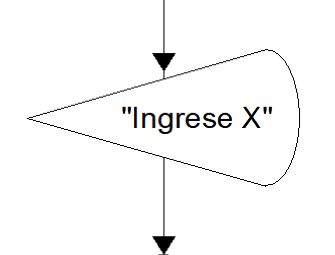
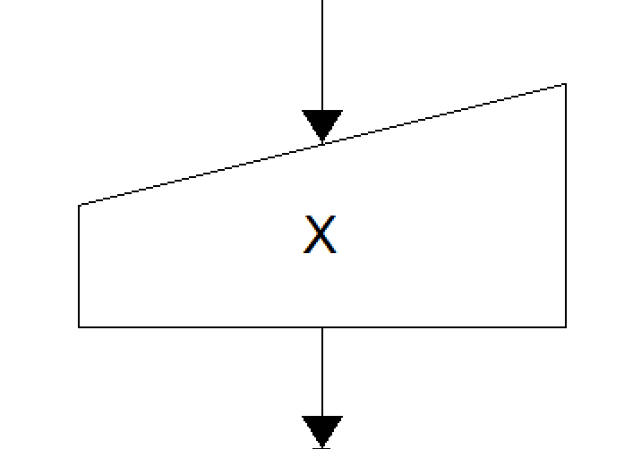
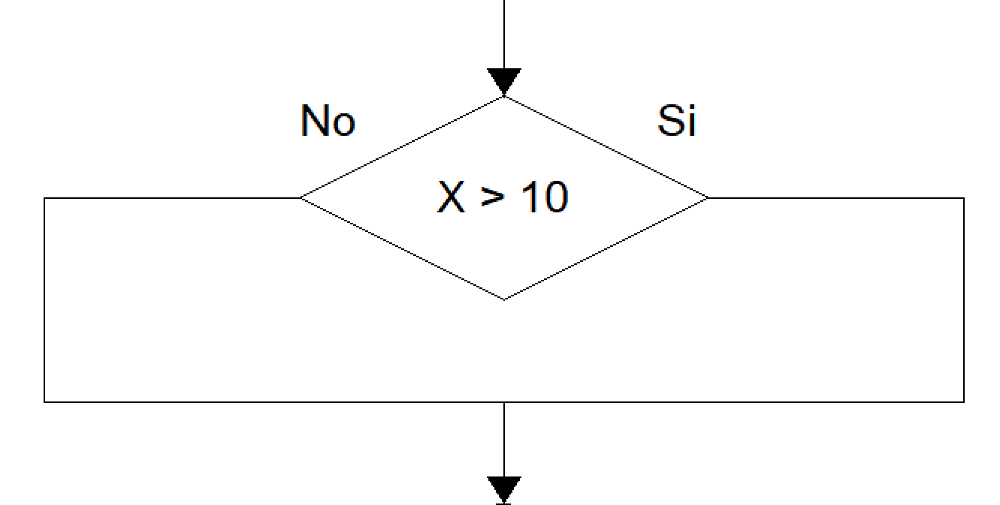
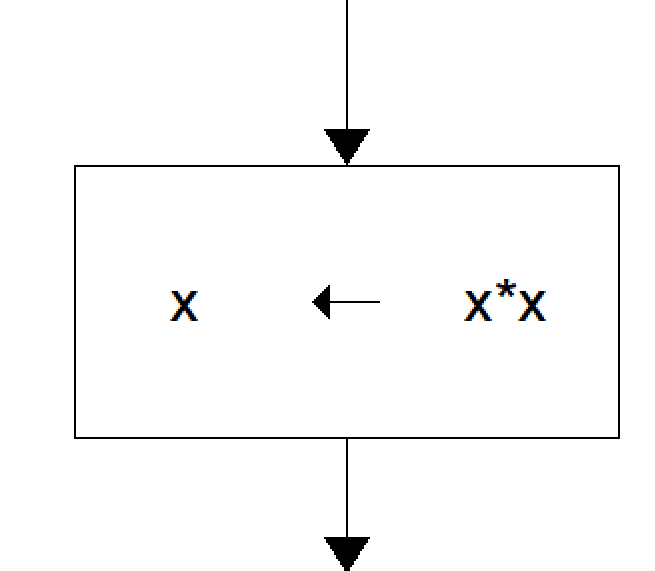
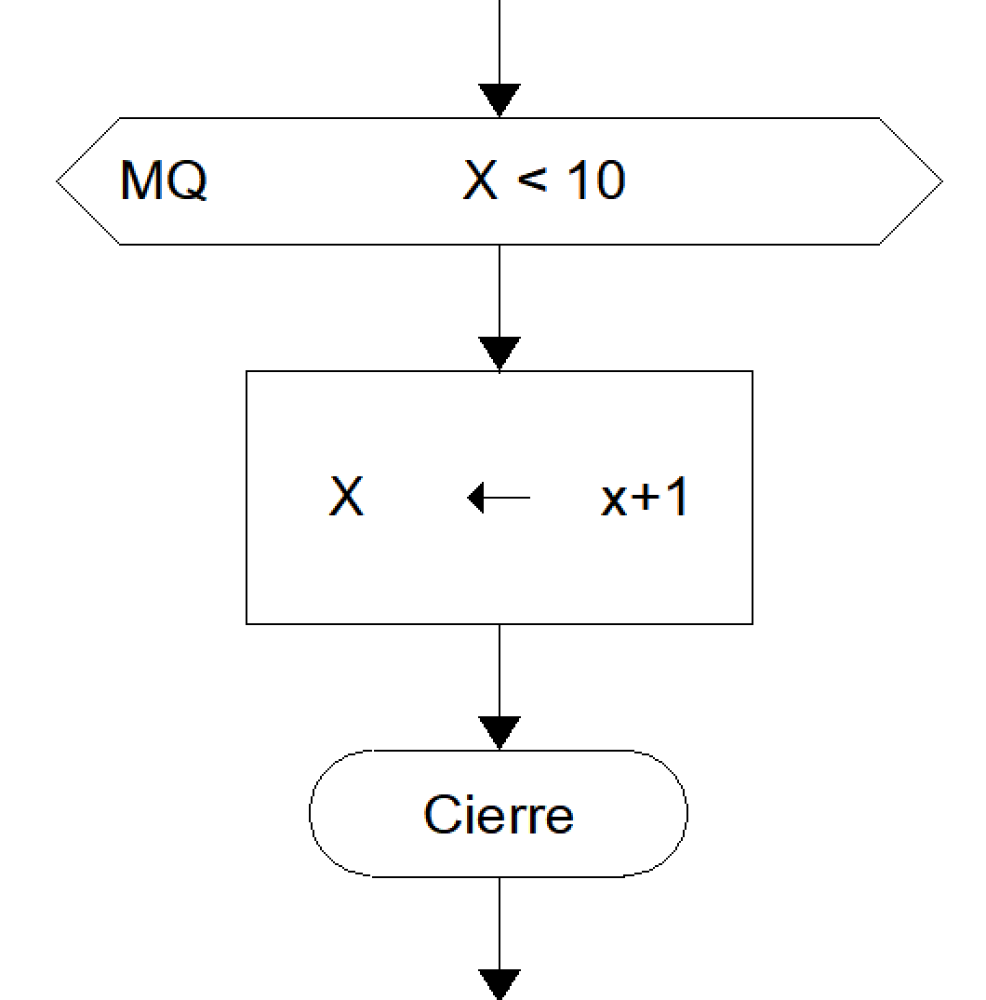
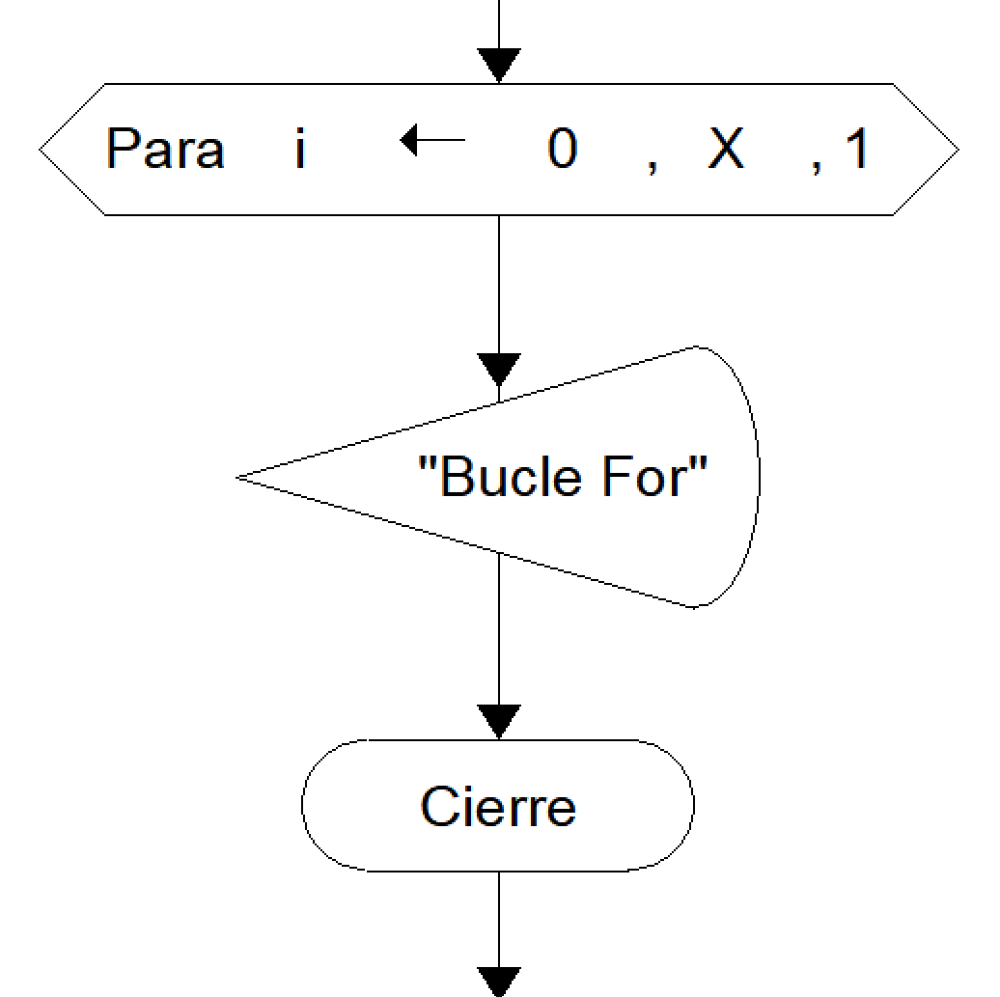

## Diagramas de Flujo
Los diagramas de flujo son una herramienta visual utilizada en la programación informática para representar de manera gráfica el flujo de control de un algoritmo o proceso. 

Estos diagramas descomponen el proceso en pasos lógicos secuenciales, utilizando una serie de símbolos estándar conectados por flechas que indican la dirección del flujo del control.

Los diagramas de flujo tiene formas geométricas que indican estructuras específicas, se usarán como referencia las figuras del programa FreeDFD:

1. **Salida/Imprimir/Escribir/`out`**
   

2. **Ingreso/Lectura/`in`**
   

3. **Condicional Simple/Si/`If`**
   

4. **Asignación**
   

5. **Bucle Mientras/`while`**
   

6. **Bucle Para/`for`**
   

