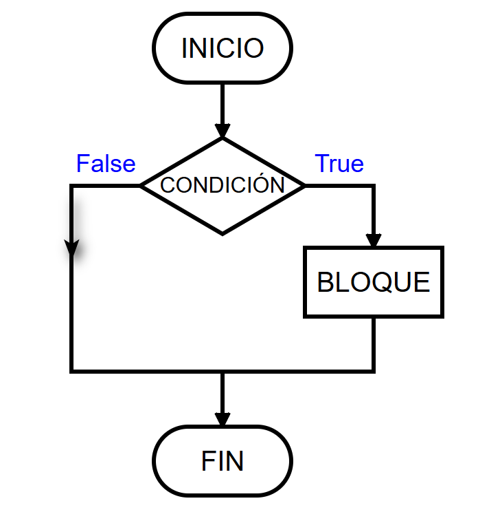
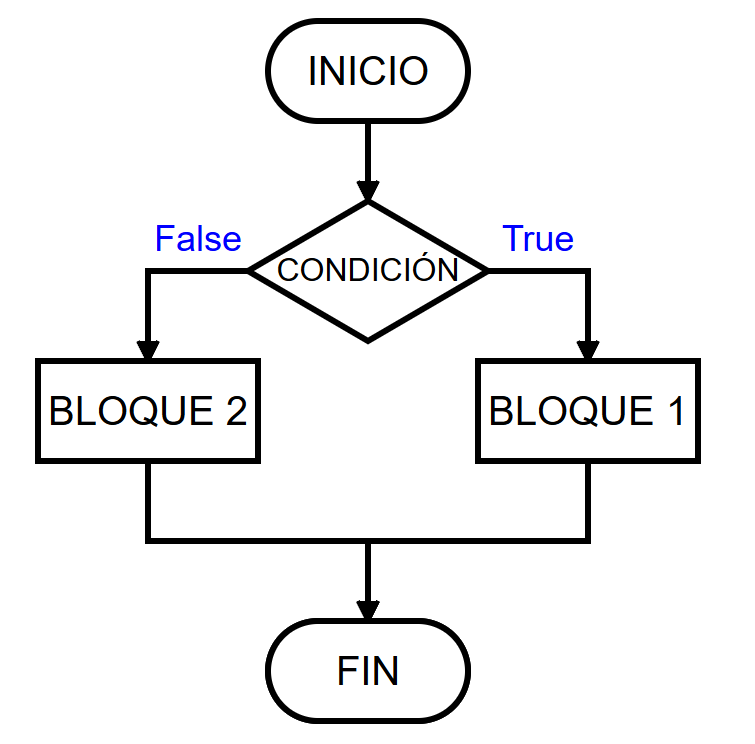
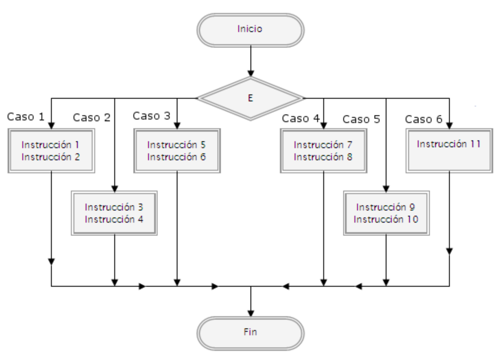
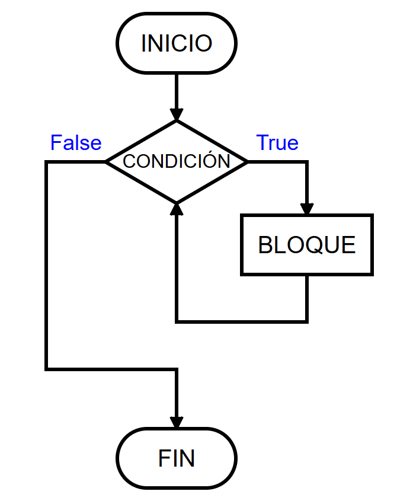
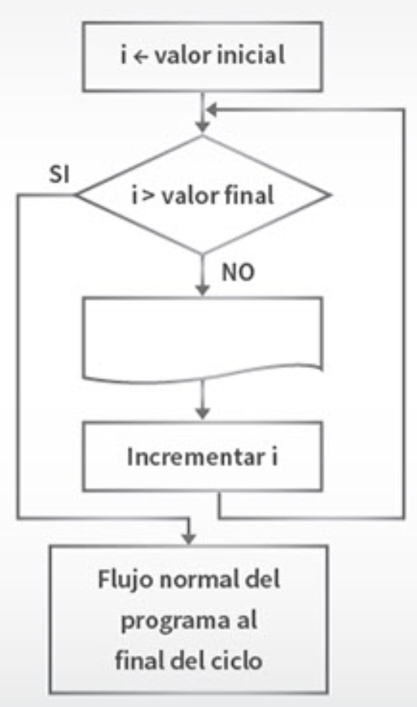

## Estructuras en Lenguajes de Programación
---
**Todo lenguaje de programación** sin importar cual sea, tiene estas estructuras:

### Estructuras de Datos
---
1. **Variables**: son espacios de memoria que almacenan valores simples, como números enteros, flotantes, caracteres, etc, **su valor puede variar** durante la ejecución del programa.
2. **Constantes**, similar a las variables con la restricción que **su valor permanece fijo** durante la ejecución del programa.
3. **Arreglos (Arrays)**: Colecciones de elementos del mismo tipo, accesibles por índices.

### Estructuras de control
---
#### 1. Estructuras Secuenciales

Son aquellas que se dedican a realizar una operación específica y se ejecutan una tras otras, por ejemplo:
   1. Mostrar mensajes
   2. Lectura de datos
   3. Asignar valores
   4. Cálculos

#### 2. Estructuras Selectivas

Las estructuras selectivas, también conocidas como **estructuras de decisión**, permiten que el flujo del programa tome diferentes caminos basados en una condición o un conjunto de condiciones.

*** Dependiendo de si la condición es VERDADERA o FALSA, el programa ejecutará diferentes bloques de código.

Las principales son:
1. **Condicional simple ("`Si`") ("`if`")**
   Ejecuta un bloque de código si una condición es verdadera.
   Se basa en los valores "true" (verdadero) y "false" (falso).
   El diagrama visual es como sigue:
   
   

2. **Condicional compuesta ("`Si`" --- "`Si no`") (`if-else`):**
   Ejecuta un bloque de código si una condición es verdadera y otro bloque de código si la condición es falsa.
   El diagrama visual es como sigue:
   
   
3. **Condicional múltiple ("`Segun XXXX hacer Caso`") (`switch/case`):** 
   Selecciona entre varias alternativas basadas en el valor de una expresión.
   El diagrama visual es como sigue:
   

#### 3. Estructuras Repetitivas, Ciclo o bucles

Las estructuras repetitivas permiten que un bloque de código se ejecute múltiples veces, mientras se cumpla una condición específica.

Estas estructuras son esenciales para automatizar tareas repetitivas en la programación.

1. **Bucle ("`mientras`") "`while`":**
   Repite un bloque de código mientras una condición sea verdadera.
   

2. **Bucle ("`para`") "`for`":** 
   Se utiliza cuando se conoce de antemano el número de iteraciones que se desea realizar.
   El diagrama visual es como sigue:
   

3. **Bucle ("`hacer XXX mientras`") "`do-while`":**
   Similar al "while", pero la condición se evalúa después de ejecutar el bloque de código, garantizando que el bloque se **ejecute al menos una vez**.
   Es poco utilizada.

#### Estructuras de Saltos (breaks)
---
Controlan la continuación o terminación de ciclos (bucles) o funciones.

Los más comunes son:
1. `break`, rompe completamente el bucle.
2. `continue`, salta al siguiente item del bucle
3. `return`, abandona completamente de la  función, métodoo o procedimiento.
4. `goto`, se desaconseja su uso.

#### Estructuras de Comentarios
---
Los comentarios encajan en la categoría de documentación dentro del código. Aunque no afectan el flujo de ejecución ni el manejo de datos, los comentarios son fundamentales para la mantenibilidad y comprensión del código.
