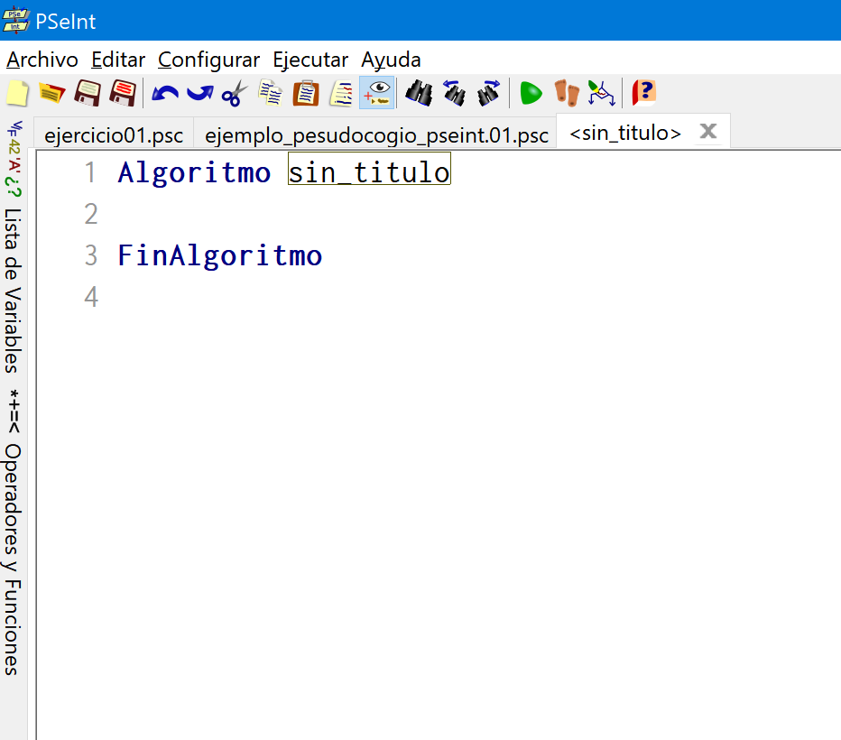
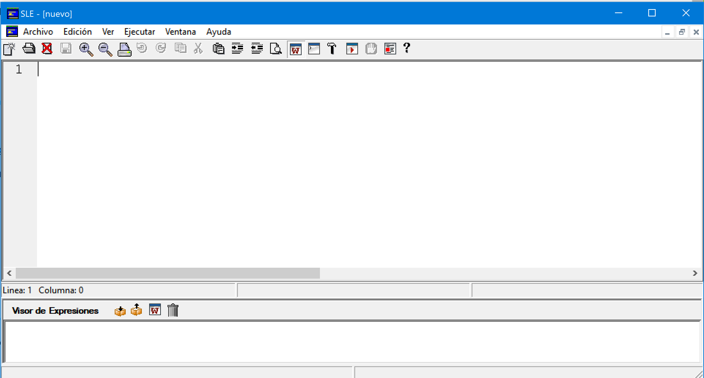
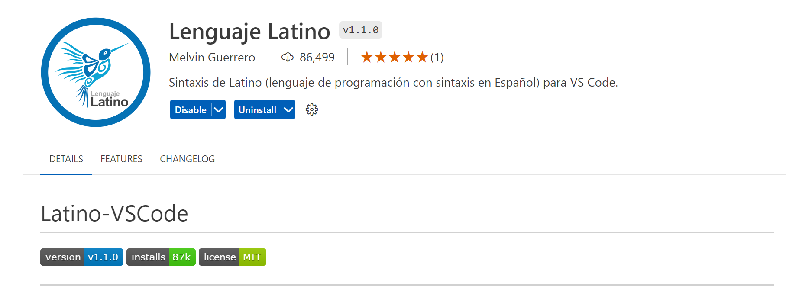
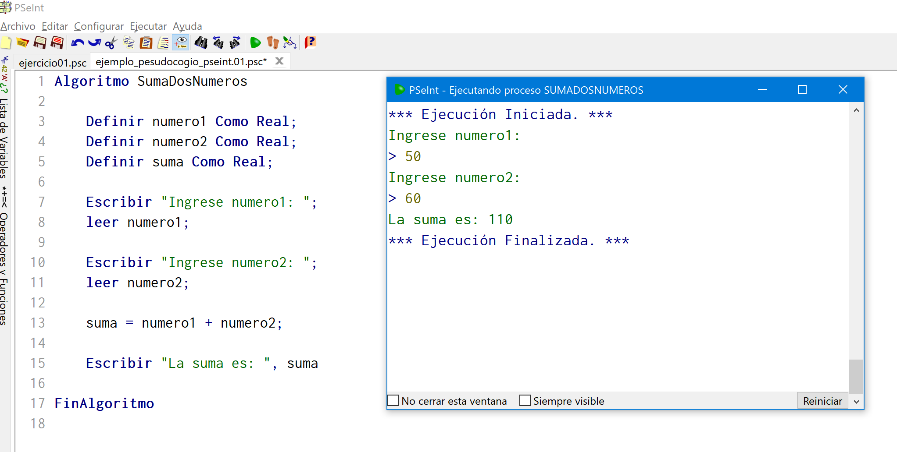
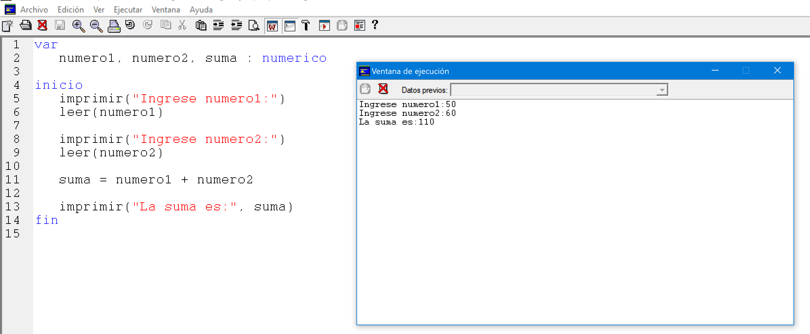
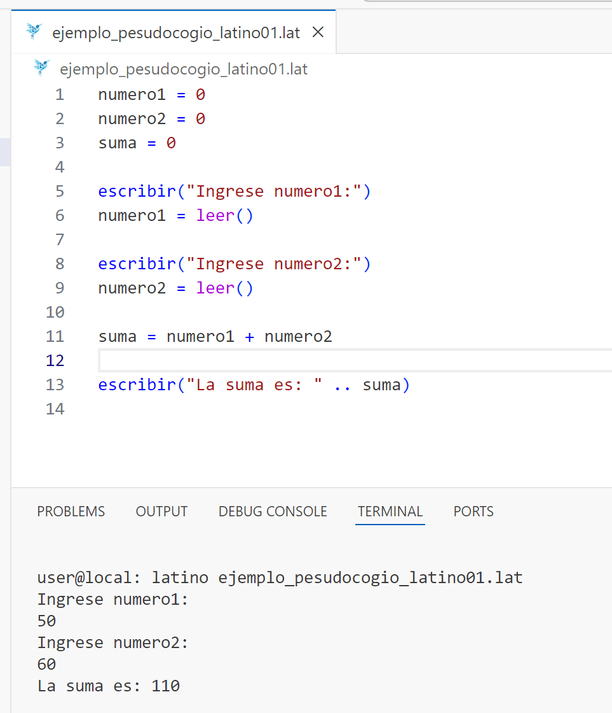

## Pseudocódigo
---
El pseudocódigo es una herramienta ampliamente utilizada en el ámbito de la programación para diseñar y comunicar algoritmos de manera que sean comprensibles tanto para personas que conocen la programación como para aquellas que no están familiarizadas con lenguajes de programación específicos.

 Al dominar el pseudocódigo, se mejora la capacidad de planificar, diseñar y comunicar soluciones de manera más efectiva.

### ¿Qué es el Pseudocódigo?

El pseudocódigo es una representación textual de un algoritmo o proceso computacional que utiliza un lenguaje semiformal, es decir, no es un lenguaje de programación real, pero se asemeja a la lógica que se implementaría en un lenguaje de programación concreto. 

El propósito principal del pseudocódigo es facilitar la comprensión y el desarrollo de algoritmos, permitiendo a los programadores y diseñadores de software planificar y discutir la lógica antes de escribir el código en un lenguaje específico.

### Propósito del Pseudocódigo

1. **Facilitar la planificación**: Ayuda a los desarrolladores a organizar y visualizar la secuencia de operaciones antes de escribir código real.
2. **Comunicación**: Permite que diferentes partes de un equipo de desarrollo, incluidos aquellos que no son expertos en programación, comprendan y contribuyan al diseño de un algoritmo.
3. **Documentación**: Sirve como una forma de documentación de alto nivel que describe cómo debe funcionar un programa o parte de un programa.

### Características del Pseudocódigo

- **Simplicidad**: El pseudocódigo debe ser fácil de entender. Se utiliza un lenguaje natural combinado con términos comunes en la programación como "si", "mientras", "para cada", etc.
- **Claridad**: La claridad es fundamental para que cualquiera pueda seguir el flujo lógico del algoritmo.
- **Estructura**: Aunque no tiene una sintaxis estricta como un lenguaje de programación, sigue una estructura lógica que refleja las construcciones de control como bucles, condicionales y bloques de código.
- **Abstracción**: El pseudocódigo se centra en la lógica del problema, omitiendo detalles técnicos como la sintaxis exacta del lenguaje de programación que se va a utilizar.

### Ventajas del Pseudocódigo

1. **Independencia del lenguaje**: Dado que no está atado a un lenguaje de programación específico, el pseudocódigo puede ser traducido a cualquier lenguaje de programación.
2. **Facilita el proceso de codificación**: Tener un pseudocódigo claro y bien diseñado hace que la traducción a un lenguaje de programación sea más directa y menos propensa a errores.
3. **Ayuda en la enseñanza**: Es una herramienta excelente para enseñar conceptos de programación y lógica a principiantes.
4. **Reduce la complejidad**: Permite dividir un problema complejo en partes manejables antes de la implementación.

### Cómo Escribir Pseudocódigo

No existe un formato estándar para escribir pseudocódigo, pero generalmente sigue algunas convenciones:

1. **Definición del problema**: Comienza con una descripción clara del problema que se va a resolver.
2. **Descripción de pasos**: Lista cada paso de manera secuencial, utilizando palabras clave como "Inicio", "Fin", "Si", "Entonces", "Mientras", "Para cada", etc.
3. **Identación**: Aunque no es obligatorio, la indentación se usa para mostrar la estructura y los niveles de anidación de las operaciones, lo que mejora la legibilidad.
4. **Comentarios**: Pueden incluirse para aclarar partes del algoritmo que podrían ser complicadas o para proporcionar contexto adicional.

#### Ejemplo de Pseudocódigo

Ejemplo sencillo de pseudocódigo que describe cómo encontrar el número mayor entre dos números:

```
Inicio
   Leer número1
   Leer número2
   Si número1 > número2 Entonces
      Mostrar "Número1 es mayor"
   Sino
      Mostrar "Número2 es mayor"
   FinSi
Fin
```

Este pseudocódigo describe un algoritmo básico que compara dos números y muestra cuál es el mayor. 

Aunque es simple, demuestra cómo se puede estructurar la lógica de manera clara y directa sin preocuparse por la sintaxis de un lenguaje de programación específico.

### Software / Herramientas
Entre las herramientas más utilizadas para implementar un algoritmo en pseudocódigo son:

1. PSEINT
   [Web Oficial](https://pseint.sourceforge.net/)
   [Documentación Oficial](https://pseint.sourceforge.net/index.php?page=features.php)
   [Editor en línea](https://www.rollapp.com/app/pseint)

   

2. SLE 2
   [Web Oficial](https://www.cnc.una.py/sl/SL-index.html)
   [Libro](https://www.cnc.una.py/sl/libro-sl.pdf)

   

3. Latino
   [Web Oficial](https://www.lenguajelatino.org/)
   [Documentación Oficial](https://manual.lenguajelatino.org/es/stable/ejemplos/Mi-Primer-Programa.html)
   [Editor en Línea](https://editorlatino.blogspot.com/)
   
   


#### Ejemplo usando el Software

Tengamos el siguiente algoritmo:

```
Inicio
   Solicitar numero1
   Leer numero1
   Solicitar numero2
   Leer numero2
   Calcular suma de numero1 y numero2
   Mostrar suma
Fin
```

##### 1. Implementado en PSEINT:
```java
Algoritmo SumaDosNumeros

  Definir numero1 Como Real;
  Definir numero2 Como Real;
  Definir suma Como Real;

  Escribir "Ingrese numero1: ";
  leer numero1;

  Escribir "Ingrese numero2: ";
  leer numero2;

  suma = numero1 + numero2;

  Escribir "La suma es: ", suma
	
FinAlgoritmo
```

Funcionamiento:



##### 2. Implementado en SLE:
```javascript
var
   numero1, numero2, suma : numerico

inicio
   imprimir("Ingrese numero1:")
   leer(numero1)

   imprimir("Ingrese numero2:")
   leer(numero2)

   suma = numero1 + numero2

   imprimir("La suma es:", suma)
fin
```

Funcionamiento:




##### 3. Implementado en Latino:

```javascript
numero1 = 0
numero2 = 0
suma = 0

escribir("Ingrese numero1:")
numero1 = leer()

escribir("Ingrese numero2:")
numero2 = leer()

suma = numero1 + numero2

escribir("La suma es: " .. suma)

```

Funcionando:



### ¿Curioso?
Vamos a ver cómo se pasa el pseudocódigo a distintos lenguajes:

