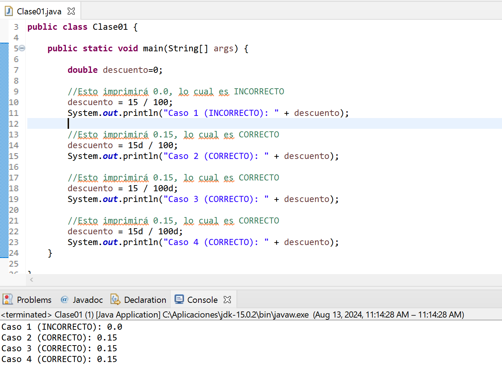

## Tipos de Datos Primitivos en Java

En Java en cualquier parte del código: 
- Cuando se escriben números sin decimales (Ejemplo: 200)  se toman como tipo **int** 
- En el caso que se escriba con decimales (Ejemplo: 200.00) se toma como **double**

### Tipos de Datos Numéricos

1. **int (entero) (MUY USADO)**
   - **Descripción**: Almacena números enteros (sin decimales).
     **Ejemplo**: `int edad = 15;`

2. **double (doble precisión) (MUY USADO)**
   - **Descripción**: Almacena números con decimales. Es **más preciso que el tipo `float`**.
     **Ejemplo**: `double precio = 19.99;`
     \
     **Importante** En operaciones donde se mezcla con enteros es mejor colocar una letra "d" o "D" al final del número así se fuerza a interpretar como decimal.
     **Ejemplo2**: `double descuento = 18d / 100d;`
     Se ilustra con una imagen:
     

3. **float (flotante)**
   - **Descripción**: Almacena números con decimales, pero con **menos precisión que `double`**.
     **Ejemplo**: `float altura = 1.75f;`
     \
     **Importante** Cuando se escribe el número se le agrega la letra "f" o "F" al final **obligatoriamente**.

4. **byte**
   - **Descripción**: Almacena números enteros pequeños (de -128 a 127).
     **Ejemplo**: `byte edadPequena = 10;`

5. **short (corto)**
   - **Descripción**: Almacena números enteros de rango más pequeño que `int` (de -32,768 a 32,767).
     **Ejemplo**: `short numeroCorto = 30000;`

6. **long (largo)**
   - **Descripción**: Almacena números enteros muy grandes, **más allá del rango de `int`**.
     **Ejemplo**: `long distanciaEnMetros = 15000000000L;`
     \
     **Importante** Cuando se escribe el número se le agrega la letra "L" o su minúscula al final **obligatoriamente**, se prefiere la mayúscula porque la versión en minúscula suele confundirse con el ´numero 1 en fuentes monospaced.

### Otros Tipos de Datos

1. **char (carácter)**
   - **Descripción**: Almacena un solo carácter (por ejemplo, una letra o un símbolo).
     **Ejemplo**: `char inicial = 'A';`

2. **boolean (booleano)**
   - **Descripción**: Almacena valores de verdad. Puede ser `true` (verdadero) o `false` (falso).
     **Ejemplo**: `boolean esMayorDeEdad = true;`

#### Ejemplos de Uso ([código java](codigos/codigo_100.md))

```java
public class TiposDeDatos {
    public static void main(String[] args) {
        // Ejemplo de int
        int edad = 15;
        System.out.println("Edad: " + edad);

        // Ejemplo de double
        double precio = 19.99;
        System.out.println("Precio: " + precio);

        // Ejemplo de float
        float altura = 1.75f;
        System.out.println("Altura: " + altura);

        // Ejemplo de byte
        byte edadPequena = 10;
        System.out.println("Edad pequeña: " + edadPequena);

        // Ejemplo de short
        short numeroCorto = 30000;
        System.out.println("Número corto: " + numeroCorto);

        // Ejemplo de long
        long distanciaEnMetros = 15000000000L;
        System.out.println("Distancia en metros: " + distanciaEnMetros);

         // Ejemplo de char
        char inicial = 'A';
        System.out.println("Inicial: " + inicial);

        // Ejemplo de boolean
        boolean esMayorDeEdad = true;
        System.out.println("Es mayor de edad: " + esMayorDeEdad);

    }
}
```
## Tipo de Dato `String` en Java

1. **String (cadena de texto)**
   - **Descripción**: Utilizado para almacenar secuencias de caracteres, es decir, texto. Las cadenas de texto en Java se escriben entre comillas dobles.
     **Ejemplo**: `String nombre = "Juan";`

#### Ejemplo de Uso

```java
public class EjemploString {
    public static void main(String[] args) {
        // Declaración y asignación de una cadena de texto
        String nombre = "Juan";
        System.out.println("Nombre: " + nombre);
    }
}
```
