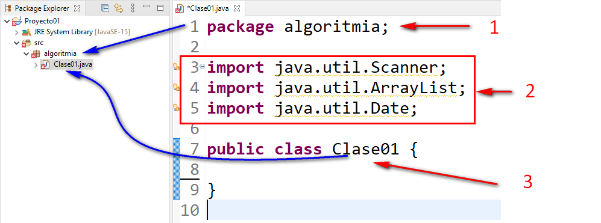
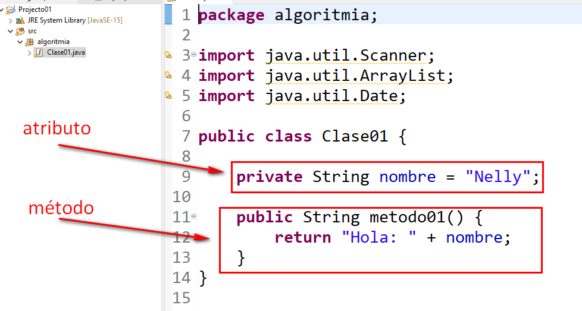

## Estructura basica de un archivo de Clase Java
---

### Fuera de la clase


1. **package**
   - Debe coincidir con el nombre de la carpeta que contiene el archivo.
   - En java las carpetas se llaman **paquetes**

2. **import**
   - La zona de imports siempre es entre la linea de **package** y el nombre de la clase.

3. **clase**
   . El nombre de la clase debe coincidir con el nombre del archivo cuando lleva la palabra **public**
   - Debe coincidir incluso con las mayúsculas y minúsculas.
   - El nombre del archivo es igual al nombre de la clase con la extensión **.java**

### Dentro de la clase



1. **atributos**
   - Se les dice así a las variables o constanstes que conforman la clase.

2. **método**
   - Son todos aquellos que pueden ejecutar código.
   - Su detalle es:
     ```java
     public String metodo01()
     ```
        - **public**: Es el alcance dentro de los paquetes.
        - **String**: significa que el método devolverá una cadena tras ejecutar su código.
        - **metodo01**: Es el nombre del método, este nombre se usará para invocarlo desde otras partes del código.
        - **()** : Significa que el método no recibe argumentos
   - Otro ejemplo:
     ```java
     public String metodo01(int edad)
     ```
        - **public**: Es el alcance dentro de los paquetes.
        - **String**: significa que el método devolverá una cadena tras ejecutar su código.
        - **metodo01**: Es el nombre del método, este nombre se usará para invocarlo desde otras partes del código.
        - **(int edad)** : Significa que el método recibe un argumento llamado **edad** del tipo **int**
   - Otro ejemplo:
     ```java
     public void metodo01(int edad)
     ```
        - **public**: Es el alcance dentro de los paquetes.
        - **void**: significa que el método **NO devolverá** algo tras ejecutar su código. **Esta es una palabra reservada.**
        - **metodo01**: Es el nombre del método, este nombre se usará para invocarlo desde otras partes del código.
        - **(int edad)** : Significa que el método recibe un argumento llamado **edad** del tipo **int**
   - Otro ejemplo:
     ```java
     public void metodo01(int edad,String color)
     ```
        - **public**: Es el alcance dentro de los paquetes.
        - **void**: significa que el método **NO devolverá** algo tras ejecutar su código.
        - **metodo01**: Es el nombre del método, este nombre se usará para invocarlo desde otras partes del código.
        - **(int edad,String color)** : Significa que el método recibe dos argumentos, uno llamado **edad** del tipo **int** y otro llamado **color** del tipo **String**
        
        - **IMPORTANTE !!!: Los argumentos se separan por comas**

### Notas adicionales
- A parte de **public**, existe protected, private y default en los métodos, pero no profundizaremos por ahora.
