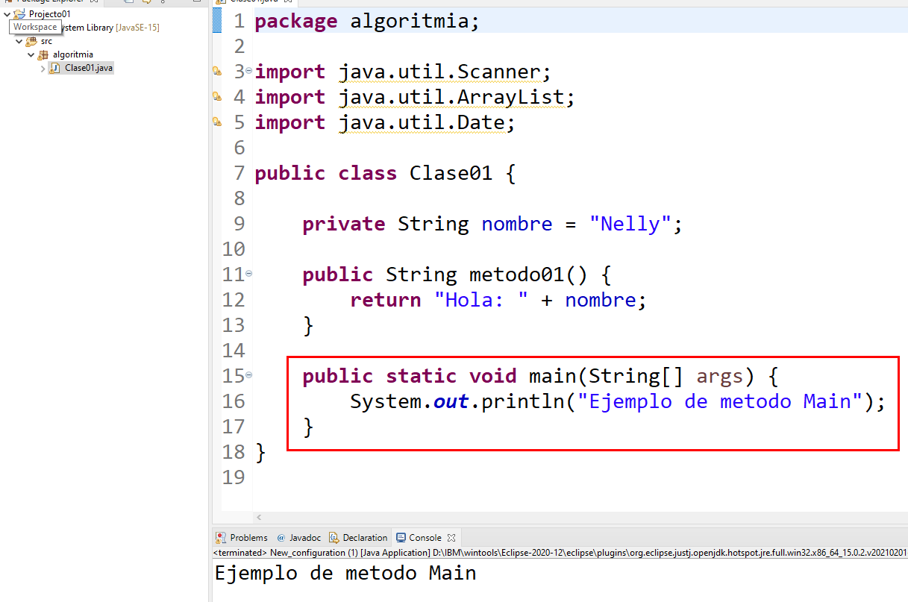
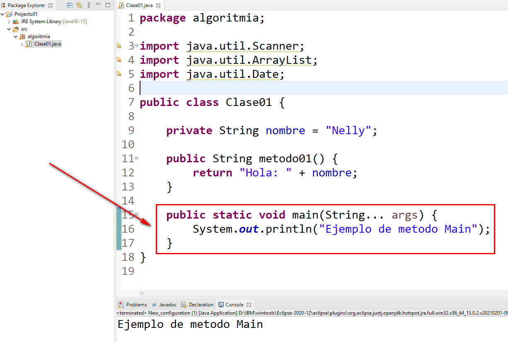

## El Método main
- Es el punto de inicio desde donde se ejecuta un programa Java.
- Es el primer método que se llama cuando se inicia la aplicación.

### Características
- La forma básica con la que debe escribirse es:
```java
public static void main(String[] args) {
}
```

- Existe otra forma de escribirlo usando una característica llamada **varargs**, es poco usada pero válida
```java
public static void main(String... args) {
}
```

- Como se aprecia en la salida de ambas ejecuciones, ambas imprimen el mensaje "Ejemplo de metodo Main"

###  Código:
```java
package algoritmia;

import java.util.Scanner;
import java.util.ArrayList;
import java.util.Date;

public class Clase01 {
	
	private String nombre = "Nelly";
	
	public String metodo01() {
		return "Hola: " + nombre;
	}
	
	public static void main(String[] args) {
		System.out.println("Ejemplo de metodo Main");
	}
}

```