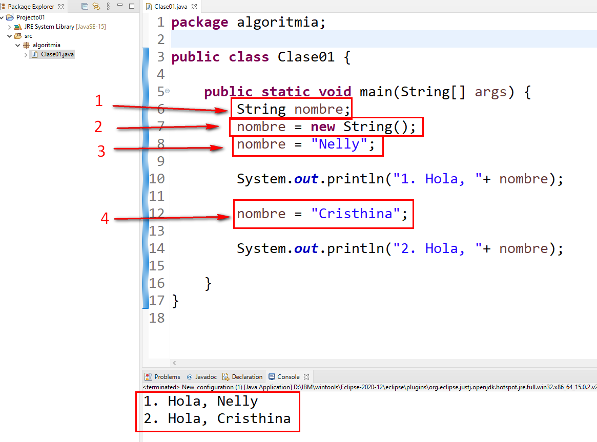
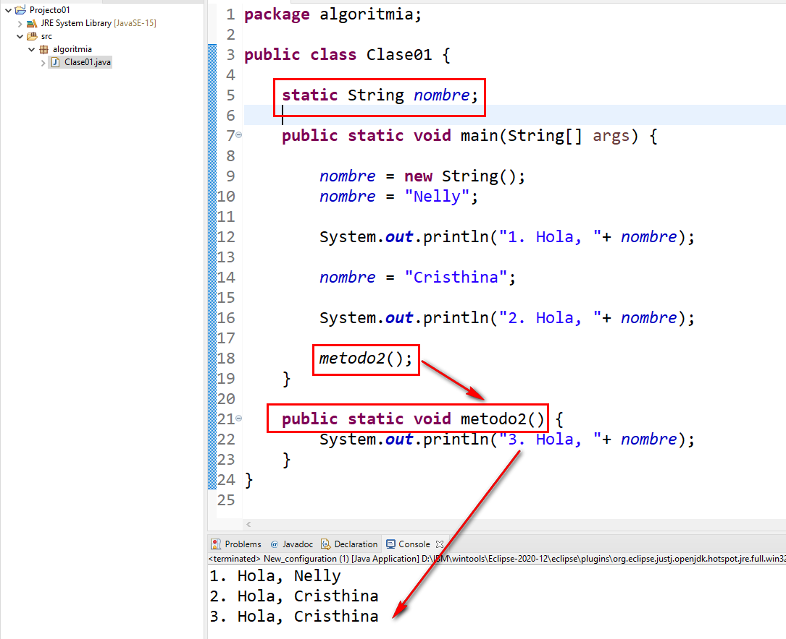

## Variables
Son espacios de memoria que pueden almacenar valores cambiantes.

### Procedimientos de uso dentro de un método

Se muestra un ejemplo:



1. **Declaración**
    ```java
    String nombre;
    ```
2. **Instanciación**
    Por lo general incluye la inicialización, en el caso de la clase String, se inicializa con cadena vacía.
    ```java
    String nombre = new String();
    ```
3. **Inicialización**
    Se le asigna un valor deseado a la variable.
    ```java
    nombre = "Nelly";
    ```
4. **Ccambio de valor**
    Se cambia el valor de la variable.
    ```java
    nombre = "Cristhina";
    ```
### Código del Ejemplo:
```java
package algoritmia;

public class Clase01 {
	
	public static void main(String[] args) {
		String nombre;
		nombre = new String();
		nombre = "Nelly";
		
		System.out.println("1. Hola, "+ nombre);
		
		nombre = "Cristhina";
		
		System.out.println("2. Hola, "+ nombre);
		
	}
}
```

### Procedimientos de uso a nivel de clase


1.  **Declaración**
    Se puede declarar una variable a nivel de clase, en este caso se llama **atributo** (un nombre específico de la programación orientada a objetos), en este ejemplo específicamente **atributo de clase**

    ```java
    static String nombre;
    ```
    Se escribe fuera de los métodos, y estará disponible para todos los métodos. En el ejemplo el método de nombre "método2" imprime la variable con el último valor que le asignó el método main. (línea 14). Con esto podemos ver como se mantienen los valores de las variables entre los métodos.

    Existen **atributos de clase** y **atributos de instancia**. Más adelante veremos las diferencias.