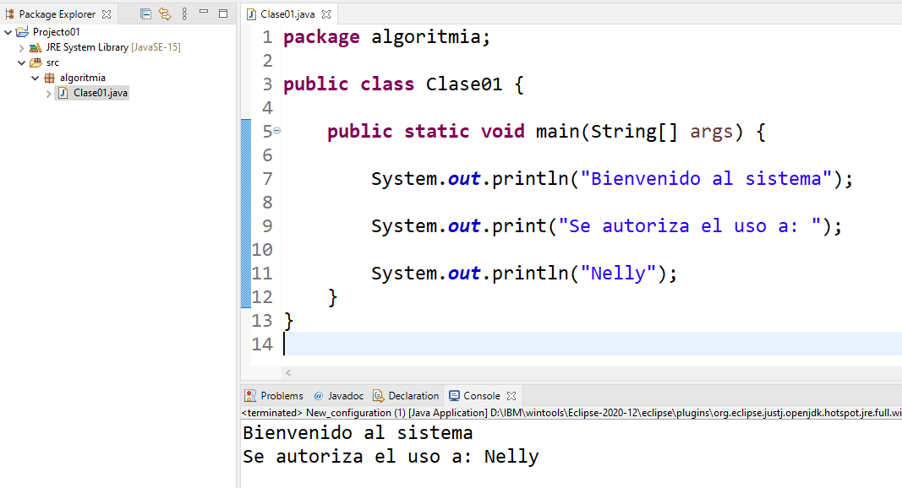

## Imprimir mensajes
---
Se puede imprimir mensajes usando la clase **System** y el atributo **out**, en caso de necesitar mostrar errores se puede usar el atributo **err** de la misma clase.

Ejemplo:


### 1. **`System.out.println("Bienvenido al sistema");`**

- **`System.out.println`**: Este es un método en Java que se utiliza para imprimir una línea de texto en la consola. La parte `System.out` se refiere al flujo de salida estándar, que en la mayoría de los casos es la consola de la aplicación. `println` es la abreviatura de "print line" (imprimir línea).
  
- **Comportamiento**:
  - Imprime el texto `"Bienvenido al sistema"` en la consola.
  - Después de imprimir el texto, `println` agrega un salto de línea, lo que significa que el cursor de la consola se moverá a la siguiente línea. Esto es útil para separar visualmente las salidas del programa.

### 2. **`System.out.print("Se autoriza el uso a: ");`**

- **`System.out.print`**: Similar a `println`, pero con una diferencia clave. `print` imprime el texto proporcionado en la consola, **sin agregar un salto de línea al final**. Esto significa que después de que se imprime `"Se autoriza el uso a: "`, el cursor de la consola permanecerá en la misma línea.
  
- **Comportamiento**:
  - Imprime el texto `"Se autoriza el uso a: "` en la consola.
  - <span style="color:red">No se agrega un salto de línea, por lo que cualquier texto impreso después de esta línea continuará en la misma línea.</span>

### 3. **`System.out.println("Nelly");`**

- **`System.out.println`**: Como se explicó antes, este método imprime una línea de texto y luego agrega un salto de línea.
  
- **Comportamiento**:
  - Imprime `"Nelly"` en la consola.
  - Debido a que la línea anterior utilizó `System.out.print`, el texto `"Nelly"` se imprimirá justo después de `"Se autoriza el uso a: "`, en la misma línea.
  - Después de imprimir `"Nelly"`, el cursor se moverá a la siguiente línea en la consola.

### Código

```java
package algoritmia;

public class Clase01 {
	
	public static void main(String[] args) {
		
		System.out.println("Bienvenido al sistema");
		
		System.out.print("Se autoriza el uso a: ");
		
		System.out.println("Nelly");
	}
}

```