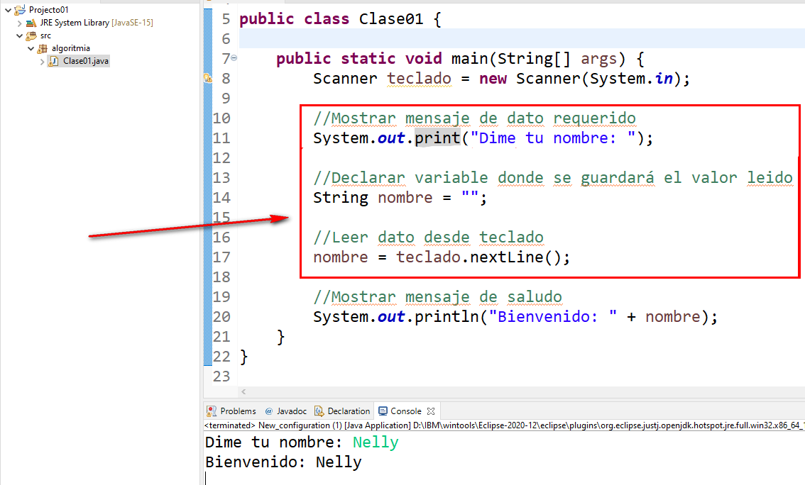

## Leer datos de entrada
Se pueden leer datos de usuario en consola usando la clase **System** y el atributo **in**. Este es un flujo de datos de entrada.

La manera más sencilla de leer los datos es utilizando la clase **java.util.Scanner** a la cual le pasaremos como argumento de su método constructor la instancia de **System.in**

### Ejemplo 01

Lo importante y siempre se repite:
- Solicitar dato al usuario usando **print** (buena práctica)
- Declarar una variable que almacena el valor leído desde teclado.
- Utilizar el método apropiado para leer el tipo de variable que se necesita.

En este ejemplo se lee una cadena de texto con el método **.nextLine()**

La clase Scanner tiene distintos métodos para los distintos [tipos](02.tipos.md) de datos de java.

A continuación un ejemplo

### Ejemplo 02 - Multiples datos

Como se aprecia en el ejemplo se requiere instanciar solo una vez la clase Scanner (línea 8)

Posteriormente solo se usan sus métodos de lectura.

El ciclo se repite:
1. Mostrar mensaje de dato requerido (usando **print**)
2. Declarar variable donde se guardará el valor leido
3. Leer dato desde teclado

Cuando hay multiples valores a leer, es buena práctica colocar las declaraciones de las variables al inicio del método, para cumplir esto el código quedaría.

