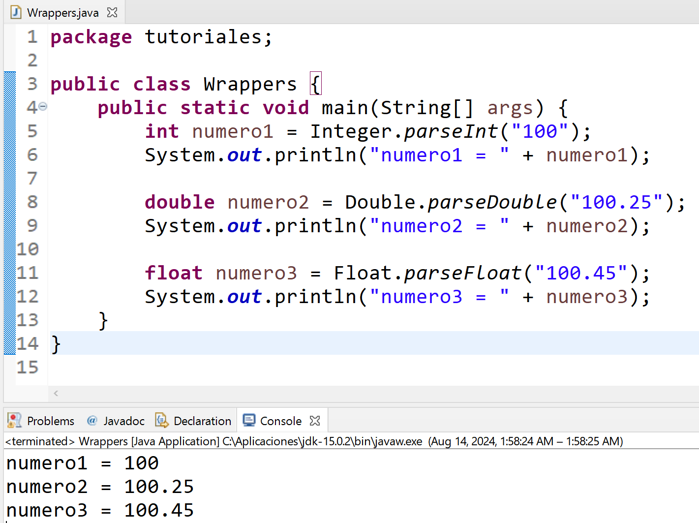

## Convertir datos desde la UI de Java Swing
---

En java los datos que se leen desde la intefaz de usuario (UI) o interfaz gráfica de usuario (GUI) se hacen en modo de cadenas (**String**) generalmente por el métoto **getTetx()** o **toString()**
\
Es por ello que se necesita conocer algo como conocido como **wrappers** con los cuales se puede convertir desde **String** hacia **Tipo Deseado**

Todos los [primitivos](02.tipos.md) tienen sus respectivos wrappers.
\
Por ejemplo los tipos numéricos más usados:

|Primitivo|Wrapper|Método|Ejemplo
|---|---|---|---|
|int| Integer|.parseInt("XX")|`int numero1 = Integer.parseInt("100");`
|double|Double|.parseDouble("XX.XX")|`double numero2 = Double.parseDouble("100.25");`
|float|Float|.parseFloat("XX.XX")|`float numero3 = Float.parseFloat("100.45");`

Funcionando:

