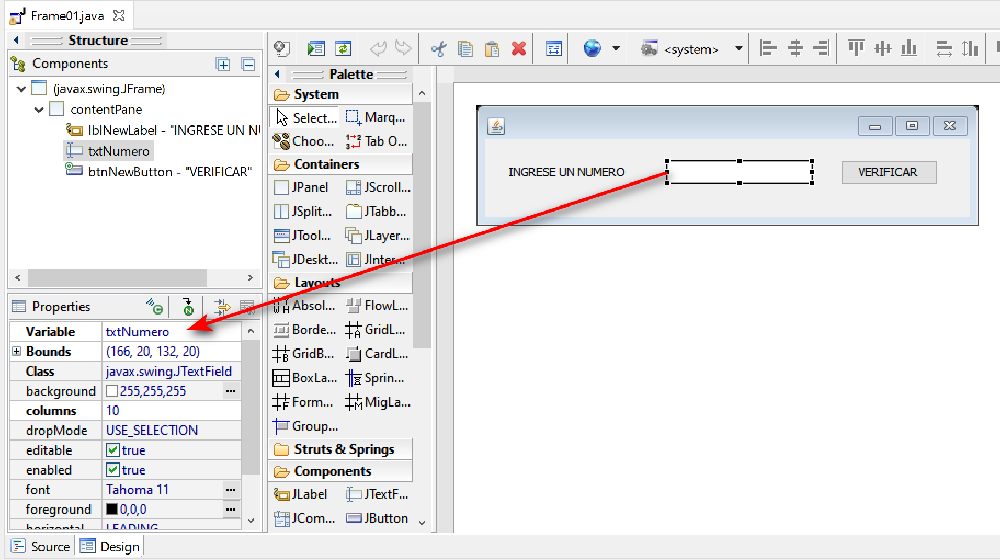

## Leer datos de la UI - Java Swing
---

Consideremos una interfaz gráfica muy simple:



La interfaz tiene un elemento llamado **txtNumero** del tipo **JTextField**, en la cual recogeremos el valor del texto y lo trataremos dentro del código al pulsar el botón "VERIFICAR".

Procedimiento:

1. Obtener el contenido (texto) del elemento JTextfield.
   Esto se hace mediante el método **.getText()**, en este caso lo vamos a guardar en una variable de tipo **String**
   ```java
   String numeroUsuario = txtNumero.getText();
   ```
2. Ahora que tenemos el contenido como String podemos [convertirlo](08.ConversionesDatos.md) al tipo de dato que necesitamos:
   - Por ejemplo en un número entero (int)
     ```java
     int numero = Integer.parseInt(numeroUsuario);
     ```
   - Por ejemplo en un número decimal largo (double)
     ```java
     double numero = Double.parseDouble(numeroUsuario);
     ```
   - Por ejemplo en un número decimal de coma flotante (float)
     ```java
     float numero = Float.parseFloat(numeroUsuario);
     ```
3. Luego ya podemos usar el valor ingresado por el usuario normalmente.