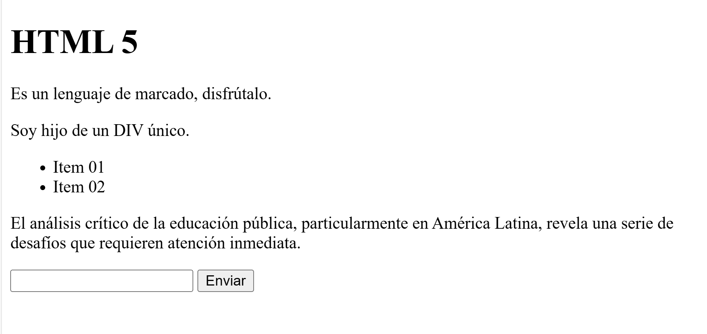
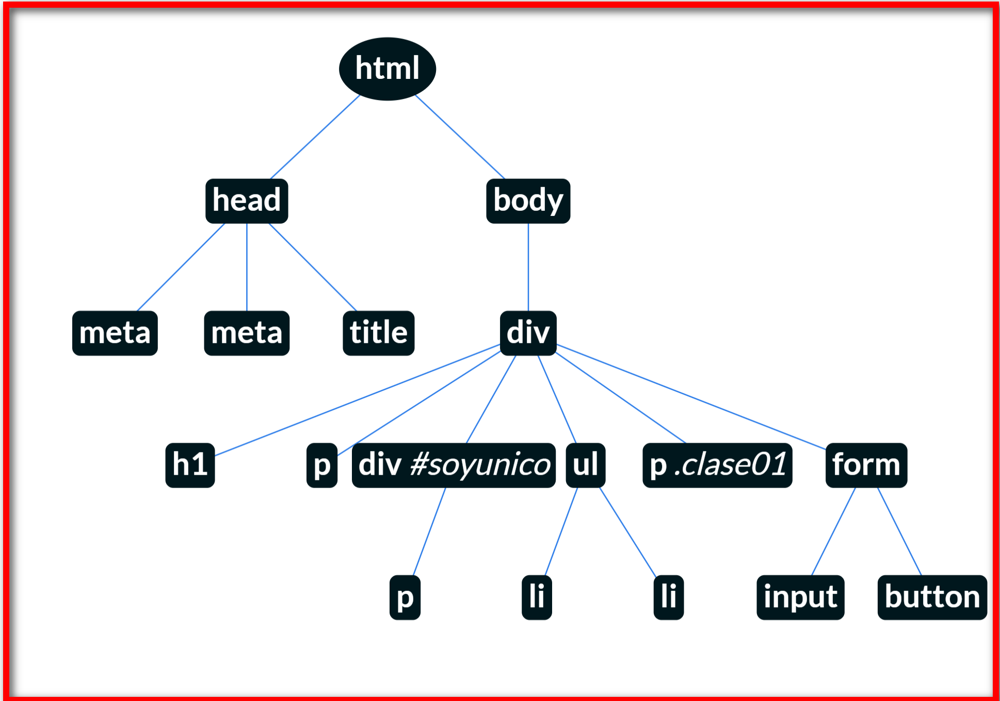

## HTML
---
[Especificación de HTML 5 w3c.org](https://www.w3.org/TR/2011/WD-html5-20110405/)
 
Es un **lenguaje de marcado**, que son las siglas de HyperText Markup Language (Lenguaje de marcas de hipertexto).  

Un documento HTML esta formado por **etiquetas**. Estas etiquetas conforman lo que se llama código HTML.

<span style="color:red;font-weight:bold">!!! En HTML se codifica pero NO se dice que se programa</span>

De forma general un **elemento** se compone de etiqueta de apertura y cierre, como se ve:

```html
<etiqueta_apertura> CONTENIDO </etiqueta_cierre>
```
Cada elemento puede tener **atributos** y estos se colocan dentro de la etiqueta de apertura:

```html
<etiqueta_apertura atributo1="xxxxxx" atributo2="xxxxxx yyyyy" > CONTENIDO </etiqueta_cierre>
```
<span style="color:red;font-weight:bold">!!! El atributo `id` de una etiqueta debe ser único en todo el documento HTML.</span>

Existen algunos elementos que usan el cierre corto, por ejemplo los ``, se llaman **elementos vacíos**

En un documento HTML los elementos pueden tener hijos, hermanos, padre. Esta visión es de **árbol**, lo que se conoce como **DOM**.

**DOM**: significa Document Object Model, en español sería Modelo de Objetos del Documento. En la parte inferior se ve un ejemplo que ayudará a su comprensión.

Se tienen 2 principales clases de elementos en HTML:
* `Elementos de bloque`: Se colocan **<span style="color:blue">uno debajo del otro</span>**.
  * Una característica es que se centran usando el atributo **margin**  

* `Elementos en linea `: Se colocan **<span style="color:red">uno al lado del otro</span>**.
  * Una característica es que se centran usando el atributo **text-align**

[Listado sobre elementos en bloque y en línea](https://www.w3schools.com/html/html_blocks.asp)

Las etiquetas válidas están en la especificación de la versión de HTML.
- [HTML 5 Specification](https://html.spec.whatwg.org/multipage/)

### DOM
Ahora muestro lo que se mencionó arriba acerca del DOM.

Consideremos el siguiente código HTML:

```HTML
<!DOCTYPE html>
<html>
<head>
  <meta charset="utf-8">
  <meta name="viewport" content="width=device-width">
  <title>Ejemplo DOM</title>
</head>
<body>
  <div>
    <h1>HTML 5</h1>
    <p>Es un lenguaje de marcado, disfrútalo.</p>
    <div id="soyunico">
      <p>
        Soy hijo de un DIV único.
      </p>
    </div>
    <ul>
      <li>Item 01</li>
      <li>Item 02</li>
    </ul>
    <p class="clase01">
      El análisis crítico de la educación pública, 
      particularmente en América Latina, 
      revela una serie de desafíos que 
      requieren atención inmediata.
    </p>
    <form>
      <input />
      <button>Enviar</button>
    </form>
  </div>
</body>
</html>
```
El cual se presenta en el navegador así:



Utilizando una herramienta para [ver el DOM Tree](https://fritscher.ch/dom-css/) se visualiza:



<span style="color:red;font-weight:bold">!!! La parte de mayor manipulación es todo lo que en el árbol está debajo de</span> `body`.

##### Referencias
1. [que-es-html](https://lenguajehtml.com/html/introduccion/que-es-html/)
2. [text-level-semantics](https://html.spec.whatwg.org/multipage/text-level-semantics.html)
3. [HTML_basics](https://developer.mozilla.org/es/docs/Learn/Getting_started_with_the_web/HTML_basics)
4. [doc](https://html.spec.whatwg.org/multipage/dom.html#attr-lang)
5. [Diferencias entre HTML4 y HTML 5](https://www.w3.org/TR/html5-diff/)
6. [HTML 4.01 Spec](https://www.w3.org/TR/html401/)
7. [HTML Intro](https://www.w3schools.com/html/html_intro.asp)
8. [html-tags-a-to-z-list](https://www.geeksforgeeks.org/html-tags-a-to-z-list/)
9. [html-etiquetas](https://www.mclibre.org/consultar/htmlcss/html/html-etiquetas.html)
10. [listado-de-etiquetas-html](https://carontestudio.com/blog/listado-de-etiquetas-html/)
11. [HTML tags w3schools](https://www.w3schools.com/TAGS/default.asp)
12. [HTML DOM](https://www.w3schools.com/whatis/whatis_htmldom.asp)
13. [HTML DOM visualize](https://github.com/lokwkin/html-dom-visualize)

##### Herramientas
1. https://fritscher.ch/dom-css/
2. https://bioub.github.io/dom-visualizer/
3. https://0xedward.github.io/dom-visualizer/
4. https://software.hixie.ch/utilities/js/live-dom-viewer