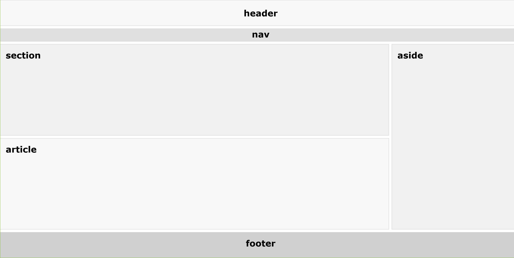
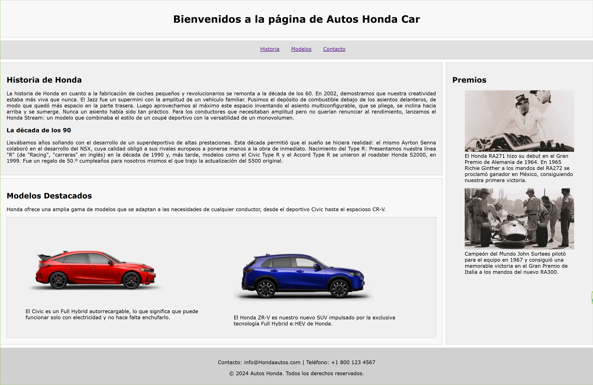

## HTML 5 - SEMÁNTICA
---
La semántica de las etiquetas en HTML5 es de suma importancia por varias razones clave que afectan tanto a la accesibilidad, como a la usabilidad, la optimización para motores de búsqueda (SEO) y el mantenimiento del código.

1. **Accesibilidad**
   Las etiquetas semánticas proporcionan una estructura clara y definida del contenido de una página web, lo que mejora la accesibilidad para las personas con discapacidades. Los lectores de pantalla, utilizados por personas con discapacidad visual, pueden interpretar y navegar de manera más efectiva el contenido si este está bien estructurado. Por ejemplo, etiquetas como `<header>`, `<nav>`, `<article>`, y `<footer>` ayudan a los lectores de pantalla a entender la jerarquía y la función de cada sección de la página.

2. **SEO (Optimización para Motores de Búsqueda)**
   Los motores de búsqueda, como Google, utilizan la estructura semántica para comprender el contenido de una página y determinar su relevancia para ciertas búsquedas. Una página bien estructurada, con etiquetas como `<article>` para el contenido principal o `<aside>` para información secundaria, puede ser mejor valorada y posicionada en los resultados de búsqueda.

3. **Mantenibilidad del Código**
   El uso de etiquetas semánticas facilita la comprensión del código tanto para los desarrolladores que lo crearon como para otros que puedan trabajar en él en el futuro. Esto reduce la curva de aprendizaje y los errores, haciendo el desarrollo y mantenimiento más eficiente. Por ejemplo, un `<section>` o un `<article>` proporciona una clara indicación del propósito de esa parte del código, lo que no se logra con una simple etiqueta `
`.

4. **Estandarización**
   HTML5 introdujo una serie de etiquetas semánticas que fomentan una estandarización en la estructura de las páginas web. Esto asegura que el código sea consistente y predecible, lo que es beneficioso para los navegadores, herramientas de desarrollo y cualquier sistema que interactúe con el HTML.

5. **Mejora de la Experiencia de Usuario**
   Las etiquetas semánticas también contribuyen a una mejor experiencia de usuario. Al estructurar el contenido de manera lógica y coherente, los usuarios pueden navegar y consumir el contenido más fácilmente, lo que mejora su satisfacción y retención en la página.

### Distribución básica:

#### Maqueta

[Código](codigos/ejemplo_html02_maqueta.html)

#### Implementado

[Código](codigos/ejemplo_html02.html)

##### Referencias
1. [w3schools html5_semantic_elements. ](https://www.w3schools.com/html/html5_semantic_elements.asp)
2. [elementos-semanticos-html5-explicados](https://www.freecodecamp.org/espanol/news/elementos-semanticos-html5-explicados/)
3. [html5-estructura-basica-elementos-semanticos](https://www.eniun.com/html5-estructura-basica-elementos-semanticos/)