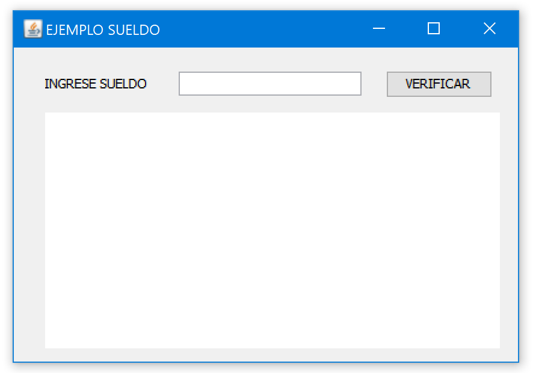

## Ejemplo 01
---
### Problema

Ingresar el sueldo de una persona, si supera los S/. 3.000 soles mostrar un mensaje en pantalla indicando que debe abonar impuestos.

---

### Análisis
1. Identificar entradas (inputs)
   - **Ingresar el sueldo de una persona**
     `input:sueldo`
2. Identificar cálculos
   `No hay`
3. Identificar condicionales
   - **si supera los S/. 3.000**
     `condición: "Si input:sueldo  > 3000 Entonces 'mostrar mensaje'"`
4. Identificar bucles
   `No hay`
5. Identificar salidas
   - **mostrar un mensaje en pantalla indicando que debe abonar impuestos**
     `'mostrar mensaje': "Debe abonar impuestos"`

---

### Algoritmo
```shell
imprimir "Ingrese sueldo: "
leer sueldo
Si sueldo > 3000 Entonces
    imprimir "Debe abonar impuestos"
FinSi
```

### Diagrama de Flujo en DFD
Ahora veremos como el algoritmo se plasma en un Diagrama de Flujo en la herramienta DFD
línea por línea.


### Pseudocódigo PSEINT

Ahora veremos como el algoritmo se convierte en pseudocódigo:


### Código en Java - Modo Consola

Para el modo consola nos ayudamos de la clase **java.util.Scanner**.  


```java
import java.util.Scanner;

public class Ejercicio01 {
  public static void main(String args[]) {
    Scanner teclado = new Scanner(System.in);

    System.out.print("Ingrese sueldo:");

    double sueldo;

    sueldo = teclado.nextDouble();

    if (sueldo > 3000) {
      System.out.println("Debe abonar impuestos");
    }
  }
}
```

## Código en Java - Modo Interfaz gráfica
Consideraremos la Interfa gráfica



Y el Código del evento click del botón:
```java
  protected void actionPerformedBtnVerificar(ActionEvent e) {
    
    double sueldo = 0;
    sueldo = Double.parseDouble( txtSueldo.getText() );
    
    if (sueldo > 3000) {
      txtResultado.setText("Debe abonar impuestos");
    }
    
  }
```

Veamos como se relaciona el algoritmo con la UI:  


Resultado final:  
