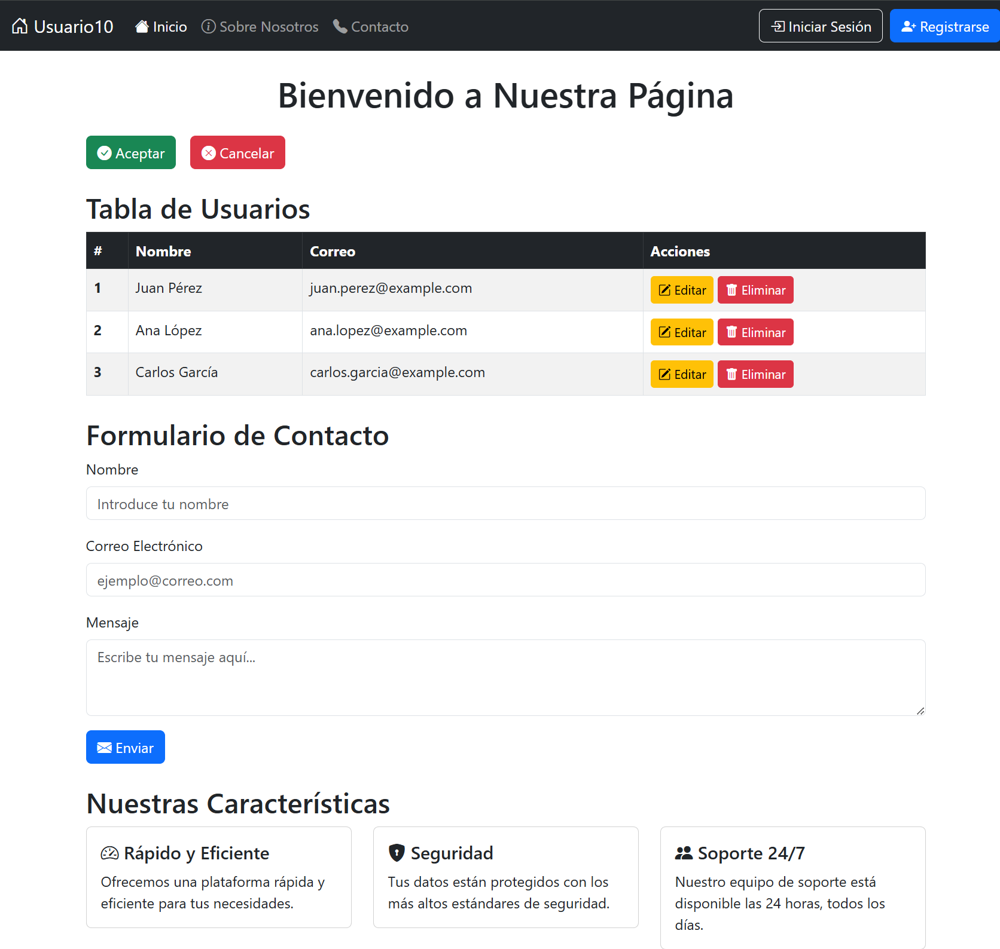

## Bootstrap

[Boostrap - Web Oficial](https://getbootstrap.com/)

Bootstrap es un framework de CSS (Cascading Style Sheets) que facilita la creación de sitios web y aplicaciones web responsivas y atractivas. Fue desarrollado por Twitter y se ha convertido en uno de los frameworks más populares para el diseño web debido a su facilidad de uso y la cantidad de componentes predefinidos.

### Características Principales de Bootstrap:

1. **Sistema de Grid (rejilla)**: Permite crear layouts (diseños) responsivos utilizando una rejilla de 12 columnas que se adapta a diferentes tamaños de pantalla.
2. **Componentes Predefinidos**: Incluye una gran variedad de componentes como botones, formularios, tarjetas, menús de navegación, entre otros, que pueden ser personalizados fácilmente.
3. **Responsividad**: Todos los componentes están diseñados para ser responsivos, lo que significa que se adaptan automáticamente a diferentes tamaños de pantalla, desde teléfonos móviles hasta monitores de escritorio.
4. **Utilidades**: Bootstrap incluye una serie de clases de utilidades para el manejo de márgenes, paddings, colores, alineación de textos, entre otros.

### Ejemplos
Se pueden ver todos los ejemplos [aquí](https://getbootstrap.com/docs/5.3/examples/)

Un ejemplo completo es:

```html
<!DOCTYPE html>
<html lang="es">
<head>
    <meta charset="UTF-8">
    <meta name="viewport" content="width=device-width, initial-scale=1.0">
    <title>Ejemplo Completo con Bootstrap</title>
    <!-- CSS de Bootstrap -->
    <link href="https://cdn.jsdelivr.net/npm/bootstrap@5.3.0/dist/css/bootstrap.min.css" rel="stylesheet">
    <!-- Iconos de Bootstrap -->
    <link href="https://cdn.jsdelivr.net/npm/bootstrap-icons/font/bootstrap-icons.css" rel="stylesheet">
</head>
<body>

    <!-- Menú de Navegación -->
    <nav class="navbar navbar-expand-lg navbar-dark bg-dark">
        <div class="container-fluid">
            <a class="navbar-brand" href="#"><i class="bi bi-house-door"></i> Usuario10</a>
            <button class="navbar-toggler" type="button" data-bs-toggle="collapse" data-bs-target="#navbarNav" aria-controls="navbarNav" aria-expanded="false" aria-label="Toggle navigation">
                <span class="navbar-toggler-icon"></span>
            </button>
            <div class="collapse navbar-collapse" id="navbarNav">
                <ul class="navbar-nav me-auto mb-2 mb-lg-0">
                    <li class="nav-item">
                        <a class="nav-link active" aria-current="page" href="#"><i class="bi bi-house-fill"></i> Inicio</a>
                    </li>
                    <li class="nav-item">
                        <a class="nav-link" href="#"><i class="bi bi-info-circle"></i> Sobre Nosotros</a>
                    </li>
                    <li class="nav-item">
                        <a class="nav-link" href="#"><i class="bi bi-telephone-fill"></i> Contacto</a>
                    </li>
                </ul>
                <button class="btn btn-outline-light me-2" type="button"><i class="bi bi-box-arrow-in-right"></i> Iniciar Sesión</button>
                <button class="btn btn-primary" type="button"><i class="bi bi-person-plus-fill"></i> Registrarse</button>
            </div>
        </div>
    </nav>

    <!-- Contenido Principal -->
    <div class="container mt-4">
        <h1 class="text-center mb-4">Bienvenido a Nuestra Página</h1>

        <!-- Botones -->
        <div class="d-grid gap-2 d-md-flex justify-content-md-start mb-4">
            <button class="btn btn-success me-md-2" type="button"><i class="bi bi-check-circle-fill"></i> Aceptar</button>
            <button class="btn btn-danger" type="button"><i class="bi bi-x-circle-fill"></i> Cancelar</button>
        </div>

        <!-- Tabla -->
        <h2>Tabla de Usuarios</h2>
        <table class="table table-hover table-striped table-bordered">
            <thead class="table-dark">
                <tr>
                    <th>#</th>
                    <th>Nombre</th>
                    <th>Correo</th>
                    <th>Acciones</th>
                </tr>
            </thead>
            <tbody>
                <tr>
                    <th scope="row">1</th>
                    <td>Juan Pérez</td>
                    <td>juan.perez@example.com</td>
                    <td>
                        <button class="btn btn-warning btn-sm"><i class="bi bi-pencil-square"></i> Editar</button>
                        <button class="btn btn-danger btn-sm"><i class="bi bi-trash-fill"></i> Eliminar</button>
                    </td>
                </tr>
                <tr>
                    <th scope="row">2</th>
                    <td>Ana López</td>
                    <td>ana.lopez@example.com</td>
                    <td>
                        <button class="btn btn-warning btn-sm"><i class="bi bi-pencil-square"></i> Editar</button>
                        <button class="btn btn-danger btn-sm"><i class="bi bi-trash-fill"></i> Eliminar</button>
                    </td>
                </tr>
                <tr>
                    <th scope="row">3</th>
                    <td>Carlos García</td>
                    <td>carlos.garcia@example.com</td>
                    <td>
                        <button class="btn btn-warning btn-sm"><i class="bi bi-pencil-square"></i> Editar</button>
                        <button class="btn btn-danger btn-sm"><i class="bi bi-trash-fill"></i> Eliminar</button>
                    </td>
                </tr>
            </tbody>
        </table>

        <!-- Formulario -->
        <h2 class="mt-4">Formulario de Contacto</h2>
        <form>
            <div class="mb-3">
                <label for="nombre" class="form-label">Nombre</label>
                <input type="text" class="form-control" id="nombre" placeholder="Introduce tu nombre">
            </div>
            <div class="mb-3">
                <label for="email" class="form-label">Correo Electrónico</label>
                <input type="email" class="form-control" id="email" placeholder="ejemplo@correo.com">
            </div>
            <div class="mb-3">
                <label for="mensaje" class="form-label">Mensaje</label>
                <textarea class="form-control" id="mensaje" rows="3" placeholder="Escribe tu mensaje aquí..."></textarea>
            </div>
            <button type="submit" class="btn btn-primary"><i class="bi bi-envelope-fill"></i> Enviar</button>
        </form>

        <!-- Tarjetas -->
        <h2 class="mt-4">Nuestras Características</h2>
        <div class="row">
            <div class="col-md-4">
                <div class="card">
                    <div class="card-body">
                        <h5 class="card-title"><i class="bi bi-speedometer2"></i> Rápido y Eficiente</h5>
                        <p class="card-text">Ofrecemos una plataforma rápida y eficiente para tus necesidades.</p>
                    </div>
                </div>
            </div>
            <div class="col-md-4">
                <div class="card">
                    <div class="card-body">
                        <h5 class="card-title"><i class="bi bi-shield-lock-fill"></i> Seguridad</h5>
                        <p class="card-text">Tus datos están protegidos con los más altos estándares de seguridad.</p>
                    </div>
                </div>
            </div>
            <div class="col-md-4">
                <div class="card">
                    <div class="card-body">
                        <h5 class="card-title"><i class="bi bi-people-fill"></i> Soporte 24/7</h5>
                        <p class="card-text">Nuestro equipo de soporte está disponible las 24 horas, todos los días.</p>
                    </div>
                </div>
            </div>
        </div>
    </div>

    <!-- JavaScript de Bootstrap -->
    <script src="https://cdn.jsdelivr.net/npm/bootstrap@5.3.0/dist/js/bootstrap.bundle.min.js"></script>
</body>
</html>
```

Puedes verlo funcionando [aquí](codigos/ejemplo_css01Boostrap.html)

El cual renderiza así:



Explicación del Código:

1. **Menú de Navegación**: Utiliza la clase `navbar` con un diseño oscuro (`bg-dark`). Incluye enlaces con iconos y botones para iniciar sesión y registrarse.

2. **Botones**: Botones de aceptación y cancelación con iconos.

3. **Tabla**: Una tabla con filas interactuables (`table-hover`) y estilizada con rayas (`table-striped`). Incluye botones de edición y eliminación.

4. **Formulario**: Formulario de contacto con campos de texto, correo, área de texto para el mensaje y un botón para enviar, con iconos.

5. **Tarjetas**: Tarjetas (`card`) que muestran algunas características de la página, con iconos para mejorar la presentación visual.

6. **Iconos**: Se utilizan los iconos de la librería Bootstrap Icons, que se integran fácilmente agregando la clase correspondiente (`bi bi-nombre-icono`).

### Cursos

Un buen curso sobre Boostrap 5 en español de 7 horas es:

[Curso codersfree.com](https://codersfree.com/cursos/aprende-bootstrap-5-desde-cero)

Bootstrap es una herramienta poderosa que te permite crear interfaces de usuario modernas y responsivas con facilidad, aprovechando su amplia colección de componentes y sistema de grid. Puedes personalizar casi todos los aspectos visuales mediante la modificación de las clases CSS o añadiendo estilos propios.
