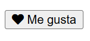

## Fuentes en CSS

En CSS, puedes cambiar la fuente del texto utilizando la propiedad `font-family`. Esta propiedad permite especificar una lista de fuentes, y si la primera no está disponible, se utilizarán las siguientes hasta encontrar una que esté disponible en el sistema del usuario.

### 1. **Uso básico de `font-family`:**
La propiedad `font-family` define la fuente del texto. Puedes especificar varias fuentes separadas por comas. Si una fuente no está disponible, se utilizará la siguiente en la lista. Si la fuente tiene un nombre compuesto por varias palabras, se debe poner entre comillas.

```css
p {
  font-family: "Times New Roman", Times, serif;
}
```

En este ejemplo:
- **"Times New Roman"** es la primera opción.
- **Times** es la segunda opción.
- **serif** es la familia genérica, utilizada como último recurso. Si ninguna de las fuentes anteriores está disponible, el navegador utilizará una fuente serif genérica.

### 2. **Usar fuentes web (Google Fonts, por ejemplo):**
Si deseas utilizar una fuente que no esté instalada en el sistema del usuario, puedes usar servicios como Google Fonts.

#### a. **Incluir la fuente desde Google Fonts:**
Debes agregar un enlace a la hoja de estilo de Google Fonts en la cabecera de tu HTML.

```html
<link href="https://fonts.googleapis.com/css2?family=Roboto&display=swap" rel="stylesheet">
```

#### b. **Aplicar la fuente en tu CSS:**

```css
body {
  font-family: 'Roboto', sans-serif;
}
```

En este ejemplo, **'Roboto'** es la fuente principal y **sans-serif** es la fuente genérica por si no se puede cargar la fuente de Google.

### 3. **Especificar tipos de letra genéricos:**
Es recomendable siempre terminar con una fuente genérica (como `serif`, `sans-serif`, `monospace`), para garantizar que el navegador siempre tenga una fuente de respaldo, aunque no sea exactamente la que deseas.

Tipos de familias genéricas:
- **serif**: Fuentes con serifas, como Times New Roman.
- **sans-serif**: Fuentes sin serifas, como Arial o Helvetica.
- **monospace**: Fuentes de ancho fijo, como Courier.

### 4. **Otras propiedades relacionadas con la fuente:**
Puedes ajustar otras características de la fuente, como el tamaño, estilo y peso.

- **`font-size`:** Ajusta el tamaño de la fuente.
- **`font-style`:** Define el estilo de la fuente (normal, italic, oblique).
- **`font-weight`:** Controla el grosor de la fuente (normal, bold, 100-900).
  
Ejemplo completo:

```css
h1 {
  font-family: 'Arial', sans-serif;
  font-size: 24px;
  font-weight: bold;
  font-style: italic;
}
```

La propiedad principal para cambiar la fuente es `font-family`, pero puedes combinarla con otras propiedades como `font-size`, `font-weight`, y `font-style` para lograr un mayor control sobre el estilo del texto en tus páginas web.

### Font Awesome

**Font Awesome** es una biblioteca de iconos basada en fuentes que te permite agregar íconos escalables a tu sitio web utilizando solo CSS y HTML. Puedes usarlos en botones, listas, enlaces y otros elementos sin necesidad de cargar imágenes, lo que mejora el rendimiento y la flexibilidad de tus diseños.

### **Cómo usar Font Awesome en tu sitio web**

1. **Agregar Font Awesome:**
   Para usar Font Awesome en tu proyecto, puedes incluirlo de varias formas, pero una de las más sencillas es usar la CDN de Font Awesome.

   Añade el siguiente enlace dentro de la etiqueta `<head>` de tu documento HTML:

   ```html
   <link rel="stylesheet" href="https://cdnjs.cloudflare.com/ajax/libs/font-awesome/6.0.0-beta3/css/all.min.css">
   ```

2. **Uso básico de iconos:**
   Una vez que hayas agregado el enlace de Font Awesome, puedes utilizar cualquier ícono de la biblioteca utilizando las clases CSS predefinidas.

   Ejemplo de uso de un ícono de Font Awesome (como el ícono de "corazón") en un botón:

   ```html
   <button>
     <i class="fas fa-heart"></i> Me gusta
   </button>
   ```

   Renderiza:

   

   Aquí, la clase `fas` indica que estamos utilizando un ícono de Font Awesome "solid" (sólido), y `fa-heart` se refiere al ícono de corazón. Los íconos están incrustados en el elemento `<i>` que representa el icono.

### **Tipos de estilos en Font Awesome:**
Font Awesome tiene diferentes estilos para los íconos, y cada uno tiene una clase específica:
   
- **Sólido (Solid):** Usas la clase `fas` (Font Awesome Solid).
  ```html
  <i class="fas fa-home"></i> <!-- Ícono sólido de casa -->
  ```

- **Contorneado (Regular):** Usas la clase `far` (Font Awesome Regular).
  ```html
  <i class="far fa-heart"></i> <!-- Ícono contorneado de corazón -->
  ```

- **Íconos de Marca (Brands):** Para íconos de marcas (por ejemplo, logos de redes sociales como Facebook o Twitter), usas la clase `fab` (Font Awesome Brands).
  ```html
  <i class="fab fa-twitter"></i> <!-- Ícono de Twitter -->
  ```

### **Ejemplos de uso común:**

1. **Agregar un ícono a un enlace:**
   Puedes usar íconos en enlaces para hacer botones más atractivos, como un botón de Twitter:

   ```html
   <a href="https://twitter.com" target="_blank">
     <i class="fab fa-twitter"></i> Síguenos en Twitter
   </a>
   ```

2. **Iconos en listas:**
   Puedes usar Font Awesome para reemplazar las viñetas en una lista.

   ```html
   <ul>
     <li><i class="fas fa-check"></i> Tarea completada</li>
     <li><i class="fas fa-times"></i> Tarea pendiente</li>
   </ul>
   ```

3. **Personalización de iconos:**
   Los íconos de Font Awesome son totalmente escalables y puedes modificar su tamaño, color y espaciado utilizando CSS.

   - **Cambiar el tamaño del ícono:**
     Usa clases como `fa-xs`, `fa-sm`, `fa-lg`, `fa-2x`, `fa-3x`, etc.

     ```html
     <i class="fas fa-camera fa-2x"></i> <!-- Ícono de cámara 2 veces más grande -->
     ```

   - **Cambiar el color del ícono:**
     Aplica CSS directamente sobre el ícono.

     ```html
     <i class="fas fa-star" style="color: gold;"></i> <!-- Ícono de estrella dorado -->
     ```

   - **Girar o animar íconos:**
     Usa clases como `fa-spin` para hacer que un ícono gire continuamente o `fa-rotate` para rotar en un ángulo específico.

     ```html
     <i class="fas fa-sync fa-spin"></i> <!-- Ícono girando -->
     <i class="fas fa-arrow-right fa-rotate-90"></i> <!-- Ícono rotado 90 grados -->
     ```

Font Awesome es una poderosa herramienta para agregar íconos vectoriales a tu sitio web. Es fácil de usar, completamente escalable y te permite personalizar los íconos con CSS estándar. Puedes cambiar su tamaño, color y aplicarles animaciones sin necesidad de imágenes externas, lo que lo convierte en una excelente opción para mejorar la estética y usabilidad de tus proyectos web.
