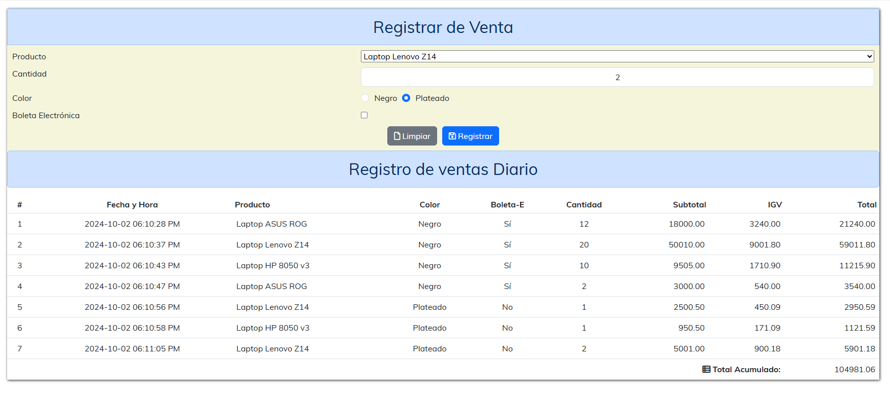

##  PROYECTO 01 - JS

El objetivo es dotar de comportamiento como se muestra en la imagen:

Se ha modificado:

1.  Los elementos del select ya no están en el HTML, se han movido a una variable de JS y se cargan mediante JS.
2.  Se han incluido funciones para inicializar los campos y eventos de los botones.

* El código HTML completo [aquí](projects/v6/index.code.md)
* El código CSS completo [aquí](projects/v6/index.css.code.md)
* El código JS completo [aquí](projects/v6/index.js.code.md)
* En Funcionamiento [aquí](projects/v6/index.html)

