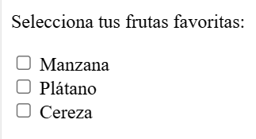
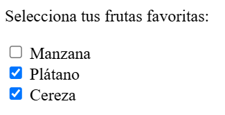
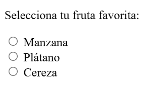
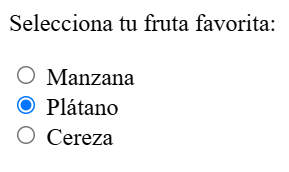
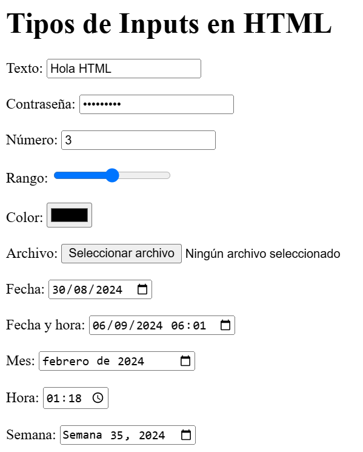
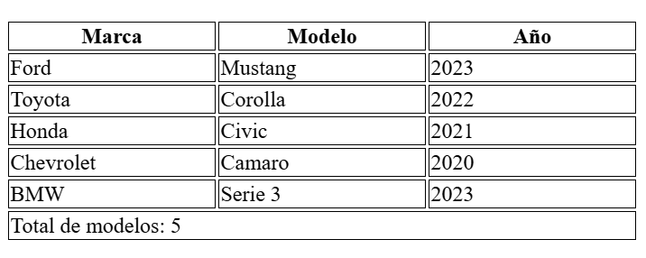

## Elementos visuales

Cuando deseamos crear formularios para que el usuario ingrese datos solemos usar ciertas etiquetas especiales:

1.  Botones [(doc)](https://developer.mozilla.org/es/docs/Web/HTML/Element/button)
    
    La etiqueta es `button`

    ```html
    <button>Aceptar</button>
    ```
    Existe además la opción de usar un `<input type="button" />` , pero debe preferirse usar `button`.
    
    Entre las diferencias básicas está que `button` se le pueden colocar íconos u otros elementos HTML.

    ```html
    <button>
      
      Enviar
    </button>
    ```
    Los botones anteriores renderizan asi:

    

    Revisa: [¿por qué usar button?](#porque-usar-button-en-lugar-de-input-type-button)
    
2.  Etiqueta de acompañamiento [(doc)](https://developer.mozilla.org/es/docs/Web/HTML/Element/label)
    
    La etiqueta es de tipo `label`, acompaña a las cajas de textos, u otros elementos de entrada.
    
    El atributo `for` debe hacer referencia a un `ìd` del elemento referenciado.

    ```html
    <label for="cboMarcas">Escoja una marca:</label>
    ```

    Renderiza asi:

    

3.  Lista de opciones [(doc)](https://developer.mozilla.org/es/docs/Web/HTML/Element/select)
    
    La etiqueta es de tipo `select`.
    
    Cada opción se coloca dentro de un elemento con etiqueta `option`

    ```html
    <select name="marca" id="cboMarcas">
      <option value="volvo">Volvo</option>
      <option value="mazda">Mazda</option>
      <option value="mercedes">Mercedes</option>
      <option value="audi">Audi</option>
    </select>
    ```

    Renderiza asi:

    

    Opciones:

    

4.  Multiples tipos de entrada [(doc)](https://developer.mozilla.org/es/docs/Web/HTML/Element/input)    
    1.  Casilla de verificación (Checkbox) [(wikipedia)](https://es.wikipedia.org/wiki/Casilla_de_verificaci%C3%B3n) [(mdn)](https://developer.mozilla.org/es/docs/Web/HTML/Element/input/checkbox)

        El atributo `type` es `checkbox`, por lo general **se usa cuando se pueden escoger multiples opciones del grupo de opciones**.

        ```html
        <p>Selecciona tu fruta favorita:</p>

        <input type="checkbox" id="manzana" name="fruta" value="manzana">
        <label for="manzana">Manzana</label><br>

        <input type="checkbox" id="platano" name="fruta" value="platano">
        <label for="platano">Plátano</label><br>

        <input type="checkbox" id="cereza" name="fruta" value="cereza">
        <label for="cereza">Cereza</label><br>
        ```

        EL cual renderiza así:

        

        Y así cuando se marcan:

        

        Para conocer cuales fueron las opciones seleccionadas se utiliza el selector css `:checked`, puedes verlo en funcionamiento [aquí](codigos/ejemplo_html10_input_checkbox.html)


    2.  Botón de opción (Radio Button) [(wikipedia)](https://es.wikipedia.org/wiki/Bot%C3%B3n_de_opci%C3%B3n) [(mdn)](https://developer.mozilla.org/en-US/docs/Web/HTML/Element/input/radio)

        El atributo `type` es `radio`, por lo general **se usa cuando solo se puede escoger una sola opción del grupo de opciones**.

        Importante notar que el atributo `name` es el mismo para los 3 elementos.

        ```html
        <p>Selecciona tu fruta favorita:</p>

        <input type="radio" id="manzana" name="fruta" value="manzana">
        <label for="manzana">Manzana</label><br>

        <input type="radio" id="platano" name="fruta" value="platano">
        <label for="platano">Plátano</label><br>

        <input type="radio" id="cereza" name="fruta" value="cereza">
        <label for="cereza">Cereza</label><br>
        ```

        El cual renderiza asi:

        

        Y así cuando se escoge una opción:

        

        Para conocer cuales fueron las opciones seleccionadas se utiliza el selector css `:checked`, puedes verlo en funcionamiento [aquí](codigos/ejemplo_html10_input_radio.html)

    3.  Otros tipos:

        Existen otros tipos que pueden verse en este código:

        ```html
        <!DOCTYPE html>
        <html lang="es">
          <head>
              <meta charset="UTF-8">
              <meta name="viewport" content="width=device-width, initial-scale=1.0">
              <title>Tipos de Inputs en HTML</title>
          </head>
          <body>
              <main>
                  <h1>Tipos de Inputs en HTML</h1>

                  <form>
                      <!-- Texto -->
                      <label for="text">Texto:</label>
                      <input type="text" id="text"><br><br>
                    
                      <!-- Contraseña -->
                      <label for="password">Contraseña:</label>
                      <input type="password" id="password"><br><br>
                    
                      <!-- Número -->
                      <label for="number">Número:</label>
                      <input type="number" id="number"><br><br>

                      <!-- Rango -->
                      <label for="range">Rango:</label>
                      <input type="range" id="range" min="0" max="10"><br><br>
                      
                      <!-- Color -->
                      <label for="color">Color:</label>
                      <input type="color" id="color"><br><br>

                      <!-- Archivo -->
                      <label for="file">Archivo:</label>
                      <input type="file" id="file"><br><br>
                    
                      <!-- Fecha -->
                      <label for="date">Fecha:</label>
                      <input type="date" id="date"><br><br>

                      <!-- Fecha y hora -->
                      <label for="datetime-local">Fecha y hora:</label>
                      <input type="datetime-local" id="datetime-local"><br><br>
                    
                      <!-- Mes -->
                      <label for="month">Mes:</label>
                      <input type="month" id="month"><br><br>
                      
                      <!-- Hora -->
                      <label for="time">Hora:</label>
                      <input type="time" id="time"><br><br>

                      <!-- Semana -->
                      <label for="week">Semana:</label>
                      <input type="week" id="week"><br><br>
                  </form>
              </main>
          </body>
        </html>
        ```

        Los cuales renderizan así:

        

        Puedes verlos en funcionamiento [aquí](codigos/ejemplo_html10_inputs.html)

5.  Tablas

    Es un elemento que se componente de multiples etiquetas:

    ```html
    <table>
      <!-- Cabecera de la tabla -->
      <thead>
          <tr>
              <th>Marca</th>
              <th>Modelo</th>
              <th>Año</th>
          </tr>
      </thead>

      <!-- Cuerpo de la tabla -->
      <tbody>
          <tr>
              <td>Ford</td>
              <td>Mustang</td>
              <td>2023</td>
          </tr>
          <tr>
              <td>Toyota</td>
              <td>Corolla</td>
              <td>2022</td>
          </tr>
          <tr>
              <td>Honda</td>
              <td>Civic</td>
              <td>2021</td>
          </tr>
          <tr>
              <td>Chevrolet</td>
              <td>Camaro</td>
              <td>2020</td>
          </tr>
          <tr>
              <td>BMW</td>
              <td>Serie 3</td>
              <td>2023</td>
          </tr>
      </tbody>

      <!-- Pie de la tabla -->
      <tfoot>
          <tr>
              <td colspan="3">Total de modelos: 5</td>
          </tr>
      </tfoot>
    </table>
    ```

    El código renderiza:

    

    Puedes ver el funcionamiento [aquí](codigos/ejemplo_html10table.html)  

    * Estructura de la Tabla: La tabla se divide en tres partes principales usando las etiquetas `<thead>`, `<tbody>`, y `<tfoot>`.
   
    * **`<thead>` (Encabezado de la Tabla)**: Esta sección contiene la fila de encabezado que describe las columnas: "Marca", "Modelo", y "Año". 

    * **`<tbody>` (Cuerpo de la Tabla)**: Esta sección contiene las filas con los datos de los modelos de autos. Cada fila (`<tr>`) representa un modelo de auto con sus datos correspondientes en las celdas (`<td>`).

    * **`<tfoot>` (Pie de la Tabla)**: Esta sección se utiliza para resumir o mostrar información adicional. En este caso, muestra el "Total de modelos", que es 5. Utilizamos el atributo `colspan="3"` para hacer que esta celda abarque las tres columnas.
  
    * **`<tr>`**: Define una fila en una tabla. Cada fila puede contener múltiples celdas de datos (`<td>`).
  
    * **`<td>`**: Define una celda de datos dentro de una fila (`<tr>`). Cada celda representa un valor en una columna específica de esa fila.
6.  
##### ¿Porque usar button en lugar de input type button?

| **Característica** | **`<button>`** | **`<input type="button">`** | 
|---|---|---| 
| **Flexibilidad de Contenido** | Puede contener contenido HTML como texto con formato, imágenes o iconos. | Solo puede contener texto plano definido por el atributo `value`. | 
| **Semántica Mejorada** | Más semántico y expresivo, mejora la accesibilidad y la comprensión del código. | Menos semántico y menos claro en términos de intención y funcionalidad. | 
| **Atributo `type` Versátil** | Puede especificar `type="button"`, `type="submit"` o `type="reset"`. | Solo es de tipo `button`; para otros tipos se necesitan diferentes elementos `<input>`. | 
| **Estilización** | Más fácil aplicar estilos CSS y manejar diferentes estados (`:hover`, `:active`, `:focus`). | Menos flexible para aplicar estilos y estados interactivos. | 
| **Contenido Limitado** | Permite incluir elementos HTML internos, lo que ofrece mayor personalización. | Limitado a texto plano; no puede incluir otros elementos HTML. | 
| **Uso Recomendado** | **Recomendado** como buena práctica debido a su flexibilidad y semántica mejorada. | Menos recomendable por sus limitaciones en funcionalidad y flexibilidad. |

##### Referencias
1. Iconos gratuitos
   1. https://www.svgrepo.com/
   2. https://iconos8.es/
   3. https://icones.js.org/
2. 