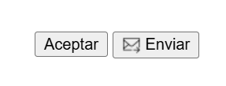
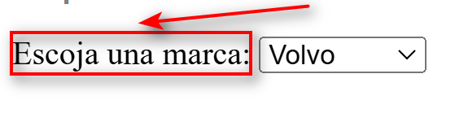
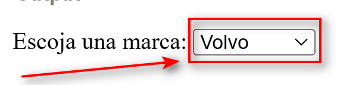
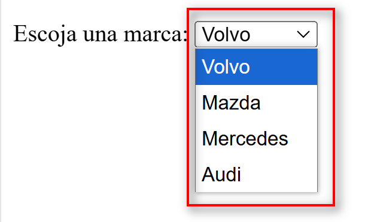

## Elementos visuales
1.  Botones [(doc)](https://developer.mozilla.org/es/docs/Web/HTML/Element/button)
    La etiqueta es `button`

    ```html
    <button>Aceptar</button>
    ```
    Existe además la opción de usar un `<input type="button" />` , pero debe preferirse usar `button`.
    
    Entre las diferencias básicas está que `button` se le pueden colocar íconos u otros elementos HTML.

    ```html
    <button>
      
      Enviar
    </button>
    ```
    Los botones anteriores renderizan asi:

    
    
2.  Etiqueta de acompañamiento [(doc)](https://developer.mozilla.org/es/docs/Web/HTML/Element/label)
    La etiqueta es de tipo `label`, acompaña a las cajas de textos, u otros elementos de entrada.
    El atributo `for` debe hacer referencia a un `ìd` del elemento referenciado.

    ```html
    <label for="cboMarcas">Escoja una marca:</label>
    ```

    Renderiza asi:
    

3.  Lista de opciones [(doc)](https://developer.mozilla.org/es/docs/Web/HTML/Element/select)
    La etiqueta es de tipo `select`.
    Cada opción se coloca dentro de un elemento con etiqueta `option`

    ```html
    <select name="marca" id="cboMarcas">
      <option value="volvo">Volvo</option>
      <option value="mazda">Mazda</option>
      <option value="mercedes">Mercedes</option>
      <option value="audi">Audi</option>
    </select>
    ```

    Renderiza asi:
    

    Opciones:
    

4.  Multiples tipos de entrada [(doc)](https://developer.mozilla.org/es/docs/Web/HTML/Element/input)
    1.  Casilla de verificación (Checkbox) [(wikipedia)](https://es.wikipedia.org/wiki/Casilla_de_verificaci%C3%B3n) [(mdn)](https://developer.mozilla.org/es/docs/Web/HTML/Element/input/checkbox)
    2.  Botón de opción (Radio Button) [(wikipedia)](https://es.wikipedia.org/wiki/Bot%C3%B3n_de_opci%C3%B3n) [(mdn)](https://developer.mozilla.org/en-US/docs/Web/HTML/Element/input/radio)
    3.  
5.  

##### ¿Porque usar button en lugar de input type button?

| **Característica** | **`<button>`** | **`<input type="button">`** | 
|---|---|---| 
| **Flexibilidad de Contenido** | Puede contener contenido HTML como texto con formato, imágenes o iconos. | Solo puede contener texto plano definido por el atributo `value`. | 
| **Semántica Mejorada** | Más semántico y expresivo, mejora la accesibilidad y la comprensión del código. | Menos semántico y menos claro en términos de intención y funcionalidad. | 
| **Atributo `type` Versátil** | Puede especificar `type="button"`, `type="submit"` o `type="reset"`. | Solo es de tipo `button`; para otros tipos se necesitan diferentes elementos `<input>`. | 
| **Estilización** | Más fácil aplicar estilos CSS y manejar diferentes estados (`:hover`, `:active`, `:focus`). | Menos flexible para aplicar estilos y estados interactivos. | 
| **Contenido Limitado** | Permite incluir elementos HTML internos, lo que ofrece mayor personalización. | Limitado a texto plano; no puede incluir otros elementos HTML. | 
| **Uso Recomendado** | **Recomendado** como buena práctica debido a su flexibilidad y semántica mejorada. | Menos recomendable por sus limitaciones en funcionalidad y flexibilidad. |

##### Referencias
1. Iconos gratuitos
   1. https://www.svgrepo.com/
   2. https://iconos8.es/
2. 