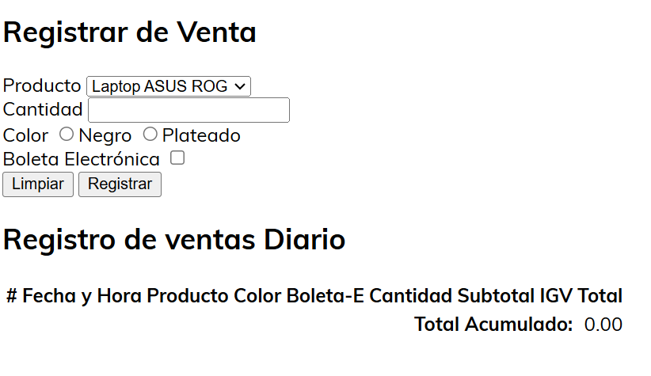
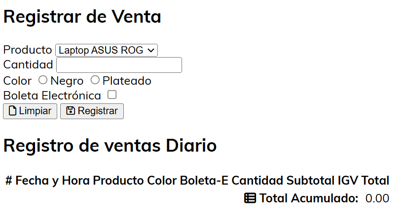
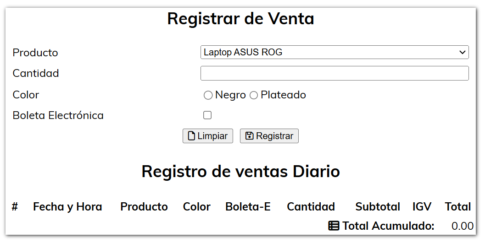
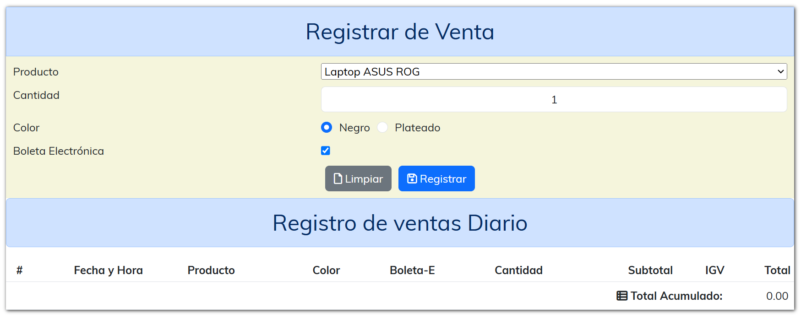
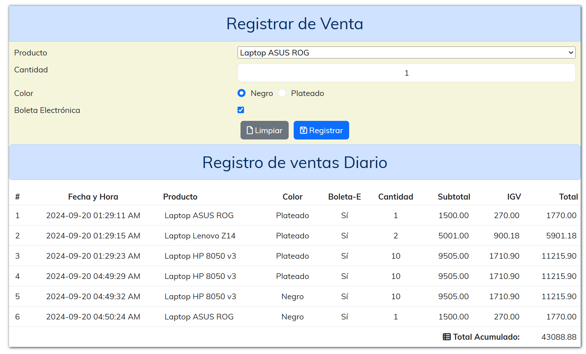

##  PROYECTO 01 - CSS

Vamos a realizar algunas modificaciones:

1.  Aplicamos una fuente al documento:

    Usaremos la fuente [Muli](https://www.fontsquirrel.com/fonts/muli)

    La usamos desde el CDN:

    ```html
    <!-- HTML -->
    <link href="https://fonts.cdnfonts.com/css/muli" rel="stylesheet"
    ```
    ```css
    /* CSS */
    body {
      font-family: 'Muli';
    }
    ```

    El renderizado es:

    

    * El código HTML completo [aquí](projects/v2/index.code.md)
    * El código CSS completo [aquí](projects/v2/index.css.code.md)
    * En Funcionamiento [aquí](projects/v2/index.html)

2.  Colocamos íconos de font awesome a los botones
    Usaremos la fuente [Font Awesome](https://fontawesome.com/v6)

    La usamos desde el CDN:

    ```html
    <!-- HTML -->
    <link rel="stylesheet" href="https://cdnjs.cloudflare.com/ajax/libs/font-awesome/6.6.0/css/all.min.css" />
    
    <!-- botones -->
    <div class="botones">
      <button id="btnLimpiar" type="reset">
        <i class="fa-regular fa-file"></i>
        Limpiar
      </button>
      <button id="btnRegistrar" type="button">
        <i class="fa-regular fa-floppy-disk"></i>
        Registrar
      </button>
    </div>

    <!-- Pie de Tabla Total -->
    <td colspan="8" style="text-align: right;">
      <strong>
        <i class="fa-solid fa-table-list"></i>
        Total Acumulado:
      </strong>
    </td>
    ```
    ```css
    /* CSS */
    /* Sin cambios*/
    ```

    El renderizado es:
    
    

    * El código HTML completo [aquí](projects/v3/index.code.md)
    * El código CSS completo [aquí](projects/v3/index.css.code.md)
    * En Funcionamiento [aquí](projects/v3/index.html)

3.  Ahora aplicaremos flexbox
    ```html
    <!-- HTML -->
    <!-- Sin cambios -->
    ```
    ```css
    /* CSS */
    /* Estiliza el contenedor principal de la página */
    main {
      box-shadow: 1px 1px 5px #222; /* Añade una sombra alrededor del contenedor con un desplazamiento leve y un desenfoque ligero para darle profundidad */
    }

    main {
      width: 30%; /* Establece que el ancho del contenedor principal sea el 30% del ancho disponible */
      max-width: 100%; /* Garantiza que el ancho máximo no exceda el 100% del espacio disponible, evitando desbordes */
      margin-left: auto; /* Centra el contenedor horizontalmente al aplicar márgenes automáticos */
      margin-right: auto; /* Centra el contenedor horizontalmente al aplicar márgenes automáticos */
    }

    /* Estiliza los encabezados de nivel 2 dentro del contenedor principal */
    h2 {
      text-align: center; /* Centra el texto de los encabezados h2 dentro de su contenedor */
    }

    /* CSS para el formulario */
    #frmRegistro {
      width: 100%; /* El formulario ocupa el 100% del ancho disponible de su contenedor */
      margin-left: auto; /* Centra el formulario horizontalmente al aplicar márgenes automáticos */
      margin-right: auto; /* Centra el formulario horizontalmente al aplicar márgenes automáticos */
      display: flex; /* Utiliza un modelo de caja flexible para organizar los elementos hijos */
      flex-direction: column; /* Organiza los elementos hijos del formulario en una columna vertical */
    }

    /* Estilos aplicados a todos los elementos hijos directos del formulario */
    #frmRegistro > * {
      padding-top: 5px; /* Añade un espaciado superior de 5px a cada elemento */
      padding-bottom: 5px; /* Añade un espaciado inferior de 5px a cada elemento */
      display: flex; /* Aplica un modelo de caja flexible a cada hijo para alinearlos correctamente */
    }

    /* Estiliza las etiquetas del formulario */
    #frmRegistro label {
      display: inline-table; /* Muestra las etiquetas como tablas en línea, lo que facilita la alineación de texto */
      width: 40%; /* Establece que las etiquetas ocupen el 40% del ancho disponible dentro del formulario */
      padding-left: 10px; /* Añade un espaciado a la izquierda de las etiquetas para separarlas del contenido */
    }

    /* Estilos específicos para los elementos select del formulario */
    #frmRegistro select {
      flex: 1; /* Permite que el elemento select se expanda para ocupar el espacio disponible */
      margin-right: 10px; /* Añade un margen derecho de 10px para separar del siguiente elemento */
    }

    /* Estilos específicos para los campos de texto dentro del formulario */
    #frmRegistro input[type="text"] {
      flex: 1; /* Permite que el campo de texto se expanda para ocupar el espacio disponible */
      text-align: center; /* Centra el texto dentro del campo de entrada */
      margin-right: 10px; /* Añade un margen derecho de 10px para separar del siguiente elemento */
    }

    /* Estiliza la sección de botones */
    .botones {
      text-align: center; /* Centra el contenido de la sección de botones */
      justify-content: center; /* Alinea los botones de manera centrada usando Flexbox */
    }

    /* Estilo específico para los botones de tipo "reset" */
    .botones > button[type="reset"] {
      margin-right: 5px; /* Añade un margen a la derecha para separar del siguiente botón */
    }

    /* Estilo específico para los botones de tipo "button" */
    .botones > button[type="button"] {
      margin-left: 5px; /* Añade un margen a la izquierda para separar del botón anterior */
    }

    /* CSS para la tabla de ventas */
    #tblVentas {
      width: 100%; /* La tabla ocupa el 100% del ancho disponible dentro de su contenedor */
      max-width: 100%; /* Garantiza que el ancho de la tabla no exceda el 100% del espacio disponible */
      margin-left: auto; /* Centra la tabla horizontalmente al aplicar márgenes automáticos */
      margin-right: auto; /* Centra la tabla horizontalmente al aplicar márgenes automáticos */
    }

    /* Estiliza los encabezados de la tabla */
    #tblVentas th {
      padding: 5px; /* Añade un espaciado de 5px alrededor de los encabezados de la tabla para mejorar la legibilidad */
    }

    /* Clase para centrar texto */
    .center-align {
      text-align: center; /* Centra el texto de los elementos que utilizan esta clase */
    }

    /* Clase para alinear texto a la izquierda */
    .left-align {
      text-align: left; /* Alinea el texto de los elementos que utilizan esta clase a la izquierda */
    }

    /* Clase para alinear texto a la derecha */
    .right-align {
      text-align: right; /* Alinea el texto de los elementos que utilizan esta clase a la derecha */
    }

    ```

    El renderizado es:
    
    

    * El código HTML completo [aquí](projects/v4/index.code.md)
    * El código CSS completo [aquí](projects/v4/index.css.code.md)
    * En Funcionamiento [aquí](projects/v4/index.html)
  
4.  Ahora vamos a agregar bootstrap
    
    El renderizado es:
    
        

    <!--  -->

    * El código HTML completo [aquí](projects/v5/index.code.md)
    * El código CSS completo [aquí](projects/v5/index.css.code.md)
    * En Funcionamiento [aquí](projects/v5/index.html)
    
5.  