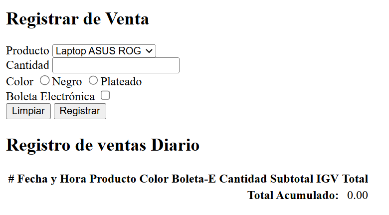

## Proyecto 01 - HTML

La idea es crear un formulario web que permita registrar la venta de artículos de cómputo, bajo las siguientes premisas:

1.  Se debe escoger los artículos de una lista desplegable
2.  El usuario debe ingresar la cantidad de artículos.
3.  El usuario debe ingresar el color del artículo.
4.  El usuario debe ingresar si se debe generar boleta electrónica.
5.  Debe tener un botón limpiar que blanquea todos los campos.
6.  Debe tener un botón de registrar que realiza el registro en una tabla HTML.
7.  Debe tener una tabla que contiene los datos.

Con todo lo básico de HTML que se ha visto se puede va a realizar un documento HTML.

La primera versión del HTML sería:
1. [Código](projects/v1/index.code.md)
2. [Funcionamiento](projects/v1/index.html)

El renderizado actual es:

Proximamente aplicaremos CSS.