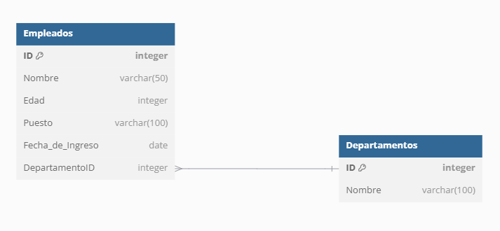
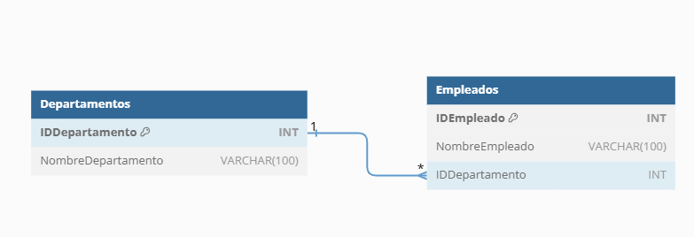
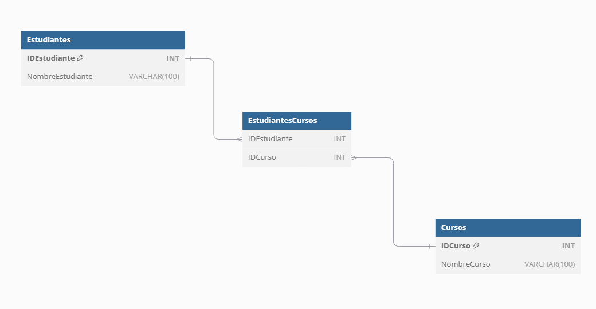

## Relaciones entre tablas

1. **Claves foráneas (Foreign Key)**:
   - Una clave foránea es una columna en una tabla que se utiliza para establecer una relación entre esa tabla y otra tabla. Representa una referencia a la clave primaria de otra tabla.
   - Ejemplo: En una tabla de "Empleados", podría haber una clave foránea que apunte a una tabla de "Departamentos", donde cada empleado está asociado con un departamento.

En una base de datos relacional, las tablas pueden estar **relacionadas** entre sí. Por ejemplo, podrías tener una tabla de **Departamentos**, y cada empleado en la tabla de **Empleados** (del ejemplo previo) estaría asociado con un departamento:

```sql
CREATE TABLE Departamentos (
    ID INT PRIMARY KEY,         -- Identificador único del departamento
    Nombre VARCHAR(100)         -- Nombre del departamento
);
```

Gráficamente:


Para establecer una relación entre empleados y departamentos, podríamos agregar una clave foránea en la tabla de empleados:

```sql
ALTER TABLE Empleados
ADD COLUMN DepartamentoID INT,
ADD FOREIGN KEY (DepartamentoID) REFERENCES Departamentos(ID);
```

Ahora, cada empleado puede estar asociado con un departamento a través de la columna `DepartamentoID`, que es una clave foránea que apunta a la clave primaria `ID` en la tabla `Departamentos`.

Gráficamente:



### Tipos de relaciones entre tablas

En las bases de datos relacionales, las **relaciones entre tablas** permiten organizar y conectar datos distribuidos en diferentes tablas. Estas relaciones se basan en la **clave primaria** (que identifica de manera única un registro en una tabla) y la **clave foránea** (que hace referencia a una clave primaria en otra tabla). Las relaciones ayudan a mantener la integridad y consistencia de los datos. Existen tres tipos principales de relaciones entre tablas:

### 1. **Relación Uno a Uno (1:1)**

En una relación uno a uno, cada registro en la tabla A está relacionado con un solo registro en la tabla B, y viceversa. Este tipo de relación es menos común en las bases de datos porque a menudo es más eficiente combinar ambas tablas en una sola. Sin embargo, se puede utilizar cuando se desea separar los datos por motivos de seguridad, privacidad o para mantener una tabla con menos columnas.

#### Ejemplo:
Supongamos que tienes una tabla `Personas` y una tabla `Pasaportes`, y cada persona puede tener solo un pasaporte, y cada pasaporte pertenece a una sola persona.

- **Tabla Personas**:
  - `IDPersona` (clave primaria)
  - `Nombre`
  
- **Tabla Pasaportes**:
  - `IDPasaporte` (clave primaria)
  - `IDPersona` (clave foránea que apunta a la clave primaria de `Personas`)
  - `NumeroPasaporte`

En este caso, cada persona tiene un pasaporte único y cada pasaporte está asignado a una persona.

```sql
CREATE TABLE Personas (
    IDPersona INT PRIMARY KEY,
    Nombre VARCHAR(100)
);

CREATE TABLE Pasaportes (
    IDPasaporte INT PRIMARY KEY,
    IDPersona INT UNIQUE,
    NumeroPasaporte VARCHAR(50),
    FOREIGN KEY (IDPersona) REFERENCES Personas(IDPersona)
);
```

Gráficamente:


### 2. **Relación Uno a Muchos (1:N)**

Esta es la relación más común en bases de datos relacionales. En una relación uno a muchos, un registro en la tabla A puede estar relacionado con múltiples registros en la tabla B, pero cada registro en la tabla B solo está relacionado con un registro en la tabla A.

#### Ejemplo:
Considera una tabla `Departamentos` y una tabla `Empleados`. Un departamento puede tener muchos empleados, pero cada empleado pertenece a un solo departamento.

- **Tabla Departamentos**:
  - `IDDepartamento` (clave primaria)
  - `NombreDepartamento`
  
- **Tabla Empleados**:
  - `IDEmpleado` (clave primaria)
  - `NombreEmpleado`
  - `IDDepartamento` (clave foránea que apunta a la clave primaria de `Departamentos`)

```sql
CREATE TABLE Departamentos (
    IDDepartamento INT PRIMARY KEY,
    NombreDepartamento VARCHAR(100)
);

CREATE TABLE Empleados (
    IDEmpleado INT PRIMARY KEY,
    NombreEmpleado VARCHAR(100),
    IDDepartamento INT,
    FOREIGN KEY (IDDepartamento) REFERENCES Departamentos(IDDepartamento)
);
```

Gráficamente:



En este caso, cada departamento puede tener muchos empleados, pero cada empleado pertenece a un solo departamento.

### 3. **Relación Muchos a Muchos (N:M)**

En una relación muchos a muchos, un registro en la tabla A puede estar relacionado con muchos registros en la tabla B, y viceversa. Este tipo de relación no se puede implementar directamente entre dos tablas en una base de datos relacional; en su lugar, se utiliza una **tabla intermedia** que actúa como un puente entre las dos tablas y almacena las relaciones.

#### Ejemplo:
Considera una tabla `Estudiantes` y una tabla `Cursos`. Un estudiante puede inscribirse en varios cursos, y un curso puede tener varios estudiantes.

- **Tabla Estudiantes**:
  - `IDEstudiante` (clave primaria)
  - `NombreEstudiante`
  
- **Tabla Cursos**:
  - `IDCurso` (clave primaria)
  - `NombreCurso`

Para representar la relación muchos a muchos entre estudiantes y cursos, necesitamos una tabla intermedia llamada `EstudiantesCursos`:

- **Tabla EstudiantesCursos**:
  - `IDEstudiante` (clave foránea que apunta a `Estudiantes`)
  - `IDCurso` (clave foránea que apunta a `Cursos`)

```sql
CREATE TABLE Estudiantes (
    IDEstudiante INT PRIMARY KEY,
    NombreEstudiante VARCHAR(100)
);

CREATE TABLE Cursos (
    IDCurso INT PRIMARY KEY,
    NombreCurso VARCHAR(100)
);

CREATE TABLE EstudiantesCursos (
    IDEstudiante INT,
    IDCurso INT,
    PRIMARY KEY (IDEstudiante, IDCurso),
    FOREIGN KEY (IDEstudiante) REFERENCES Estudiantes(IDEstudiante),
    FOREIGN KEY (IDCurso) REFERENCES Cursos(IDCurso)
);
```

Gráficamente:



En este caso, la tabla intermedia `EstudiantesCursos` permite almacenar las relaciones entre estudiantes y cursos. Un estudiante puede estar inscrito en varios cursos, y un curso puede tener varios estudiantes.

### Resumen:

| Tipo de relación      | Descripción                                                    | Ejemplo               |
|---|---|---|
| **Uno a Uno (1:1)**    | Cada registro en una tabla está relacionado con un único registro en otra tabla. | Persona y Pasaporte   |
| **Uno a Muchos (1:N)** | Un registro en una tabla está relacionado con varios registros en otra tabla. | Departamento y Empleados |
| **Muchos a Muchos (N:M)** | Un registro en una tabla puede estar relacionado con varios registros en otra tabla y viceversa. | Estudiantes y Cursos |

Las relaciones entre tablas son fundamentales en el modelo de bases de datos relacional porque permiten **organizar** y **conectar** datos de manera eficiente, manteniendo la integridad y evitando redundancia de información.