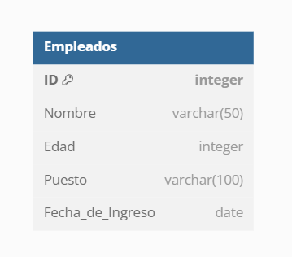

## Tablas SQL

En SQL, una **tabla** es una estructura fundamental utilizada para almacenar datos en un **sistema de gestión de bases de datos relacional (RDBMS)**. Cada tabla se organiza en filas (**registros**) y columnas (**campos**), donde cada columna representa un atributo o propiedad de los datos y cada fila contiene un conjunto de valores que representan una instancia de esos datos.

### Características clave de una tabla en SQL:

1. **Columnas (Campos o Atributos)**:
   - Cada tabla tiene una serie de columnas que definen los tipos de datos que se almacenan en ella. Cada columna tiene un nombre único y un tipo de dato (por ejemplo, `INT`, `VARCHAR`, `DATE`, etc.).
   - Las columnas representan las propiedades o características de los datos que queremos almacenar.
   - Ejemplo de columnas en una tabla de empleados: `ID`, `Nombre`, `Edad`, `Puesto`, `Fecha_de_Ingreso`.

2. **Filas (Registros o Tuplas)**:
   - Cada fila en una tabla representa un conjunto único de datos. Cada fila contiene valores para todas las columnas de la tabla.
   - Las filas representan instancias de datos. En una tabla de empleados, cada fila sería un empleado con sus correspondientes detalles.

3. **Claves primarias (Primary Key)**:
   - Una clave primaria es una columna o combinación de columnas que garantiza la **unicidad** de cada fila dentro de la tabla. No pueden existir dos filas con el mismo valor en la clave primaria, y este valor no puede ser `NULL`.
   - Ejemplo: En una tabla de empleados, la columna `ID` podría ser la clave primaria, asegurando que cada empleado tenga un identificador único.

4. **Tipos de datos**:
   - Cada columna en una tabla tiene un tipo de dato específico que define qué tipo de valor puede almacenar (por ejemplo, enteros, texto, fechas, etc.). Esto garantiza que los datos sean almacenados de manera consistente.
   - Ejemplos de tipos de datos: `INT` (enteros), `VARCHAR` (cadena de caracteres), `DATE` (fechas), `BOOLEAN` (verdadero/falso).

### Ejemplo de una tabla en SQL

Imagina que queremos almacenar información sobre empleados en una base de datos. Podemos definir una tabla llamada `Empleados` con las siguientes columnas:

```sql
CREATE TABLE Empleados (
    ID INT PRIMARY KEY,         -- Identificador único del empleado
    Nombre VARCHAR(100),        -- Nombre del empleado
    Edad INT,                   -- Edad del empleado
    Puesto VARCHAR(100),        -- Puesto del empleado
    Fecha_de_Ingreso DATE       -- Fecha en que el empleado ingresó a la empresa
);
```

Gráficamente:



#### Explicación de la tabla:

- La tabla `Empleados` tiene cinco columnas: `ID`, `Nombre`, `Edad`, `Puesto`, y `Fecha_de_Ingreso`.
- `ID` es la **clave primaria** (PRIMARY KEY), lo que significa que cada empleado tiene un número de identificación único.
- `Nombre` y `Puesto` son cadenas de caracteres (`VARCHAR`) que pueden almacenar hasta 100 caracteres.
- `Edad` es un número entero (`INT`), mientras que `Fecha_de_Ingreso` es de tipo fecha (`DATE`).

### Ejemplo de inserción de datos en la tabla:

Una vez que se ha creado la tabla, puedes agregar datos a ella utilizando la sentencia `INSERT`:

```sql
INSERT INTO Empleados (ID, Nombre, Edad, Puesto, Fecha_de_Ingreso)
VALUES (1, 'Carlos Pérez', 30, 'Ingeniero de Software', '2022-05-15');
```

Esto añade una fila (registro) a la tabla `Empleados` con la información de un empleado llamado Carlos Pérez.
