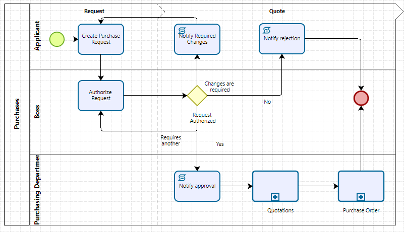

## BPM - Business Process Management

**BPM (Business Process Management)** y **BPMN (Business Process Model and Notation)** son dos conceptos relacionados pero diferentes, ambos enfocados en la mejora, gestión y automatización de los procesos empresariales. Vamos a explicarlos de manera clara y sencilla para tu curso.

### ¿Qué es **BPM** (Business Process Management)?
**BPM**, o **Gestión de Procesos de Negocio**, es una disciplina que tiene como objetivo **mejorar la eficiencia y la eficacia de los procesos empresariales**. Implica analizar, modelar, optimizar y automatizar los procesos de una organización para que funcionen de manera más eficiente, reduciendo costos y mejorando los resultados.

#### Características Clave de BPM
1. **Optimización de procesos**: Identificar ineficiencias en los procesos empresariales existentes y encontrar formas de mejorarlos.
2. **Automatización**: Usar software para automatizar partes de los procesos empresariales y reducir la intervención humana.
3. **Análisis y Mejora Continua**: Medir constantemente los resultados de los procesos y hacer ajustes para mejorar.
4. **Colaboración Interdepartamental**: BPM asegura que los procesos fluyan correctamente entre los diferentes departamentos de una empresa.

#### Ejemplo Práctico de BPM:
Imagina una empresa que tiene un proceso de aprobación de compras. Actualmente, este proceso es manual: un empleado llena un formulario, lo envía por correo a un supervisor, el supervisor lo aprueba y lo envía al departamento de compras. Este proceso puede tardar días.

Con BPM, puedes **optimizar** este proceso utilizando una herramienta automatizada. El empleado llena un formulario digital, el sistema lo envía automáticamente al supervisor y, una vez aprobado, lo manda directamente al departamento de compras, reduciendo significativamente el tiempo y evitando errores manuales.

### Ciclo de Vida del BPM
El ciclo de vida típico en la gestión de procesos de negocio es el siguiente:

1. **Diseño**: Se modelan los procesos actuales y se identifican áreas de mejora.
2. **Modelado**: Se crea una versión mejorada del proceso.
3. **Ejecución**: El nuevo proceso se implementa, ya sea manualmente o mediante software.
4. **Monitoreo**: Se supervisa el proceso para asegurarse de que funcione como se espera.
5. **Optimización**: Basado en los resultados, se ajusta y mejora el proceso.

## ¿Qué es **BPMN** (Business Process Model and Notation)?

[Web Oficial](https://www.omg.org/spec/BPMN/2.0.2/About-BPMN)
[Specification](https://www.omg.org/spec/BPMN/2.0.2/PDF)

**BPMN** es un estándar gráfico que se utiliza para **modelar procesos de negocio** de manera visual y comprensible para todos los involucrados (desde los analistas de negocio hasta los desarrolladores de software). Es una herramienta clave dentro de la disciplina BPM para diseñar, analizar y documentar procesos.

#### Características Clave de BPMN
1. **Notación Estándar**: BPMN utiliza una notación visual estándar que facilita la comprensión del proceso, independientemente de la audiencia.
2. **Simulación**: BPMN no solo permite la visualización del proceso, sino también la simulación para evaluar su eficiencia antes de implementarlo.
3. **Conexión entre Negocio y TI**: BPMN permite a los analistas de negocio diseñar un proceso que luego puede ser entendido e implementado por el equipo técnico.

#### Símbolos Principales de BPMN

- **Eventos (círculos)**: Son los puntos que marcan el inicio, fin o algo que ocurre durante el proceso (Ej: inicio de una tarea, recepción de un mensaje).
  
  - Evento de inicio (círculo vacío): Marca el inicio de un proceso.
  - Evento de fin (círculo relleno): Marca el fin de un proceso.

- **Actividades (rectángulos redondeados)**: Representan las tareas o acciones realizadas en el proceso.
  
  Ejemplo: "Aprobar Solicitud", "Enviar Factura".

- **Decisiones o Puertas (diamantes)**: Representan puntos donde se toma una decisión que influye en el flujo del proceso.
  
  Ejemplo: "¿Está aprobado?", con posibles salidas como "Sí" o "No".

- **Flujo de secuencia (flechas)**: Indican el flujo o la secuencia de las actividades en el proceso.

- **Piscinas (Pools) y Carriles (Lanes)**: Dividen el proceso en diferentes secciones para mostrar qué departamentos o individuos son responsables de cada actividad.

### Diferencias entre BPM y BPMN

- **BPM** es la **disciplina** que se enfoca en la gestión, análisis, y mejora de los procesos de negocio. Involucra prácticas, estrategias y tecnologías para optimizar los procesos empresariales.
  
- **BPMN** es la **notación gráfica** o herramienta utilizada para modelar los procesos empresariales en BPM. BPMN es uno de los métodos que se usan para representar gráficamente los procesos en un esfuerzo de BPM.

### Ventajas del Uso de BPMN en BPM
1. **Claridad**: BPMN proporciona una forma visual clara de entender los procesos empresariales.
2. **Comunicación entre áreas**: Facilita la comunicación entre diferentes equipos (negocio y tecnología) ya que utiliza una notación estándar comprensible por ambas partes.
3. **Identificación de Cuellos de Botella**: Los diagramas BPMN ayudan a detectar puntos donde los procesos pueden ser lentos o ineficientes.
4. **Optimización antes de la Implementación**: Permite modelar y simular el proceso antes de implementarlo, asegurando que es eficiente.

### Resumiendo
- **BPM** es la gestión completa de los procesos empresariales con el objetivo de hacerlos más eficientes mediante el análisis, mejora y automatización.
- **BPMN** es un lenguaje gráfico estándar utilizado dentro de BPM para modelar procesos de negocio de manera clara y comprensible.

Ambos conceptos son cruciales en la transformación digital de las empresas, ya que permiten entender y optimizar cómo funcionan las organizaciones a nivel de procesos.

### Ejemplo usando Bizagi:

Podemos apreciar un ejemplo de un proceso usando Bizagi Process Modeler.

[Descarga Bizagi Process Modeler](https://www.bizagi.com/es/plataforma/pruebe-modeler)

[Documentación](https://help.bizagi.com/platform/es/index.html?my_first_model.htm)

##### Referencias

Un buen material de inicio está en [BPMN Guia de Referencia y Modelado](https://users.dcc.uchile.cl/~nbaloian/DSS-DCC/Software/ModeladoBPMN.pdf)