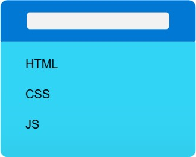
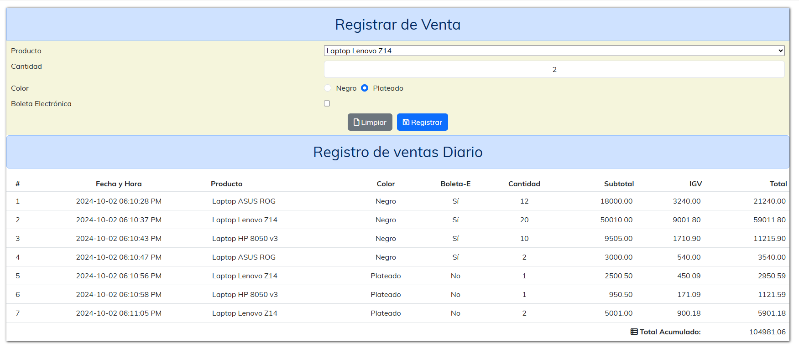

## Resumen del proyecto 01

Hasta ahora tenemos una web que utiliza:

|Lenguaje|Tipo|Uso|Implementación
|---|---|---|---|
|HTML|Lenguaje de Marcado| Contenido de la web| Todos los elementos HTML
|CSS| Lenguaje de Estilos| Formato visual de la web|- Fuentes - Iconos< - Bootstrap
|JS|Lenguaje de Programación| Manipulación del DOM |- Carga de listado de Productos - Inserción de datos en la tabla HTML

Nuestro diagrama de la aplicación web es:

El resultado es:

