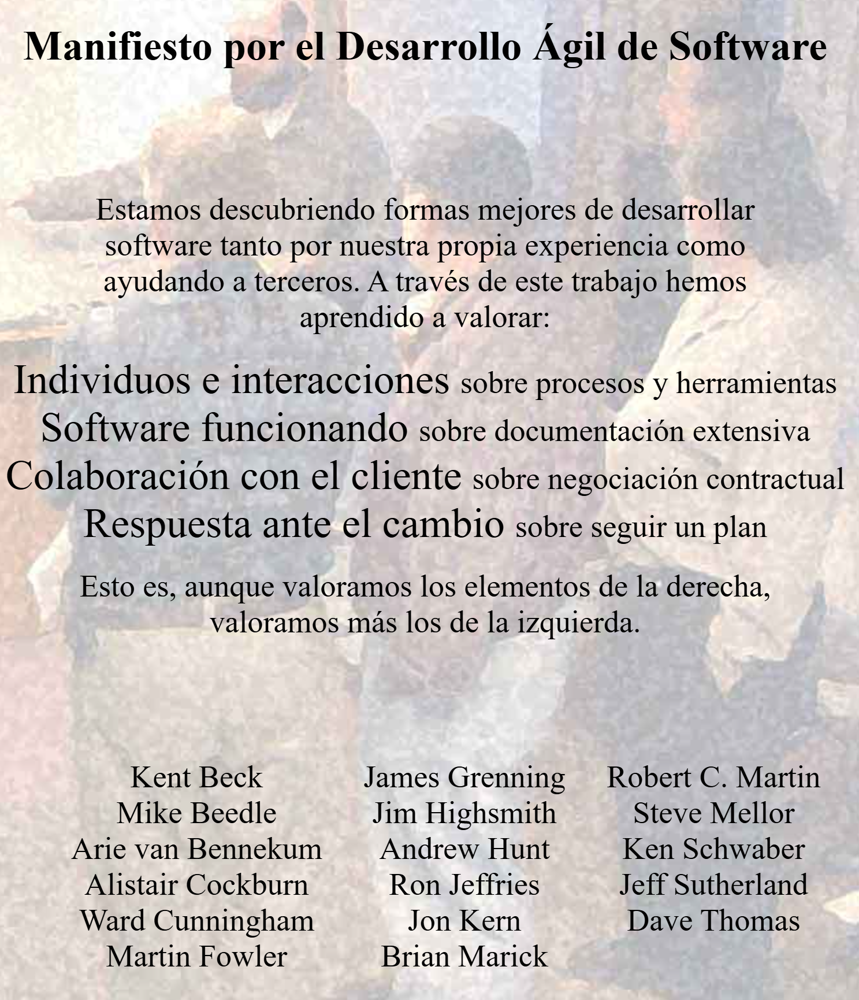
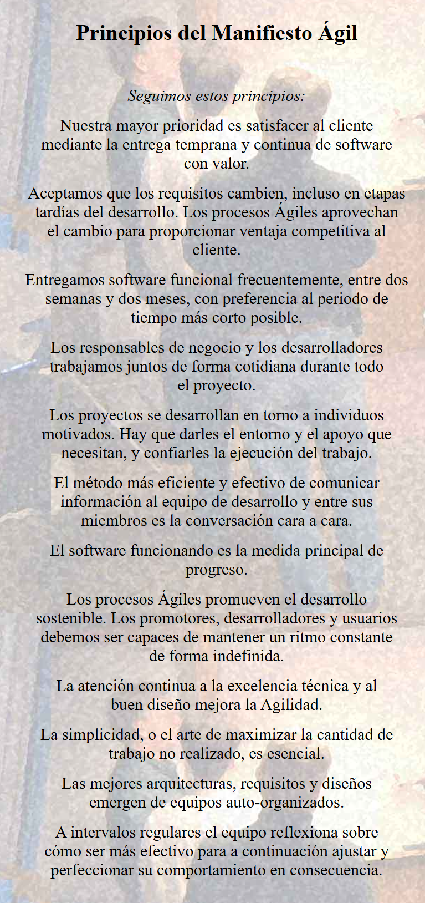

## AGILE

[AGILE - Manifiesto Inglés](https://agilemanifesto.org/iso/en/manifesto.html)
[AGILE - Manifiesto Español](https://agilemanifesto.org/iso/es/manifesto.html)

**Agile** es un enfoque para la gestión de proyectos y desarrollo de software que se centra en la flexibilidad, la colaboración, la entrega rápida de valor y la adaptación continua al cambio. El enfoque Agile se originó en la industria del software, pero sus principios y prácticas han sido adoptados en diversos sectores y disciplinas debido a su capacidad para mejorar la eficiencia, la productividad y la satisfacción del cliente.

### Principales Características de Agile:

1. **Manifiesto Ágil (Agile Manifesto)**:
   - El **Manifiesto Ágil** fue creado en 2001 por un grupo de 17 desarrolladores de software que buscaban una alternativa a los enfoques tradicionales de desarrollo de software, como el modelo en cascada (Waterfall). El manifiesto se basa en **cuatro valores** y **doce principios** que guían el desarrollo ágil de software.

   **Cuatro Valores del Manifiesto Ágil**:
   1. **Individuos e interacciones** sobre procesos y herramientas.
   2. **Software funcionando** sobre documentación exhaustiva.
   3. **Colaboración con el cliente** sobre negociación de contratos.
   4. **Respuesta ante el cambio** sobre seguir un plan.

   **Doce Principios del Manifiesto Ágil**:
   - Satisfacción del cliente mediante la entrega temprana y continua de software de valor.
   - Bienvenida a los requisitos cambiantes, incluso en etapas avanzadas.
   - Entrega frecuente de software funcionando (cada pocas semanas).
   - Colaboración diaria entre el negocio y los desarrolladores.
   - Proyectos construidos en torno a individuos motivados.
   - Comunicación cara a cara como la forma más eficaz y eficiente de transmitir información.
   - Software funcionando como la principal medida de progreso.
   - Sostenibilidad del desarrollo mediante un ritmo constante.
   - Atención continua a la excelencia técnica y buen diseño.
   - Simplicidad, o el arte de maximizar el trabajo no hecho.
   - Los mejores resultados provienen de equipos autoorganizados.
   - Reflexionar regularmente sobre cómo ser más efectivos y ajustar el comportamiento en consecuencia.

2. **Marcos de Trabajo Ágiles**:
   - Agile no es un marco de trabajo en sí mismo, sino un conjunto de principios que pueden ser aplicados a través de varios marcos y metodologías. Algunos de los marcos y metodologías ágiles más populares incluyen:

   - **Scrum**: Se centra en ciclos de desarrollo cortos llamados **Sprints** y un conjunto de roles, eventos y artefactos definidos. Scrum se centra en la entrega iterativa y la mejora continua.
   - **Kanban**: Un método visual para gestionar el trabajo a medida que pasa por un proceso. Utiliza tableros Kanban para mostrar el flujo de trabajo, limitar el trabajo en progreso y optimizar la eficiencia.
   - **Extreme Programming (XP)**: Se centra en las mejores prácticas de desarrollo, como **programación en pares**, **desarrollo dirigido por pruebas (TDD)**, **integración continua** y **revisiones de código**.
   - **Lean Development**: Inspirado en los principios de Lean Manufacturing, se centra en la eliminación de desperdicios, la entrega rápida de valor y la mejora continua.
   - **Crystal**: Un conjunto de metodologías ágiles que varían según el tamaño del equipo, la criticidad del proyecto y las prioridades. Crystal enfatiza la comunicación, la reflexión y la entrega frecuente.
   - **Dynamic Systems Development Method (DSDM)**: Un enfoque ágil centrado en principios de entrega rápida y la colaboración con el cliente.
   - **Feature-Driven Development (FDD)**: Enfocado en entregar características de software en iteraciones cortas.

3. **Componentes Clave de Agile**:
   - **Iteraciones e Incrementos**: El trabajo se divide en ciclos de tiempo cortos (iteraciones o sprints) que producen incrementos funcionales del producto. Cada iteración incluye planificación, desarrollo, pruebas y entrega.
   - **Equipos Multifuncionales y Autoorganizados**: Los equipos ágiles son pequeños, multifuncionales y autoorganizados, lo que les permite tomar decisiones rápidas y adaptarse a los cambios.
   - **Colaboración Continua con el Cliente**: La participación del cliente es fundamental en Agile. Los clientes son parte del equipo y participan en la planificación, revisiones y ajustes del producto.
   - **Retroalimentación Continua y Mejora Continua**: Agile enfatiza la retroalimentación constante y la adaptación continua del proceso y del producto para mejorar.

4. **Prácticas Comunes en Agile**:
   - **Daily Stand-Ups (Reuniones Diarias)**: Reuniones rápidas (generalmente de 15 minutos) para que el equipo se sincronice y discuta los progresos, obstáculos y planes del día.
   - **Backlogs (Product Backlog y Sprint Backlog)**: Listas priorizadas de tareas, requisitos o historias de usuario que deben ser completadas por el equipo.
   - **Retrospectivas**: Reuniones regulares donde el equipo reflexiona sobre lo que funcionó bien, lo que no funcionó y cómo mejorar en el próximo ciclo.
   - **Timeboxing**: Limitar el tiempo que el equipo tiene para completar una tarea o actividad. Esto ayuda a mantener el enfoque y evita la sobreplanificación.
   - **Continuous Integration (Integración Continua)**: El código se integra, prueba y despliega frecuentemente para detectar errores rápidamente y asegurar que el software siempre esté en un estado de entrega.

5. **Beneficios de Agile**:
   - **Flexibilidad y Adaptabilidad**: Agile permite a los equipos responder rápidamente a los cambios en los requisitos del cliente o en las condiciones del mercado.
   - **Mejora en la Calidad del Producto**: Las entregas incrementales y la retroalimentación constante permiten a los equipos detectar y corregir errores más rápidamente.
   - **Mayor Satisfacción del Cliente**: Los clientes participan activamente en el proceso de desarrollo, asegurando que el producto final cumpla con sus expectativas y necesidades.
   - **Reducción del Riesgo**: La entrega incremental reduce el riesgo al proporcionar incrementos funcionales del producto que pueden ser revisados y ajustados.
   - **Aumento de la Colaboración y la Moral del Equipo**: Los equipos ágiles trabajan juntos de manera más estrecha, fomentando la comunicación abierta y la colaboración.

6. **Desafíos de Implementar Agile**:
   - **Cambio Cultural**: Implementar Agile requiere un cambio cultural en la organización, lo que puede ser difícil en entornos tradicionales.
   - **Resistencia al Cambio**: Los equipos y gerentes que están acostumbrados a enfoques tradicionales pueden resistirse a adoptar nuevas formas de trabajo.
   - **Escalabilidad**: Implementar Agile a gran escala puede ser un desafío, especialmente cuando se coordina entre múltiples equipos y proyectos. Marcos como **SAFe (Scaled Agile Framework)**, **LeSS (Large-Scale Scrum)** y **Nexus** son soluciones para escalar Agile en organizaciones más grandes.

7. **Escalado de Agile**:
   - **SAFe (Scaled Agile Framework)**: Proporciona una guía para aplicar principios ágiles a nivel empresarial, coordinando múltiples equipos y alineándolos con los objetivos estratégicos.
   - **LeSS (Large-Scale Scrum)**: Simplifica la escalabilidad de Scrum para varios equipos trabajando en un solo producto.
   - **Spotify Model**: Un enfoque menos formal que divide los equipos en "squads", "tribes", "chapters" y "guilds" para fomentar la colaboración y la autonomía.

**Agile** es un enfoque revolucionario para la gestión de proyectos que se centra en la flexibilidad, la entrega continua de valor y la colaboración estrecha con los clientes. Su capacidad para adaptarse rápidamente a los cambios y su enfoque en la mejora continua lo hacen ideal para entornos dinámicos donde la innovación y la rapidez son clave.

### Manifiesto

### Principios
https://agilemanifesto.org/iso/es/principles.html
