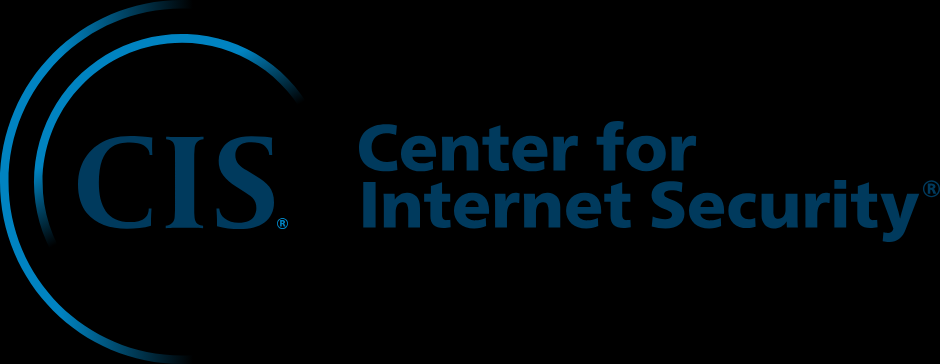

## CIS

[CIS - Web Oficial](https://www.cisecurity.org/)

**CIS (Center for Internet Security)** es una organización sin fines de lucro que se dedica a mejorar la seguridad cibernética mediante la creación y promoción de prácticas, estándares y herramientas de seguridad que ayudan a proteger los sistemas y datos en todo el mundo. Entre sus contribuciones más destacadas están los **CIS Controls** y los **CIS Benchmarks**, que son guías y configuraciones de seguridad ampliamente utilizadas para proteger infraestructuras de TI.

### Principales Contribuciones de CIS:

1. **CIS Controls**:
   - Los **CIS Controls** son un conjunto de 18 controles de ciberseguridad priorizados que proporcionan un enfoque basado en riesgos para mejorar la postura de seguridad de una organización. Los controles están organizados en grupos basados en su impacto y facilidad de implementación, proporcionando un marco para defenderse contra las amenazas más comunes.
   - Los CIS Controls son desarrollados y mantenidos por una comunidad global de expertos en ciberseguridad, lo que los hace robustos y relevantes para múltiples industrias y entornos.

   **CIS Controls v8 (Última versión)**:
   - **Controles Básicos**:
     1. **Inventario y Control de Activos de Hardware**.
     2. **Inventario y Control de Activos de Software**.
     3. **Gestión Continua de Vulnerabilidades**.
     4. **Control de Uso de Privilegios Administrativos**.
     5. **Configuración Segura de Hardware y Software en Dispositivos Móviles, Portátiles, Estaciones de Trabajo y Servidores**.
   - **Controles Fundamentales**:
     6. **Mantenimiento, Monitoreo y Análisis de Registros de Auditoría**.
     7. **Correo Electrónico y Defensa de Navegador Web**.
     8. **Protección contra Malware**.
     9. **Limitación y Control de Puertos de Red, Protocolos y Servicios**.
     10. **Recuperación de Copias de Seguridad y Protección de Datos**.
   - **Controles Organizacionales**:
     11. **Implementación de la Seguridad en Redes Inalámbricas**.
     12. **Defensa contra Ingeniería Social y Phishing**.
     13. **Gestión de Incidentes de Seguridad**.
     14. **Concienciación y Capacitación sobre Seguridad**.
     15. **Monitoreo de Acceso a Aplicaciones y Datos**.

2. **CIS Benchmarks**:
   - Los **CIS Benchmarks** son configuraciones de seguridad detalladas que ofrecen recomendaciones prácticas para proteger sistemas y aplicaciones. Cubren una amplia gama de tecnologías, incluyendo sistemas operativos (Windows, Linux, macOS), bases de datos (Oracle, SQL Server, MySQL), software de red, servicios en la nube (AWS, Azure, Google Cloud), entre otros.
   - Cada CIS Benchmark proporciona configuraciones de seguridad específicas que pueden implementarse para reducir vulnerabilidades y mitigar riesgos. Estos benchmarks están disponibles en diferentes niveles:
     - **Level 1**: Controles básicos que equilibran la seguridad y la funcionalidad.
     - **Level 2**: Controles más estrictos para entornos que requieren mayor seguridad, aunque pueden afectar la funcionalidad.

   **Beneficios de los CIS Benchmarks**:
   - **Reducción de Superficie de Ataque**: Ayuda a reducir la exposición a amenazas comunes al proporcionar configuraciones seguras.
   - **Cumplimiento Normativo**: Facilita el cumplimiento de estándares regulatorios y de la industria, como GDPR, HIPAA, PCI-DSS, y más.
   - **Estandarización de Configuración**: Proporciona configuraciones consistentes y estandarizadas que pueden implementarse en toda la organización.

3. **CIS Hardened Images**:
   - Las **CIS Hardened Images** son imágenes de máquinas virtuales preconfiguradas que siguen las recomendaciones de los CIS Benchmarks. Están disponibles para una variedad de sistemas operativos y plataformas en la nube, como AWS, Azure y Google Cloud Platform. Estas imágenes están listas para ser desplegadas y están diseñadas para cumplir con altos estándares de seguridad desde el primer momento.

4. **CIS RAM (Risk Assessment Method)**:
   - El **CIS Risk Assessment Method (RAM)** es una guía para ayudar a las organizaciones a realizar evaluaciones de riesgo que alineen sus prácticas de seguridad con los CIS Controls. Esta metodología proporciona un enfoque basado en riesgos para identificar y priorizar las medidas de seguridad que deben implementarse.

5. **Beneficios de Implementar CIS Controls y Benchmarks**:
   - **Mejora de la Postura de Seguridad**: Al implementar controles y configuraciones de seguridad efectivas, las organizaciones pueden proteger mejor sus sistemas contra amenazas cibernéticas comunes.
   - **Facilita el Cumplimiento**: Las configuraciones y controles de CIS son ampliamente aceptados como marcos de referencia que ayudan a cumplir con los requisitos regulatorios y de conformidad.
   - **Guías Prácticas y Accionables**: Los controles y benchmarks de CIS son directos y prácticos, lo que facilita su implementación tanto en grandes empresas como en pequeñas y medianas empresas.
   - **Comunidad y Actualización Constante**: Los controles y benchmarks de CIS son desarrollados por una comunidad global de expertos y se actualizan regularmente para reflejar las amenazas emergentes y las mejores prácticas de la industria.

6. **CIS Controls Implementation Groups (IGs)**:
   - Para facilitar la implementación, los CIS Controls están organizados en **Grupos de Implementación (IGs)**, que están diseñados para ayudar a diferentes tipos de organizaciones a implementar controles de manera priorizada según sus necesidades y capacidades.
   - **IG1**: Para organizaciones pequeñas con recursos limitados de ciberseguridad.
   - **IG2**: Para organizaciones medianas con una base de ciberseguridad más madura.
   - **IG3**: Para organizaciones grandes con recursos y necesidades avanzadas de ciberseguridad.

7. **Certificaciones y Herramientas de CIS**:
   - CIS también ofrece **certificaciones** para personas y organizaciones que deseen demostrar su conocimiento y competencia en la implementación de los CIS Controls.
   - Herramientas como **CIS-CAT Pro** y **CIS WorkBench** proporcionan capacidades automatizadas de evaluación y remediación para facilitar la implementación y gestión de los CIS Benchmarks.

**CIS** es una organización fundamental en el campo de la seguridad cibernética que proporciona herramientas, estándares y recursos valiosos como los **CIS Controls** y **CIS Benchmarks** para ayudar a las organizaciones a proteger sus infraestructuras de TI y mejorar su postura de seguridad. Al seguir estas guías, las organizaciones pueden reducir significativamente su superficie de ataque y mejorar su capacidad de respuesta ante incidentes de seguridad.
