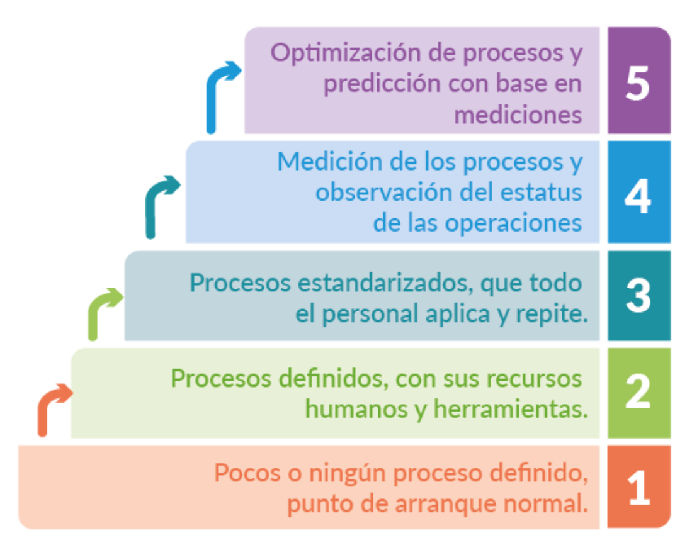

## CMMI

[CMMI - Web Oficial](https://cmmiinstitute.com/)
[SEI - Web Oficial](https://www.sei.cmu.edu/)

**CMMI (Capability Maturity Model Integration)** es un modelo de mejora de procesos desarrollado por el **Software Engineering Institute (SEI)** de la Universidad Carnegie Mellon, que proporciona una guía para mejorar la capacidad de los procesos de una organización. CMMI se utiliza ampliamente en las industrias de software, defensa, aeroespacial y manufactura para evaluar y mejorar la eficiencia, calidad y rendimiento de los procesos de desarrollo de productos y servicios.

### Principales Características de CMMI:

1. **Propósito de CMMI**:
   - **CMMI** ayuda a las organizaciones a optimizar sus procesos y mejorar sus capacidades en diversas áreas, como desarrollo de software, gestión de proyectos, ingeniería de sistemas, adquisición de productos y servicios, y más. El objetivo es mejorar la calidad, reducir los riesgos y aumentar la eficiencia mediante la mejora continua de los procesos.

2. **Evolución del CMMI**:
   - **CMMI para Desarrollo (CMMI-DEV)**: Centrado en el desarrollo de productos y servicios.
   - **CMMI para Servicios (CMMI-SVC)**: Centrado en la entrega de servicios.
   - **CMMI para Adquisición (CMMI-ACQ)**: Centrado en la adquisición de productos y servicios.
   - La última versión, **CMMI V2.0**, lanzada en 2018, integra y simplifica estos modelos, proporcionando un enfoque más unificado y accesible para mejorar el rendimiento organizacional.

3. **Niveles de Madurez de CMMI**:
   - **CMMI** define cinco niveles de madurez que miden la capacidad de los procesos de una organización para ser gestionados, controlados y optimizados. Estos niveles permiten a las organizaciones evaluar su estado actual y planificar mejoras.

   **Cinco Niveles de Madurez de CMMI**:

   - **Nivel 1: Inicial (Initial)**:
     - Los procesos son ad hoc e impredecibles. El éxito depende de individuos talentosos y sus esfuerzos heroicos. No hay un enfoque estándar ni definido para los procesos.

   - **Nivel 2: Gestionado (Managed)**:
     - Los procesos se gestionan a nivel de proyecto y se planifican, ejecutan, miden y controlan, pero pueden variar entre diferentes proyectos. Los proyectos aseguran que los procesos se lleven a cabo de manera planificada.

   - **Nivel 3: Definido (Defined)**:
     - Los procesos se definen y documentan a nivel organizacional. Se establecen estándares, procedimientos, herramientas y métodos que se aplican a todos los proyectos, proporcionando consistencia y un enfoque común.

   - **Nivel 4: Gestionado Cuantitativamente (Quantitatively Managed)**:
     - Los procesos son gestionados utilizando datos y mediciones cuantitativas. La organización tiene objetivos de calidad y rendimiento que se utilizan para predecir y controlar los resultados.

   - **Nivel 5: Optimización (Optimizing)**:
     - La organización se centra en la mejora continua mediante el uso de retroalimentación de procesos y datos de rendimiento. Se implementan innovaciones y mejoras de proceso de manera proactiva para optimizar el rendimiento.

4. **Áreas de Proceso de CMMI**:
   - CMMI V2.0 organiza las áreas de proceso en categorías que cubren las diversas áreas de gestión y mejora de procesos:

   - **Gestión de Desempeño**: Evaluación y gestión del desempeño de los procesos.
   - **Planificación y Gestión de Proyectos**: Prácticas para la planificación, monitoreo y control de proyectos.
   - **Desarrollo e Ingeniería**: Prácticas relacionadas con el desarrollo de productos y servicios.
   - **Gestión de Proveedores y Adquisiciones**: Prácticas para la adquisición y gestión de proveedores.
   - **Soporte**: Prácticas para la gestión de configuraciones, aseguramiento de la calidad, y gestión de la información y medición.

5. **Representaciones de CMMI**:
   - **Representación Continua**: Permite a las organizaciones mejorar procesos individuales o grupos de procesos en función de las necesidades específicas, en lugar de avanzar por niveles de madurez completos.
   - **Representación Por Etapas**: Se enfoca en mejorar de un nivel de madurez al siguiente, proporcionando una hoja de ruta clara para la mejora general de procesos.

6. **Componentes de CMMI**:
   - **Prácticas Genéricas y Específicas**: Las prácticas genéricas se aplican a todas las áreas de proceso, mientras que las prácticas específicas están diseñadas para mejorar procesos particulares dentro de cada área.
   - **Objetivos Genéricos y Específicos**: Definen lo que una organización debe alcanzar para mejorar sus procesos de manera efectiva.
   - **Evaluación de CMMI (SCAMPI - Standard CMMI Appraisal Method for Process Improvement)**: El método estándar para evaluar el nivel de madurez y la capacidad de los procesos de una organización en el modelo CMMI.

7. **Beneficios de Implementar CMMI**:
   - **Mejora de la Calidad del Producto y Servicio**: Al mejorar la gestión de procesos, se reducen los defectos y se mejora la calidad del producto final.
   - **Mejor Gestión de Riesgos**: La planificación y gestión de proyectos más disciplinadas ayudan a identificar y mitigar riesgos de manera más efectiva.
   - **Reducción de Costos y Eficiencia Operativa**: La estandarización de los procesos y la eliminación de ineficiencias reducen los costos de desarrollo y operación.
   - **Mayor Satisfacción del Cliente**: Mejora en la entrega a tiempo y dentro del presupuesto, y una mayor calidad del producto conducen a una mayor satisfacción del cliente.
   - **Reconocimiento Internacional**: Las organizaciones que implementan y obtienen una certificación CMMI a menudo son vistas como proveedores de confianza y de alta calidad, lo que puede ser una ventaja competitiva en licitaciones y contratos.

8. **Desafíos de Implementar CMMI**:
   - **Cambio Cultural y Resistencia**: Adoptar CMMI puede requerir un cambio cultural significativo en la organización, especialmente si los procesos actuales no están bien definidos o documentados.
   - **Requiere Inversión en Tiempo y Recursos**: La implementación de CMMI puede ser costosa y requerir tiempo, especialmente para llegar a niveles de madurez más altos.
   - **Documentación y Formalización**: Algunas organizaciones pueden encontrar el enfoque de CMMI demasiado formal o burocrático, lo que puede ser visto como una barrera para la agilidad.

9. **CMMI y su Relación con Otros Marcos**:
   - **CMMI y Agile**: Aunque CMMI se originó en un contexto más formal, puede combinarse con prácticas ágiles. De hecho, el **CMMI V2.0** enfatiza la agilidad y el enfoque Lean, y proporciona prácticas que complementan marcos ágiles como **Scrum**.
   - **CMMI y ISO**: CMMI es complementario a estándares como **ISO 9001**. Mientras que ISO se enfoca en el sistema de gestión de calidad de toda la organización, CMMI proporciona un enfoque detallado para mejorar los procesos de desarrollo y entrega.

**CMMI** es un marco robusto y maduro para la mejora de procesos que permite a las organizaciones mejorar sus capacidades de desarrollo, gestión de proyectos, adquisición y entrega de servicios. Su enfoque basado en niveles de madurez y mejora continua proporciona un camino claro para el crecimiento organizacional, la calidad del producto, la eficiencia y la satisfacción del cliente.

###### Referencias
1.  [modelo-cmmi-para-desarrollo](https://blog.innevo.com/modelo-cmmi-para-desarrollo)