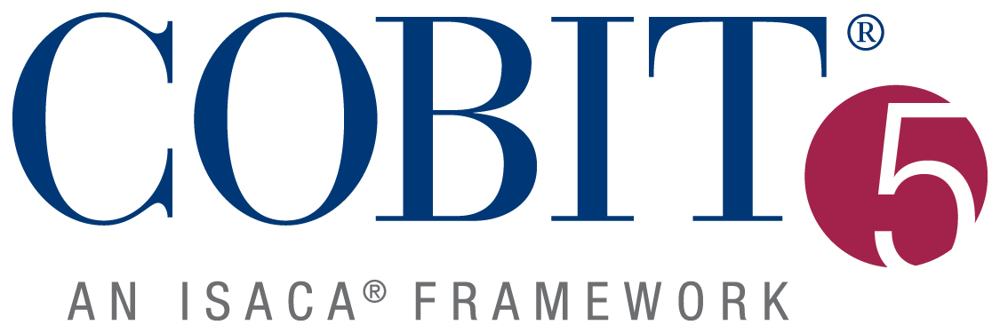

## COBIT

[COBIT - Web Oficial](https://www.isaca.org/resources/cobit/)

**COBIT** (Control Objectives for Information and Related Technologies) es un marco de referencia desarrollado por ISACA para la gobernanza y gestión de TI en las organizaciones. COBIT proporciona un conjunto integral de herramientas, principios y mejores prácticas para ayudar a las organizaciones a desarrollar, implementar, monitorear y mejorar sus prácticas de TI para lograr una gobernanza efectiva y cumplir con sus objetivos estratégicos.

### Principales Características de COBIT:

1. **Gobernanza y Gestión de TI**: COBIT se centra tanto en la **gobernanza** (asegurar que las necesidades de las partes interesadas se consideren y equilibren) como en la **gestión** de TI (planeación, construcción, ejecución y monitoreo de las actividades de TI).

2. **Componentes del Marco COBIT**:
   - **Principios**: COBIT está basado en cinco principios que guían la gobernanza y la gestión de TI en la empresa:
     1. Satisfacer las necesidades de las partes interesadas.
     2. Cubrir la empresa de extremo a extremo.
     3. Aplicar un único marco integrado.
     4. Permitir un enfoque holístico.
     5. Separar la gobernanza de la gestión.
   - **Procesos**: COBIT 2019 (la última versión) define 40 objetivos de gobierno y gestión agrupados en dominios, que incluyen Planificación y Organización, Construcción, Adquisición e Implementación, Entrega, Servicio y Soporte, Monitoreo, Evaluación y Auditoría.
   - **Componentes**: Recursos, estructuras organizativas, procesos, principios, políticas, marcos, cultura, ética, comportamiento, servicios, infraestructura, aplicaciones e información.

3. **Enfoque Holístico**: COBIT toma en cuenta una variedad de factores que afectan la efectividad de la gobernanza y la gestión de TI, incluyendo personas, procesos y tecnología.

4. **Integración con Otros Marcos**: COBIT es flexible y puede integrarse con otros marcos y estándares como ITIL, ISO/IEC 27001, NIST, y más, proporcionando una visión unificada de la gobernanza de TI.

5. **Valor para la Empresa**: Alinea los objetivos de TI con los objetivos empresariales, lo que permite a las organizaciones maximizar el valor de la información y la tecnología.

6. **Mejora Continua**: COBIT incluye herramientas para la evaluación y la mejora continua de los procesos de TI, facilitando la implementación de mejoras y ajustándose a los cambios en el entorno empresarial y tecnológico.

### Aplicaciones de COBIT:

- **Gestión de Riesgos de TI**: COBIT ayuda a identificar, evaluar y mitigar riesgos relacionados con TI.
- **Cumplimiento Regulatorio**: Proporciona directrices para cumplir con las normativas y regulaciones de TI.
- **Evaluaciones de Madurez**: Permite evaluar el nivel de madurez de los procesos de TI y planificar mejoras.

COBIT es utilizado por organizaciones de todo el mundo para mejorar la gobernanza de TI, garantizar la seguridad de la información, gestionar riesgos, cumplir con las normativas y optimizar los recursos de TI.
