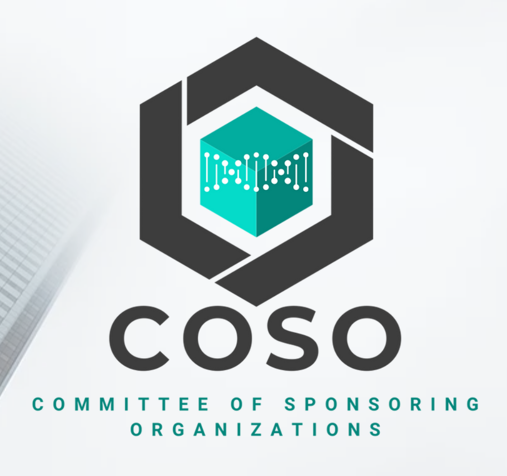

## COSO

[COSO - Web Oficial](https://www.coso.org/)

**COSO** (Committee of Sponsoring Organizations of the Treadway Commission) es un marco de referencia ampliamente utilizado para la gestión de riesgos y control interno en las organizaciones. Fue desarrollado inicialmente en 1992 y actualizado en 2013 para ayudar a las empresas a evaluar y mejorar sus sistemas de control interno, con el objetivo de lograr una gestión efectiva y asegurar la integridad de la información financiera.

### Principales Características de COSO:

1. **Objetivo de COSO**:
   COSO proporciona un modelo integral para diseñar, implementar y evaluar los sistemas de control interno, enfocado en tres áreas clave:
   - **Operaciones**: Eficiencia y efectividad de las operaciones.
   - **Informes**: Confiabilidad de los informes financieros.
   - **Cumplimiento**: Cumplimiento de leyes y regulaciones aplicables.

2. **Componentes del Marco COSO**:
   COSO está estructurado en cinco componentes interrelacionados que conforman el sistema de control interno:

   - **Ambiente de Control**: Define el tono de la organización, incluyendo la integridad, valores éticos, competencia y la manera en que se asignan las responsabilidades. Es el fundamento de todos los demás componentes.
   
   - **Evaluación de Riesgos**: Implica la identificación y análisis de riesgos relevantes para el logro de los objetivos de la organización, estableciendo mecanismos para manejarlos.
   
   - **Actividades de Control**: Políticas y procedimientos que ayudan a asegurar que las directrices de la administración se lleven a cabo. Incluye actividades como la segregación de funciones, autorizaciones, verificaciones y revisiones.
   
   - **Información y Comunicación**: Captura, procesamiento y comunicación de información relevante en toda la organización, para que todos los niveles puedan llevar a cabo sus responsabilidades de control interno.
   
   - **Monitoreo**: Evaluaciones continuas o independientes para asegurar que los componentes del control interno estén presentes y funcionen de manera efectiva con el tiempo. Incluye actividades de auditoría interna y revisión de controles.

3. **Enfoque Basado en Principios**:
   COSO se basa en 17 principios fundamentales que proporcionan criterios detallados para cada uno de los cinco componentes del marco. Estos principios ayudan a las organizaciones a entender y aplicar los conceptos de control interno de manera práctica y efectiva.

4. **Modelo de Cubo COSO**:
   COSO es frecuentemente representado en un "cubo" tridimensional que ilustra la relación entre los objetivos de control, los componentes de control interno y las unidades organizativas, proporcionando una representación visual de cómo se deben implementar y supervisar los controles en toda la organización.

5. **Integración con Otros Marcos**:
   COSO se puede integrar con otros marcos de gestión de riesgos como **COBIT** (para la gobernanza de TI), **ISO 31000** (gestión de riesgos) y **NIST** (gestión de riesgos de ciberseguridad), proporcionando una visión completa y coordinada del control interno y la gestión de riesgos en la organización.

6. **Actualización de 2017: COSO ERM**:
   COSO también ha desarrollado un marco de **Enterprise Risk Management (ERM) - Integrating with Strategy and Performance** en 2017, que amplía el enfoque de COSO para incluir la gestión del riesgo empresarial. ERM se centra en cómo el riesgo puede afectar la estrategia y el desempeño de la organización, proporcionando un enfoque más estratégico y enfocado en el valor.

### Aplicaciones de COSO:

- **Gestión de Riesgos**: Ayuda a las organizaciones a identificar, evaluar y gestionar riesgos de manera sistemática.
- **Control Interno**: Facilita la implementación de controles internos robustos para prevenir fraudes, errores y garantizar la exactitud de la información financiera.
- **Cumplimiento Normativo**: Asegura que las organizaciones cumplan con las normativas locales e internacionales sobre control interno y auditoría.
- **Gobernanza Corporativa**: Mejora la gobernanza corporativa al asegurar que los objetivos de la organización se alcancen de manera efectiva y ética.

COSO es un marco clave en la gestión de riesgos y control interno, ampliamente adoptado por organizaciones en todo el mundo para fortalecer sus procesos y asegurar la transparencia y confiabilidad en sus operaciones.

#### Aplicado a TI

**COSO** se puede aplicar a la gestión de **Tecnologías de la Información (TI)**. Aunque COSO es un marco de control interno y gestión de riesgos que originalmente se desarrolló para entornos financieros y operativos, sus principios son lo suficientemente flexibles y universales como para ser aplicados a cualquier área de una organización, incluida TI. 

COSO ayuda a las organizaciones a integrar la gestión de riesgos de TI con la gestión de riesgos corporativos, asegurando que los controles y prácticas de TI se alineen con los objetivos generales de la empresa.

#### Aplicación de COSO en TI

1. **Ambiente de Control en TI**:
   - Asegura que la organización tenga una política sólida de gobernanza de TI, promoviendo una cultura de control a través de políticas, estándares y procedimientos de TI.
   - Establecimiento de roles y responsabilidades claras dentro del departamento de TI, incluyendo la segregación de funciones para evitar conflictos de intereses.
   - Promoción de la ética, integridad y competencia técnica en los equipos de TI.

2. **Evaluación de Riesgos en TI**:
   - Identificación y evaluación de los riesgos de TI que puedan impactar los objetivos del negocio, como la pérdida de datos, ataques cibernéticos, fallos en la infraestructura o interrupciones de servicios.
   - Análisis de la probabilidad y el impacto de estos riesgos, considerando la implementación de controles apropiados para mitigarlos.
   - Uso de enfoques como análisis de riesgos cualitativos y cuantitativos, y análisis de impacto en el negocio (BIA) para evaluar los riesgos de TI.

3. **Actividades de Control en TI**:
   - Establecimiento de controles de TI como autenticación, autorización, control de acceso, auditoría de registros, y revisiones de sistemas y aplicaciones para proteger la integridad, confidencialidad y disponibilidad de los datos.
   - Implementación de controles generales de TI (ITGC) y controles de aplicación que garanticen la seguridad y efectividad del entorno tecnológico.
   - Realización de evaluaciones periódicas de vulnerabilidad, pruebas de penetración, y monitoreo continuo de la infraestructura de TI.

4. **Información y Comunicación en TI**:
   - Asegurarse de que la información relevante de TI, como incidentes de seguridad, riesgos identificados, políticas actualizadas y cambios de infraestructura, se comunique de manera efectiva a todos los niveles de la organización.
   - Fomentar una comunicación clara y fluida entre el departamento de TI y otros departamentos, asegurando que los riesgos y controles de TI sean entendidos y valorados.

5. **Monitoreo en TI**:
   - Realización de auditorías internas de TI y revisiones periódicas de los controles de TI para garantizar que funcionen según lo previsto.
   - Monitoreo continuo de la infraestructura de TI, detección de incidentes y respuesta ante eventos de seguridad.
   - Evaluación continua de la efectividad del control interno de TI a través de indicadores clave de riesgo (KRI) y métricas de desempeño de TI.

#### Beneficios de Aplicar COSO a TI

- **Mejora en la Gestión de Riesgos de TI**: COSO ayuda a identificar, evaluar y mitigar los riesgos tecnológicos de una manera alineada con los objetivos corporativos.
- **Cumplimiento Normativo y Auditorías de TI**: Facilita el cumplimiento de las regulaciones y normas de auditoría, al proporcionar un marco reconocido para la gestión de riesgos y controles internos.
- **Alineación de TI con los Objetivos del Negocio**: Asegura que los objetivos de TI estén alineados con la misión, visión y objetivos estratégicos de la organización.

COSO es un marco flexible y adaptable que puede ser aplicado efectivamente a TI para mejorar la gestión de riesgos, fortalecer los controles internos, y asegurar la alineación con los objetivos estratégicos de la organización. Su integración con otros marcos específicos de TI ofrece un enfoque holístico para la gobernanza y gestión de TI.
