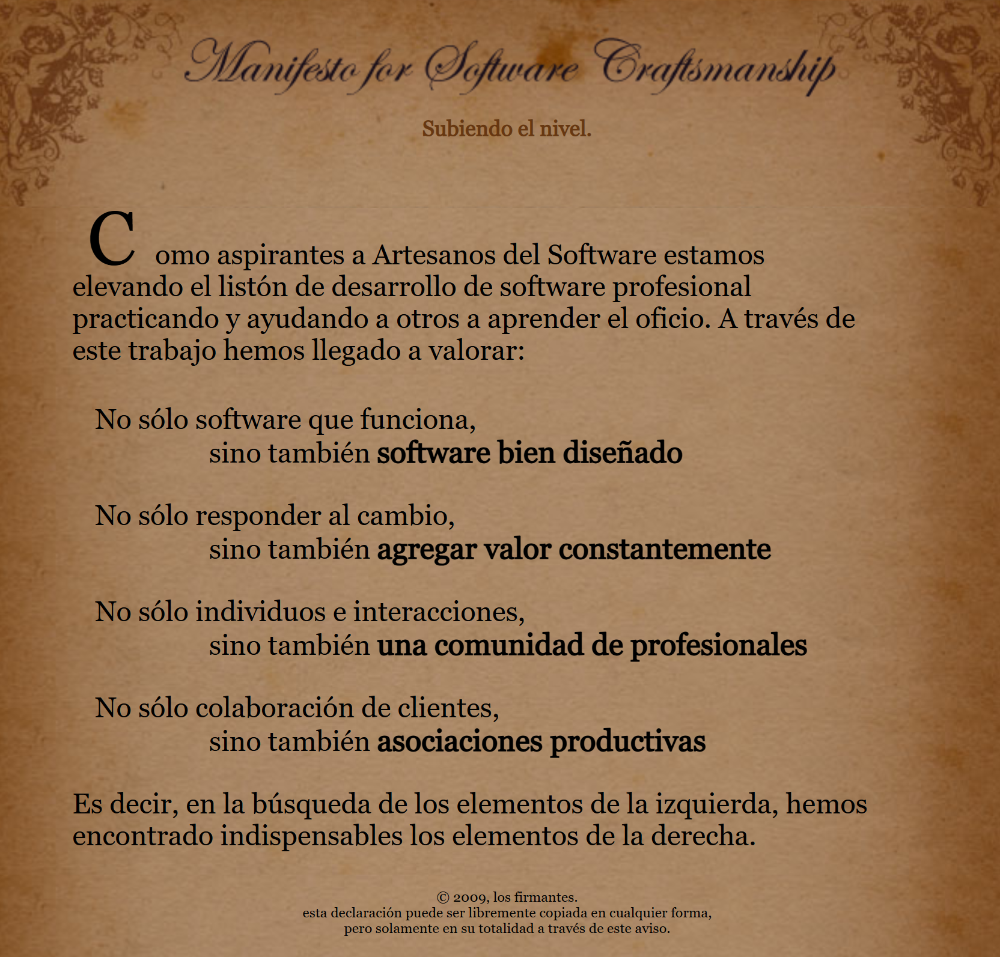

## SOFTWARE CRAFTSMANSHIP

[SOFTWARE CRAFTSMANSHIP - Manifiesto Inglés](https://manifesto.softwarecraftsmanship.org/)
[SOFTWARE CRAFTSMANSHIP - Manifiesto Español](https://manifesto.softwarecraftsmanship.org/#/es)

**Artesanía del Software** (en inglés, **Software Craftsmanship**) es un enfoque que promueve el desarrollo de software de alta calidad a través de técnicas artesanales, una fuerte ética de trabajo y un enfoque en la mejora continua. Este movimiento surgió como una extensión de los principios de **Agile**, poniendo un mayor énfasis en la habilidad y el cuidado de los desarrolladores al escribir código.

### Principios de la Artesanía del Software:

1. **Manifesto for Software Craftsmanship**:
   En 2009, un grupo de profesionales del software publicó el **Manifiesto de la Artesanía del Software**, que se basa en los principios de Agile pero con un enfoque más fuerte en la calidad del código y el profesionalismo en el desarrollo. El manifiesto incluye cuatro valores centrales:

   - **No solo software que funciona, sino también software bien hecho.**
   - **No solo responder al cambio, sino también agregar valor constante.**
   - **No solo individuos e interacciones, sino también una comunidad de profesionales.**
   - **No solo colaboración con el cliente, sino también asociaciones productivas.**

   Estos valores reflejan un compromiso con la excelencia técnica, la responsabilidad personal y la mejora continua.

2. **Enfoque en la Calidad del Código**:
   - La artesanía del software pone un énfasis significativo en escribir **código limpio, mantenible y legible**. Los desarrolladores son alentados a seguir prácticas como:
     - **Clean Code (Código Limpio)**: Uso de nombres claros para variables, métodos y clases, evitando el código duplicado, y manteniendo funciones y métodos cortos y enfocados en una sola responsabilidad.
     - **Refactorización Continua**: Mejorar continuamente el diseño del código sin cambiar su funcionalidad. La refactorización ayuda a reducir la deuda técnica y mejora la mantenibilidad.
     - **Desarrollo Guiado por Pruebas (Test-Driven Development, TDD)**: Escribir pruebas automatizadas antes de escribir el código funcional. Esto ayuda a asegurar que el código sea probado y que el diseño del software esté guiado por los requisitos de la prueba.

3. **Mejora Continua y Aprendizaje**:
   - Los artesanos del software valoran la mejora continua y el aprendizaje permanente. Se espera que los desarrolladores estén siempre mejorando sus habilidades y aprendiendo nuevas tecnologías y prácticas.
   - **Prácticas de Kata**: Ejercicios repetitivos de codificación, conocidos como "katas", son una forma de practicar técnicas de programación, aprender nuevas habilidades y mejorar en las habilidades existentes.
   - **Mentoría y Parejas de Programación (Pair Programming)**: El desarrollo de software se ve como un esfuerzo colaborativo. La mentoría y el trabajo en pareja no solo ayudan a mejorar la calidad del código, sino que también fomentan la transferencia de conocimientos y la mejora continua del equipo.

4. **Ética Profesional y Responsabilidad Personal**:
   - Un artesano del software se considera responsable de su propio trabajo y es consciente de cómo su código afectará a la empresa, los clientes y los usuarios finales. Hay un fuerte sentido de **propiedad** y **responsabilidad** por el producto final.
   - La **ética profesional** es un componente central de la artesanía del software. Los artesanos del software deben comprometerse a entregar no solo lo que se les pide, sino lo que realmente es necesario para crear soluciones de alta calidad.

5. **Enfoque en la Comunidad y la Colaboración**:
   - La **comunidad de profesionales** es clave en el movimiento de la artesanía del software. Esto incluye compartir conocimientos, participar en grupos de usuarios locales, conferencias, talleres y discusiones en línea.
   - Se fomenta la colaboración y la asociación con otros profesionales del software, no solo dentro de la misma organización, sino también en la comunidad más amplia, para promover las mejores prácticas y avanzar en la disciplina.

6. **Prácticas Relacionadas con la Artesanía del Software**:
   - **Continuous Integration (Integración Continua)**: Fusionar el código de los desarrolladores frecuentemente para detectar errores rápidamente y mantener el software siempre en un estado de entrega.
   - **Continuous Delivery (Entrega Continua)**: Automatizar el proceso de despliegue para entregar software de manera rápida y confiable.
   - **Code Reviews (Revisiones de Código)**: Revisión del código por pares para garantizar la calidad y compartir el conocimiento dentro del equipo.

7. **El Papel del Software Craftsmanship en la Cultura Agile**:
   - Mientras que Agile se centra en los procesos y la colaboración, la Artesanía del Software aporta un enfoque adicional en la calidad del código y la mejora continua del profesionalismo técnico.
   - La Artesanía del Software complementa a Agile al garantizar que no solo se entregue software que cumpla con los requisitos funcionales, sino que también sea mantenible, escalable y de alta calidad.

8. **Beneficios de la Artesanía del Software**:
   - **Mayor Calidad del Software**: Un enfoque en el código limpio, la refactorización y las pruebas continuas asegura que el software sea robusto, escalable y mantenible.
   - **Reducción de la Deuda Técnica**: La atención continua a la calidad del código y la refactorización reduce la deuda técnica, lo que lleva a una mayor sostenibilidad del proyecto.
   - **Aumento de la Satisfacción del Cliente**: El software de alta calidad que es fácil de mantener y extender conduce a una mayor satisfacción del cliente, ya que los cambios y mejoras se pueden realizar más fácilmente.
   - **Mejora de la Moral del Equipo**: La cultura de la artesanía y el compromiso con la calidad fomentan un entorno de trabajo positivo y colaborativo.

9. **Desafíos de la Artesanía del Software**:
   - **Cambio Cultural**: Adoptar la Artesanía del Software puede requerir un cambio cultural significativo, especialmente en organizaciones que priorizan la entrega rápida sobre la calidad del código.
   - **Inversión en Tiempo y Recursos**: Las prácticas de artesanía requieren tiempo y esfuerzo, lo que puede ser visto como una desventaja a corto plazo, aunque los beneficios a largo plazo superen los costos iniciales.
   - **Equilibrio entre Perfección y Entrega**: Existe el riesgo de caer en la trampa de la "perfección técnica", lo que puede retrasar la entrega. Se necesita encontrar un equilibrio entre la excelencia técnica y la entrega de valor al cliente.

La **Artesanía del Software** representa un enfoque en el desarrollo de software que va más allá de simplemente cumplir con los requisitos funcionales. Promueve la excelencia técnica, el profesionalismo, la colaboración y la mejora continua para crear software de alta calidad que sea mantenible, escalable y valioso a largo plazo. Este enfoque es cada vez más relevante en un mundo donde la calidad del software es fundamental para el éxito organizacional.

### Manifiesto

