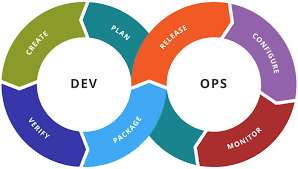

## DEVOPS

[DEVOPS INSTITUTE](https://www.devopsinstitute.com/)

**DevOps** es una combinación de prácticas, herramientas y filosofía cultural que tiene como objetivo automatizar y mejorar la colaboración y la integración entre los equipos de desarrollo de software (Dev) y operaciones de TI (Ops). DevOps permite a las organizaciones entregar software de manera más rápida, eficiente, y con mayor calidad, alineando el desarrollo con las operaciones y asegurando una entrega continua de valor a los usuarios finales.

### Principales Características de DevOps:

1. **Propósito de DevOps**:
   - El objetivo de DevOps es **romper los silos** entre los equipos de desarrollo y operaciones, fomentando una cultura de colaboración, comunicación y responsabilidad compartida en todo el ciclo de vida del desarrollo de software, desde la planificación y codificación hasta la entrega y operación.
   - DevOps busca **automatizar y optimizar** los procesos de desarrollo, pruebas, implementación y monitoreo para mejorar la calidad del software, reducir el tiempo de entrega y responder más rápidamente a los cambios del mercado y a las necesidades del cliente.

2. **Principios Fundamentales de DevOps**:
   DevOps se basa en varios principios clave que guían su implementación:

   - **Colaboración y Comunicación**: Fomentar una cultura de trabajo colaborativo entre desarrolladores, operadores y otras partes interesadas. Se promueve la transparencia y la comunicación continua.
   - **Automatización**: Automatizar tanto como sea posible, desde la integración del código hasta las pruebas, la implementación y el monitoreo. La automatización reduce los errores humanos, acelera los procesos y mejora la eficiencia.
   - **Integración Continua y Entrega Continua (CI/CD)**: CI/CD es un conjunto de prácticas que implica la integración regular del código en un repositorio compartido (CI) y la automatización del proceso de entrega del software a producción (CD).
   - **Responsabilidad Compartida**: Los equipos de desarrollo y operaciones comparten la responsabilidad de la entrega de software, su calidad y su rendimiento en producción.
   - **Mejora Continua**: DevOps enfatiza la retroalimentación constante, la mejora continua y el aprendizaje, utilizando métricas e indicadores clave de rendimiento (KPIs) para ajustar los procesos y herramientas.

3. **Prácticas Clave de DevOps**:
   DevOps abarca una variedad de prácticas que se alinean con los principios fundamentales para mejorar la eficiencia y la calidad de la entrega de software:

   - **Integración Continua (Continuous Integration, CI)**:
     - Los desarrolladores integran su código en un repositorio compartido con frecuencia, lo que permite detectar errores de forma temprana. Cada integración se valida mediante pruebas automatizadas.
   
   - **Entrega Continua (Continuous Delivery, CD)**:
     - Extiende la integración continua al automatizar el despliegue de cambios de código a un entorno de pruebas o producción. La entrega continua asegura que el código siempre esté en un estado listo para su liberación.

   - **Despliegue Continuo (Continuous Deployment)**:
     - Similar a la entrega continua, pero los cambios se despliegan automáticamente a producción sin intervención manual. Esto requiere un alto nivel de automatización y pruebas.

   - **Infraestructura como Código (Infrastructure as Code, IaC)**:
     - Gestionar y aprovisionar infraestructuras de TI mediante definiciones de software, utilizando herramientas como **Terraform**, **Ansible**, **Chef**, **Puppet** y **AWS CloudFormation**. IaC permite la creación y configuración de entornos de manera reproducible y eficiente.

   - **Monitoreo y Logging Continuos**:
     - Implementar soluciones de monitoreo y logging que proporcionen visibilidad del rendimiento de las aplicaciones y la infraestructura en tiempo real. Herramientas como **Prometheus**, **Grafana**, **ELK Stack (Elasticsearch, Logstash, Kibana)**, **Datadog**, y **Splunk** son populares para este propósito.

   - **Gestión de la Configuración**:
     - Automatizar la configuración y el mantenimiento de los sistemas mediante herramientas como **Ansible**, **Chef**, **Puppet** y **SaltStack**, asegurando que los entornos sean consistentes y estén configurados de acuerdo con los estándares.

   - **Pruebas Automatizadas**:
     - Automatizar las pruebas de unidad, integración, funcionales, de rendimiento y de seguridad para garantizar que el código sea de alta calidad y esté libre de defectos. Herramientas como **JUnit**, **Selenium**, **JUnit**, **Jenkins**, **SonarQube**, y **TestNG** son ampliamente utilizadas.

   - **Contenedorización y Orquestación de Contenedores**:
     - Utilizar tecnologías de contenedores como **Docker** para empaquetar aplicaciones y sus dependencias, asegurando que funcionen de manera consistente en diferentes entornos. La orquestación de contenedores con **Kubernetes** permite gestionar, escalar y mantener aplicaciones en contenedores a gran escala.

   - **Pipeline de DevOps**:
     - Un **Pipeline de CI/CD** es una serie de etapas automatizadas por las que pasa el código de una aplicación desde su desarrollo hasta su despliegue. Estas etapas incluyen construcción, pruebas, entrega y despliegue, asegurando una entrega continua y rápida de software.

4. **Cultura y Roles en DevOps**:
   - **Cultura de DevOps**:
     - DevOps no es solo una combinación de herramientas y prácticas, sino también un **cambio cultural** que promueve la colaboración, la transparencia y la mejora continua. La adopción de DevOps requiere que los equipos cambien sus mentalidades hacia la propiedad compartida del código, la responsabilidad colectiva del rendimiento y la entrega continua de valor.

   - **Roles en DevOps**:
     - **Ingeniero DevOps**: Responsable de implementar y mantener las herramientas y prácticas de DevOps, como la automatización de CI/CD, IaC, monitoreo y gestión de la configuración.
     - **Site Reliability Engineer (SRE)**: Un rol que se superpone con DevOps, centrado en la confiabilidad y la disponibilidad de los sistemas de producción.
     - **Desarrollador Full-Stack**: Participa en el desarrollo y es responsable de la calidad y la entrega de su código hasta la producción.
     - **Ingeniero de Calidad (QA)**: Trabaja en estrecha colaboración con los desarrolladores y los ingenieros de DevOps para integrar las pruebas automatizadas en los pipelines de CI/CD.

5. **Herramientas Comunes en DevOps**:
   DevOps utiliza una variedad de herramientas para automatizar y optimizar cada fase del ciclo de vida del desarrollo de software:

   - **Control de Versiones**: Git (GitHub, GitLab, Bitbucket).
   - **Integración y Entrega Continua**: Jenkins, GitLab CI, CircleCI, Travis CI, Bamboo.
   - **Infraestructura como Código**: Terraform, AWS CloudFormation, Ansible, Puppet, Chef.
   - **Contenedorización y Orquestación**: Docker, Kubernetes, OpenShift, Helm.
   - **Monitoreo y Observabilidad**: Prometheus, Grafana, ELK Stack, Datadog, Splunk, New Relic.
   - **Gestión de la Configuración**: Ansible, Puppet, Chef, SaltStack.
   - **Gestión de Artefactos**: Nexus, JFrog Artifactory.
   - **Seguridad DevOps (DevSecOps)**: Snyk, SonarQube, OWASP ZAP, Aqua Security.

6. **Beneficios de DevOps**:
   - **Mayor Frecuencia de Entrega**: DevOps permite la entrega continua de software de alta calidad, lo que permite a las organizaciones responder rápidamente a los cambios en el mercado.
   - **Mejora de la Calidad del Software**: La automatización de pruebas, la integración continua y las prácticas de monitoreo continuo mejoran la calidad del software al detectar y corregir errores rápidamente.
   - **Mayor Eficiencia y Reducción de Costos**: La automatización de tareas repetitivas y la estandarización de procesos reducen los costos operativos y el tiempo de entrega.
   - **Mejora de la Colaboración y Comunicación**: DevOps rompe los silos entre los equipos de desarrollo y operaciones, fomentando un entorno colaborativo y alineado con los objetivos del negocio.
   - **Mayor Satisfacción del Cliente**: La entrega rápida y continua de valor conduce a una mayor satisfacción del cliente y a una ventaja competitiva en el mercado.

7. **Desafíos de Implementar DevOps**:
   - **Cambio Cultural y Resistencia**: Implementar DevOps requiere un cambio cultural significativo, que puede enfrentar resistencia por parte de equipos que están acostumbrados a trabajar de manera aislada.
   - **Complejidad en la Integración de Herramientas**: La adopción de herramientas DevOps puede ser compleja y requiere experiencia para integrarlas en un flujo de trabajo continuo.
   - **Seguridad y Gobernanza**: La integración de la seguridad (DevSecOps) es esencial para garantizar que la velocidad de entrega no comprometa la seguridad.

**DevOps** es un enfoque revolucionario que combina prácticas, herramientas y un cambio cultural para mejorar la eficiencia, la calidad y la velocidad de la entrega de software. Su enfoque en la automatización, la integración continua y la entrega continua ayuda a las organizaciones a adaptarse rápidamente a las necesidades cambiantes del mercado y a entregar valor de manera constante.
