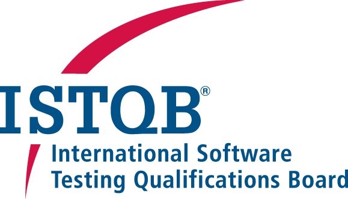

## ISTQB

[ISTQB - Web Oficial](https://www.istqb.org/)

**ISTQB** (International Software Testing Qualifications Board), que es una organización global que ofrece certificaciones reconocidas internacionalmente para profesionales en pruebas de software. El **ISTQB** se enfoca en establecer un marco común de competencias, terminología y buenas prácticas en el ámbito de las pruebas de software.

### Principales Características del ISTQB:

1. **Propósito del ISTQB**:
   - El ISTQB proporciona un esquema de certificación estandarizado para mejorar la calidad y la competencia en las pruebas de software. Las certificaciones del ISTQB son ampliamente reconocidas en la industria de TI y ayudan a los profesionales de pruebas a demostrar sus conocimientos y habilidades.
   - La misión de ISTQB es promover el valor de las pruebas de software como una profesión, proporcionando un marco para las mejores prácticas de pruebas de software y un conjunto de conocimientos compartidos a nivel global.

2. **Esquema de Certificación de ISTQB**:
   - El esquema de certificación ISTQB está estructurado en varios niveles y abarca diferentes áreas de especialización en pruebas de software. El esquema es modular, lo que permite a los profesionales personalizar su trayectoria de certificación según sus intereses y necesidades profesionales.

3. **Niveles de Certificación de ISTQB**:
   El esquema de certificación del ISTQB se divide en tres niveles principales:

   - **Nivel Foundation**:
     - **ISTQB Certified Tester Foundation Level (CTFL)**: Es el nivel de entrada que cubre los conceptos básicos de las pruebas de software, los principios, técnicas de prueba, gestión de pruebas y herramientas de soporte. Es adecuado para cualquier persona involucrada en las pruebas de software y proporciona una base sólida para avanzar a niveles superiores.
     - Subniveles o certificaciones especializadas en el nivel Foundation incluyen:
       - **Agile Tester**: Centrado en las pruebas en entornos Agile.
       - **Model-Based Tester**: Enfocado en pruebas basadas en modelos.
       - **Automotive Tester**: Para pruebas en el contexto de la industria automotriz.

   - **Nivel Advanced**:
     - **ISTQB Certified Tester Advanced Level (CTAL)**: Para profesionales con experiencia en pruebas de software que buscan profundizar en áreas específicas. Incluye tres certificaciones principales:
       - **Test Manager**: Se centra en la gestión y liderazgo de las actividades de pruebas de software.
       - **Test Analyst**: Aborda las técnicas y prácticas de pruebas a nivel funcional.
       - **Technical Test Analyst**: Enfocado en técnicas de prueba avanzadas, automatización de pruebas y pruebas de rendimiento.
     - También hay certificaciones especializadas avanzadas como **Test Automation Engineer** y **Security Tester**.

   - **Nivel Expert**:
     - **ISTQB Certified Tester Expert Level**: Es el nivel más alto del esquema de certificación de ISTQB, diseñado para profesionales altamente experimentados que buscan demostrar su experiencia en áreas avanzadas de pruebas de software. Las certificaciones Expert incluyen:
       - **Test Management**: Cobertura profunda de la gestión de pruebas.
       - **Improving the Test Process**: Enfocado en la mejora continua de los procesos de pruebas.
       - **Test Automation Engineering**: Desarrollo e implementación de estrategias avanzadas de automatización de pruebas.

4. **Cuerpo de Conocimientos de ISTQB (Syllabi y Glosario)**:
   - ISTQB proporciona un conjunto de **sílabos** que sirven como guías de estudio para cada nivel de certificación, describiendo los temas cubiertos, objetivos de aprendizaje, y ejemplos de preguntas de examen. Estos sílabos se actualizan periódicamente para reflejar las mejores prácticas actuales y los desarrollos en la industria de las pruebas de software.
   - **ISTQB Glosario**: Proporciona terminología estándar en pruebas de software, lo cual es fundamental para garantizar la coherencia y el entendimiento común en la comunicación global entre profesionales de pruebas.

5. **Beneficios de la Certificación ISTQB**:
   - **Reconocimiento Global**: Las certificaciones ISTQB son reconocidas en todo el mundo, lo que permite a los profesionales validar sus habilidades en diferentes mercados laborales.
   - **Mejora de Carrera**: Ayuda a los profesionales a mejorar sus perspectivas de carrera, obtener roles más altos y salarios potencialmente mejores.
   - **Estandarización y Mejores Prácticas**: Alinea las competencias con estándares internacionales, promoviendo el uso de metodologías y herramientas de pruebas reconocidas.
   - **Adaptabilidad y Especialización**: El esquema modular permite a los profesionales elegir las certificaciones que mejor se alineen con su trayectoria profesional y objetivos de aprendizaje.

6. **Exámenes de Certificación ISTQB**:
   - Los exámenes del ISTQB son administrados por **Boards Nacionales** o **Proveedores de Exámenes** autorizados por ISTQB. Los exámenes pueden ser presenciales o en línea, dependiendo del proveedor, y generalmente consisten en preguntas de opción múltiple.

7. **Integración con Otros Marcos y Prácticas**:
   - ISTQB complementa otros marcos de desarrollo de software y pruebas como **Agile**, **DevOps**, **CMMI**, y **ISO/IEC 29119**, permitiendo a los profesionales aplicar sus conocimientos de pruebas en diferentes contextos de desarrollo.

**ISTQB** es una organización líder en la certificación de pruebas de software, proporcionando un marco integral y modular para el desarrollo de competencias en el ámbito de las pruebas. Sus certificaciones son valiosas tanto para individuos que buscan mejorar su carrera en pruebas de software como para organizaciones que desean mejorar sus prácticas de pruebas.
