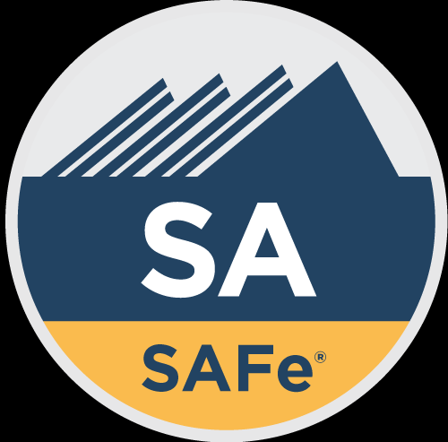

# SAFE

[SAFE - Web Oficial](https://scaledagile.com/)

**SAFe (Scaled Agile Framework)** es un marco de trabajo para escalar los principios y prácticas ágiles a nivel empresarial, proporcionando un enfoque estructurado para coordinar a múltiples equipos ágiles y alinear sus esfuerzos con los objetivos estratégicos de la organización. SAFe es uno de los marcos de escalado ágil más populares y es utilizado por organizaciones de todo el mundo para gestionar la complejidad de desarrollar productos y servicios a gran escala.

### Principales Características de SAFe:

1. **Propósito de SAFe**:
   - SAFe permite a las organizaciones aplicar principios ágiles y **Lean** en múltiples niveles (equipo, programa, solución y cartera) para mejorar la entrega de valor, la calidad del producto y la eficiencia operativa. Proporciona un marco claro y flexible que combina elementos de **Scrum**, **Kanban**, **Lean** y **DevOps**, entre otros.

2. **Niveles de SAFe**:
   SAFe se organiza en cuatro niveles principales que permiten escalar Agile en toda la organización:

   - **Essential SAFe**:
     - Es el nivel más básico de SAFe y contiene los elementos esenciales para implementar Agile a nivel de equipo y programa. Es el núcleo de SAFe y proporciona las prácticas fundamentales para coordinar múltiples equipos ágiles que trabajan juntos.
     - **Agile Release Train (ART)**: Es el principal vehículo de entrega de SAFe. Un ART es un equipo de equipos (generalmente de 5 a 12 equipos) que trabajan juntos para entregar valor en incrementos de programa (PI, Program Increment). Cada PI es un ciclo de tiempo fijo (generalmente de 8 a 12 semanas) que incluye múltiples **sprints**.
     - **PI Planning**: Un evento de planificación donde todos los equipos del ART colaboran para planificar el trabajo a realizar durante el próximo incremento de programa. Esto asegura la alineación y la colaboración en todo el tren de lanzamiento ágil.

   - **Large Solution SAFe**:
     - Este nivel se utiliza para gestionar la entrega de soluciones grandes y complejas que requieren la coordinación de varios ARTs. Incluye prácticas y roles adicionales para gestionar la entrega de soluciones a gran escala.
     - **Solution Train**: Es similar a un Agile Release Train, pero para soluciones que requieren la coordinación de múltiples ARTs y proveedores externos.

   - **Portfolio SAFe**:
     - Proporciona un nivel de gestión de la cartera para alinear la estrategia empresarial con la ejecución, utilizando principios Lean y Agile para gestionar la inversión y el flujo de valor.
     - **Lean Portfolio Management (LPM)**: Facilita la toma de decisiones de inversión, la gobernanza y la alineación estratégica mediante la gestión de epics, el presupuesto Lean y los flujos de valor.
     - **Portfolio Kanban**: Un sistema Kanban para gestionar epics y flujos de trabajo a nivel de cartera, asegurando que los proyectos más valiosos reciban la prioridad adecuada.

   - **Full SAFe**:
     - Es la configuración completa del marco SAFe que incluye todos los niveles anteriores y está diseñado para grandes organizaciones que necesitan coordinar múltiples soluciones, ARTs y carteras.

3. **Principios de SAFe**:
   SAFe se basa en 10 principios fundamentales que guían a las organizaciones en su implementación:

   1. **Tomar decisiones económicas**.
   2. **Aplicar el pensamiento sistémico**.
   3. **Asumir la variabilidad; preservar las opciones**.
   4. **Construir incrementos de forma rápida e integrada**.
   5. **Basar los hitos en la evaluación objetiva de los sistemas en funcionamiento**.
   6. **Visualizar y limitar el trabajo en progreso (WIP), reducir el tamaño de los lotes y gestionar la longitud de las colas**.
   7. **Aplicar la cadencia, sincronizar con la planificación transversal**.
   8. **Desbloquear la motivación intrínseca de los trabajadores del conocimiento**.
   9. **Descentralizar la toma de decisiones**.
   10. **Organizarse en torno a flujos de valor**.

4. **Roles y Equipos en SAFe**:
   - **Equipos Ágiles**: Los equipos son responsables de entregar incrementos de producto en cada Sprint. Los equipos pueden ser Scrum, Kanban o una combinación de ambos.
   - **Scrum Master**: Facilita la implementación de Scrum en el equipo y elimina impedimentos.
   - **Product Owner (PO)**: Gestiona y prioriza el backlog del equipo para maximizar el valor del trabajo realizado por el equipo.
   - **Release Train Engineer (RTE)**: Es el "Scrum Master del ART" y facilita los eventos del tren, como el PI Planning y las retrospectivas de ART.
   - **System Architect/Engineer**: Responsable de la arquitectura y el diseño técnico a nivel de ART.
   - **Epic Owners**: Gestionan las epics en el nivel de cartera y trabajan con los equipos para desglosarlas en características y tareas.
   - **Lean Portfolio Management (LPM)**: Se encarga de la gestión de la estrategia y la inversión a nivel de cartera.

5. **Artefactos y Eventos de SAFe**:
   - **Program Backlog**: Contiene características (features) priorizadas para el ART, que son desglosadas por los equipos ágiles en historias más pequeñas.
   - **PI Objectives**: Objetivos de alto nivel que los equipos y ARTs planean alcanzar durante un incremento de programa.
   - **PI Planning**: Un evento de dos días donde todos los equipos del ART planifican el trabajo del próximo incremento de programa.
   - **System Demo**: Una demostración periódica de las características completadas a nivel de ART.
   - **Inspect and Adapt (I&A)**: Un evento de mejora continua al final de cada PI donde el ART reflexiona sobre los resultados obtenidos y planifica mejoras para el próximo ciclo.

6. **SAFe y DevOps**:
   - **Calidad Integrada**: SAFe enfatiza la importancia de la calidad en cada fase de desarrollo, lo que incluye prácticas como **Continuous Integration**, **Continuous Deployment**, y **Test-Driven Development (TDD)**.
   - **DevOps y Entrega Continua**: SAFe integra prácticas de DevOps para asegurar una entrega continua de valor, fomentando una cultura de colaboración entre los equipos de desarrollo y operaciones.

7. **Beneficios de SAFe**:
   - **Alineación Estratégica**: SAFe proporciona un marco para alinear a los equipos con los objetivos estratégicos y prioridades de la organización.
   - **Mejora de la Calidad y la Productividad**: La sincronización y coordinación entre equipos, junto con las prácticas de mejora continua, llevan a una mejor calidad del producto y mayor eficiencia.
   - **Transparencia y Visibilidad**: SAFe permite a las organizaciones tener una mejor visibilidad del trabajo en curso y del progreso hacia los objetivos de negocio.
   - **Mayor Flexibilidad y Adaptación**: Las organizaciones pueden responder más rápidamente a los cambios en las prioridades del mercado o del cliente.

8. **Desafíos de Implementar SAFe**:
   - **Cambio Cultural**: La implementación de SAFe requiere un cambio cultural significativo hacia la colaboración, la transparencia y la entrega continua.
   - **Complejidad de la Implementación**: Para organizaciones grandes, la implementación de SAFe puede ser compleja y requiere capacitación, coaching y adaptación a las necesidades específicas de la empresa.
   - **Resistencia al Cambio**: Los equipos y líderes acostumbrados a enfoques tradicionales pueden resistirse a los cambios necesarios para adoptar SAFe con éxito.

**SAFe** es un marco de trabajo integral para escalar Agile en organizaciones grandes y complejas, permitiendo la alineación estratégica, la mejora de la calidad y la entrega continua de valor a través de una mejor colaboración entre equipos y niveles organizacionales. Es un enfoque poderoso para aquellas organizaciones que buscan implementar Agile a gran escala y obtener los beneficios de la agilidad en toda la empresa.
