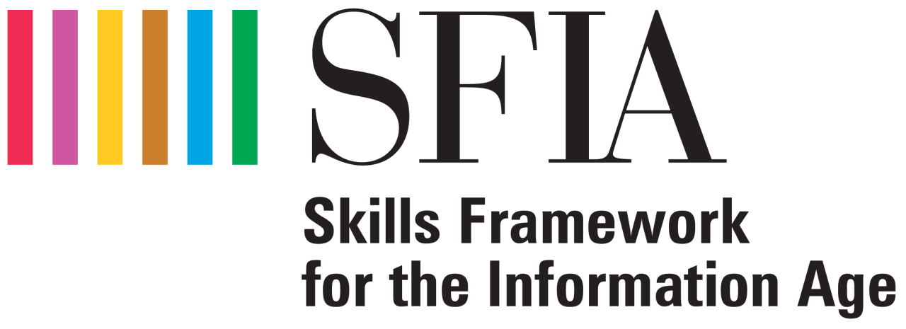

## SFIA (Skills Framework for the Information Age)

[SFIA - Web Oficial](https://sfia-online.org/es)

SFIA es un marco global que define las habilidades y competencias requeridas por los profesionales en los campos de las tecnologías de la información y la comunicación (TIC). Fue creado para ayudar a las organizaciones a gestionar y desarrollar las habilidades de su personal en TI de manera efectiva.

**Estructura**: SFIA organiza las habilidades en diferentes niveles de responsabilidad, desde los niveles básicos hasta los niveles de liderazgo estratégico. Cada nivel incluye una descripción de las habilidades, responsabilidades y autonomía que se espera.

**Usos**: Se utiliza para la gestión de talento, desarrollo de carrera, evaluación de desempeño, definición de roles, y planificación de recursos humanos en TI.

**Actualización**: SFIA se actualiza periódicamente para reflejar los cambios y nuevas demandas en la industria de TI.