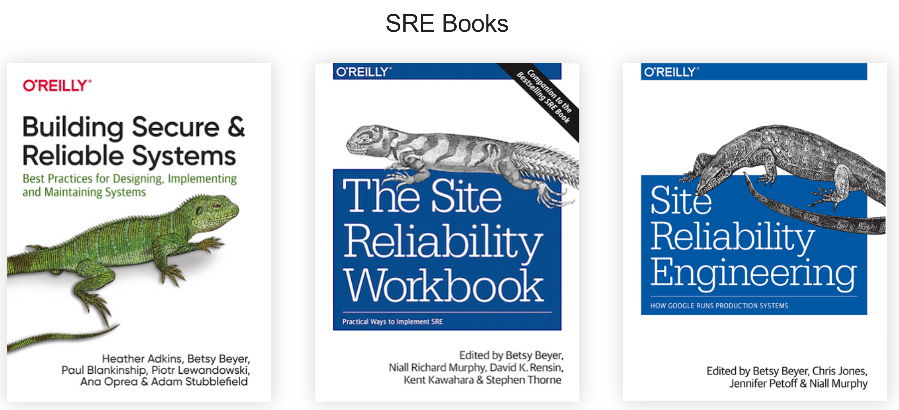

## SRE

[SRE GOOGLE](https://sre.google/)
[SRE LIBROS](https://sre.google/books/)

**SRE (Site Reliability Engineering)** es una disciplina que aplica principios y prácticas de ingeniería de software a las operaciones de TI con el objetivo de crear sistemas escalables y altamente confiables. Desarrollado originalmente por **Google**, SRE es ahora un enfoque ampliamente adoptado para gestionar la infraestructura, la fiabilidad y la disponibilidad de los servicios en producción. SRE se basa en la premisa de que los problemas de operaciones deben tratarse como problemas de software, utilizando la automatización, la ingeniería de sistemas y el monitoreo proactivo para reducir el trabajo manual y mejorar la eficiencia.

### Principales Características de SRE:

1. **Propósito de SRE**:
   - SRE busca **reducir el trabajo manual (toil)** mediante la automatización y la ingeniería, permitiendo a los equipos centrarse más en tareas de alto valor que mejoran la confiabilidad, escalabilidad y eficiencia de los sistemas. El objetivo final es mantener un equilibrio entre la entrega rápida de nuevas características y la estabilidad del sistema.

2. **Principios Fundamentales de SRE**:
   SRE se basa en varios principios clave que guían su implementación:

   - **Automatización de Operaciones**: Minimizar el trabajo manual mediante la automatización de tareas repetitivas y procesos operativos, como la implementación de software, la gestión de la infraestructura y la respuesta a incidentes.
   - **Medición y Gestión del Riesgo**: Definir y medir indicadores clave de rendimiento y fiabilidad como los **SLOs (Service Level Objectives)**, **SLAs (Service Level Agreements)** y **SLIs (Service Level Indicators)**.
   - **Error Budget**: Un concepto clave en SRE que establece un nivel de tolerancia a los errores basado en los SLOs acordados. El presupuesto de errores permite a los equipos de desarrollo y operaciones equilibrar la velocidad de entrega con la confiabilidad del servicio.
   - **Trabajo Proactivo vs. Reactivo**: Minimizar la cantidad de tiempo dedicado a tareas reactivas (como la gestión de incidentes) mediante la mejora proactiva de la confiabilidad del sistema y la automatización.

3. **Prácticas Clave de SRE**:
   SRE abarca una variedad de prácticas para mejorar la confiabilidad, la disponibilidad y el rendimiento de los sistemas:

   - **Definición y Gestión de SLOs, SLAs y SLIs**:
     - **SLO (Service Level Objective)**: Un objetivo específico para la confiabilidad y el rendimiento de un servicio, como un tiempo de respuesta del 99.9% dentro de 200 ms. Los SLOs son métricas que guían las decisiones sobre el desarrollo y la operación de servicios.
     - **SLA (Service Level Agreement)**: Un acuerdo formal entre un proveedor de servicios y sus clientes que define el nivel de servicio esperado. Incluye sanciones si no se cumplen los SLOs.
     - **SLI (Service Level Indicator)**: Una métrica específica utilizada para medir el cumplimiento de un SLO, como la latencia promedio o la tasa de error.

   - **Error Budget (Presupuesto de Error)**:
     - El presupuesto de errores es el nivel permitido de no cumplimiento del SLO. Por ejemplo, si el SLO es del 99.9% de tiempo de actividad, el 0.1% restante es el presupuesto de errores. Los equipos pueden "gastar" este presupuesto en lanzamientos más rápidos de nuevas características, pero si se excede, deben enfocarse en mejorar la confiabilidad.

   - **Automatización y Gestión de Incidentes**:
     - Automatizar tareas como la detección de fallos, la creación de alertas, el escalado de incidentes y la implementación de correcciones. Herramientas como **PagerDuty**, **OpsGenie**, **VictorOps**, y sistemas de gestión de incidentes personalizados son comunes.
     - Utilizar **Runbooks** y **Playbooks** para gestionar y resolver incidentes de manera eficiente y consistente.

   - **Ingeniería de Confiabilidad Proactiva**:
     - Implementar cambios en los sistemas para reducir la probabilidad de fallos. Esto puede incluir pruebas de resistencia (resilience testing), **Chaos Engineering**, optimización de la infraestructura y mejoras en la escalabilidad.

   - **Gestión de Capacidades y Planificación de Demanda**:
     - Monitorear y analizar el rendimiento y la capacidad del sistema para prever futuros cuellos de botella y planificar la expansión de la infraestructura. Herramientas como **Prometheus**, **Grafana**, **DataDog**, y **New Relic** son ampliamente utilizadas.

   - **Reducción de Toil (Trabajo Manual Repetitivo)**:
     - Identificar tareas repetitivas y de bajo valor que no escalan y automatizarlas para reducir el "toil". El trabajo que requiere intervención manual y no genera valor a largo plazo debe ser minimizado.

   - **Postmortems Sin Culpa**:
     - Realizar postmortems detallados después de incidentes significativos para entender qué salió mal y cómo se puede prevenir en el futuro. Un enfoque de "sin culpa" fomenta la apertura y la honestidad, permitiendo a los equipos aprender y mejorar sin temor a represalias.

4. **Herramientas Comunes en SRE**:
   SRE utiliza una amplia variedad de herramientas para automatizar tareas, gestionar la infraestructura, monitorear el rendimiento y mejorar la confiabilidad:

   - **Monitoreo y Observabilidad**: Prometheus, Grafana, Datadog, New Relic, ELK Stack (Elasticsearch, Logstash, Kibana), Splunk.
   - **Gestión de Incidentes y Alertas**: PagerDuty, OpsGenie, VictorOps, Slack (integraciones).
   - **Automatización y Gestión de la Configuración**: Ansible, Puppet, Chef, Terraform, SaltStack.
   - **Orquestación de Contenedores**: Kubernetes, Docker Swarm, OpenShift.
   - **Pruebas de Resiliencia y Chaos Engineering**: Chaos Monkey, Gremlin, LitmusChaos.
   - **Gestión de Logs y Eventos**: ELK Stack, Fluentd, Loggly, Graylog.

5. **Cultura en SRE**:
   - **Colaboración entre Equipos**: SRE fomenta una cultura de colaboración entre equipos de desarrollo y operaciones, eliminando los silos y promoviendo la responsabilidad compartida por la confiabilidad y el rendimiento del sistema.
   - **Mentalidad de Ingeniería**: SRE aplica principios de ingeniería de software para resolver problemas de infraestructura y operaciones, utilizando automatización y programación para abordar problemas repetitivos y mejorar la eficiencia.

6. **Beneficios de Implementar SRE**:
   - **Mejora de la Confiabilidad y Disponibilidad**: SRE ayuda a las organizaciones a mantener altos niveles de confiabilidad mediante la automatización, el monitoreo y la ingeniería proactiva de la infraestructura.
   - **Mayor Agilidad y Velocidad de Entrega**: Al establecer un presupuesto de errores y automatizar procesos, SRE permite una entrega más rápida de nuevas características mientras se gestiona el riesgo.
   - **Reducción del Toil y Mayor Eficiencia**: La automatización de tareas repetitivas libera a los equipos de operaciones para que se centren en la mejora continua y en tareas de alto valor.
   - **Mejora Continua y Aprendizaje**: Los postmortems sin culpa y el análisis de errores promueven una cultura de aprendizaje continuo y mejora.

7. **Desafíos de Implementar SRE**:
   - **Cambio Cultural y Aceptación**: Implementar SRE requiere un cambio cultural hacia la colaboración entre desarrollo y operaciones, lo que puede enfrentar resistencia.
   - **Equilibrio entre Velocidad y Confiabilidad**: Mantener el equilibrio adecuado entre la entrega rápida de nuevas características y la fiabilidad del sistema puede ser un desafío.
   - **Complejidad Técnica**: SRE implica una alta competencia técnica en áreas como la automatización, el monitoreo avanzado y la gestión de la infraestructura a gran escala.

8. **Relación entre SRE y DevOps**:
   - **SRE y DevOps** son enfoques complementarios que comparten muchos principios y objetivos comunes, como la automatización, la mejora continua y la colaboración entre equipos. Sin embargo, SRE proporciona una metodología más definida y una serie de prácticas centradas en la **confiabilidad** y la **disponibilidad** del sistema.
   - **DevOps** es un enfoque cultural y filosófico más amplio, mientras que **SRE** es un conjunto específico de prácticas y roles que se alinean con los principios de DevOps.

**SRE (Site Reliability Engineering)** es un enfoque innovador para la gestión de operaciones de TI que aplica principios de ingeniería de software para mejorar la confiabilidad, la escalabilidad y la eficiencia de los sistemas. Su enfoque en la automatización, la medición del rendimiento y la mejora continua permite a las organizaciones equilibrar la entrega rápida de nuevas características con la estabilidad y la confiabilidad del sistema.

