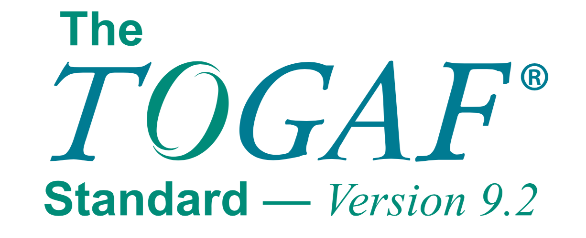

## TOGAF

[TOGAF - Web Oficial](https://www.opengroup.org/togaf)

**TOGAF** (The Open Group Architecture Framework) es un marco de trabajo de arquitectura empresarial (EA, por sus siglas en inglés) que proporciona un enfoque integral para diseñar, planificar, implementar y gobernar la arquitectura de una organización. Desarrollado por **The Open Group**, TOGAF es uno de los marcos más utilizados globalmente para la gestión de la arquitectura empresarial y ayuda a las organizaciones a alinear sus objetivos de negocio con la estrategia y los procesos de TI.

### Principales Características de TOGAF:

1. **Propósito y Alcance de TOGAF**:
   - TOGAF proporciona una metodología estructurada y un conjunto de herramientas para desarrollar arquitecturas empresariales que sean consistentes, alineadas con los objetivos del negocio y capaces de integrar procesos y sistemas complejos.
   - El marco es aplicable a organizaciones de todos los tamaños y sectores, ya que es flexible y puede adaptarse a diferentes necesidades empresariales.

2. **Estructura de TOGAF**:
   TOGAF se divide en varias partes principales que abarcan diferentes aspectos del desarrollo de la arquitectura empresarial:
   - **Architecture Development Method (ADM)**: El método central de TOGAF que describe un proceso paso a paso para desarrollar una arquitectura empresarial. Se organiza en un ciclo de fases interdependientes que permiten la iteración y adaptación.
   - **Enterprise Continuum**: Un repositorio de activos arquitectónicos que incluye modelos, patrones y otros elementos reutilizables que pueden ser utilizados para desarrollar arquitecturas empresariales.
   - **Architecture Content Framework**: Proporciona un conjunto estructurado de artefactos que se producen durante el proceso ADM, incluidos catálogos, matrices y diagramas.
   - **TOGAF Reference Models**: Conjuntos de modelos de referencia que se pueden adaptar a las necesidades de una organización, como el **Technical Reference Model (TRM)** y el **Integrated Information Infrastructure Reference Model (III-RM)**.
   - **Architecture Capability Framework**: Proporciona directrices sobre cómo establecer y operar una función de arquitectura dentro de una organización.

3. **Architecture Development Method (ADM)**:
   El **ADM** es el núcleo del marco TOGAF y consta de las siguientes fases principales:
   - **Preliminary Phase**: Define el contexto de la arquitectura, establece principios, gobernanza y equipo de arquitectura.
   - **Phase A: Architecture Vision**: Establece la visión de la arquitectura, los objetivos del proyecto y se desarrolla un modelo de caso de negocio.
   - **Phase B: Business Architecture**: Desarrolla la arquitectura empresarial que define los procesos, roles, organización y flujos de información.
   - **Phase C: Information Systems Architectures**:
     - **Data Architecture**: Define la estructura de datos lógica y física.
     - **Application Architecture**: Establece el mapa de las aplicaciones necesarias para la empresa.
   - **Phase D: Technology Architecture**: Define la arquitectura de tecnología que incluye la infraestructura de TI, las plataformas y la red.
   - **Phase E: Opportunities and Solutions**: Identifica las oportunidades para mejorar y prioriza los proyectos que deben llevarse a cabo.
   - **Phase F: Migration Planning**: Desarrolla planes de migración para implementar la nueva arquitectura.
   - **Phase G: Implementation Governance**: Asegura que la implementación se ajuste a la arquitectura planificada y establece mecanismos de gobernanza.
   - **Phase H: Architecture Change Management**: Gestiona los cambios en la arquitectura para adaptarse a nuevos requisitos.
   - **Requirements Management**: Es una fase continua que asegura que los requisitos sean gestionados a lo largo de todo el ciclo ADM.

4. **Enterprise Continuum y Repositorio de Activos**:
   - El **Enterprise Continuum** actúa como un repositorio de activos arquitectónicos que incluye tanto elementos **Genéricos** como **Específicos de la Organización**. Los componentes incluyen:
     - **Foundation Architectures**: Elementos comunes y genéricos que se pueden aplicar a cualquier organización.
     - **Common Systems Architectures**: Arquitecturas que pueden ser utilizadas por organizaciones similares dentro de un sector.
     - **Industry Architectures**: Soluciones específicas para industrias particulares.
     - **Organization-Specific Architectures**: Arquitecturas específicas para una organización en particular.

5. **Beneficios de Utilizar TOGAF**:
   - **Alineación entre Negocio y TI**: TOGAF asegura que la arquitectura de TI esté alineada con los objetivos de negocio de la organización.
   - **Estandarización y Consistencia**: Proporciona un enfoque estandarizado para el desarrollo de la arquitectura, lo que asegura la consistencia y calidad de los proyectos arquitectónicos.
   - **Flexibilidad y Adaptabilidad**: TOGAF es lo suficientemente flexible para adaptarse a las necesidades específicas de cada organización, sector o tamaño.
   - **Reducción de Costos y Eficiencia Operativa**: Al reutilizar componentes arquitectónicos y optimizar la infraestructura de TI, se pueden reducir costos y mejorar la eficiencia.
   - **Mejor Gestión de Riesgos**: Ayuda a identificar, evaluar y mitigar riesgos relacionados con la TI y los procesos de negocio.

6. **Certificación TOGAF**:
   - TOGAF ofrece un programa de certificación para profesionales que desean demostrar su competencia en la arquitectura empresarial utilizando el marco TOGAF. La certificación está dividida en dos niveles:
     - **TOGAF 9 Foundation**: Proporciona un conocimiento básico de los términos, conceptos y estructura de TOGAF.
     - **TOGAF 9 Certified**: Profundiza en cómo aplicar TOGAF en la práctica.

7. **Integración con Otros Marcos**:
   - TOGAF puede integrarse con otros marcos y estándares como **ITIL**, **COBIT**, **PMBOK**, y **ISO/IEC 42010** para ofrecer un enfoque más completo a la gestión de arquitectura y gobernanza empresarial.
   - **ITIL** y **COBIT** complementan a TOGAF proporcionando mejores prácticas para la gestión de servicios de TI y la gobernanza de TI, respectivamente.

### Resumiendo

TOGAF se basa en cuatro dimensiones:

* **Arquitectura de Negocios (o de Procesos de Negocio)**, diseñando la estrategia de negocios, la gobernabilidad, la estructura y los procesos clave de la organización.
* **Arquitectura de Aplicaciones**, suministrando un plano o mapa de servicios como borrador (blueprint, en inglés) para cada uno de los sistemas de aplicación que se requiere implantar, las interacciones entre estos sistemas y sus relaciones con los procesos de negocio centrales de la organización.
* **Arquitectura de Datos**, describiendo la estructura de datos físicos y lógicos de la organización, conjuntamente con los recursos de gestión de estos datos.
* **Arquitectura Tecnológica**, describiendo la estructura de hardware, software y redes requerida para dar soporte a la implantación de las aplicaciones principales, de misión crítica, de la organización.

**TOGAF** es un marco robusto, flexible y ampliamente utilizado para la arquitectura empresarial que ayuda a las organizaciones a planificar, diseñar e implementar arquitecturas de TI que estén alineadas con sus objetivos estratégicos. Su enfoque metódico y estructurado permite a las organizaciones optimizar sus recursos de TI, reducir costos, mejorar la eficiencia y mitigar riesgos.

##### Referencias
- [Wikipedia: TOGAF](https://es.wikipedia.org/wiki/TOGAF)
- [Unir: togaf-que-es](https://www.unir.net/empresa/revista/togaf-que-es/)